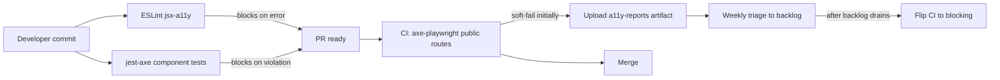

# A11y Testing Setup - Phase 1 (Public Routes, Hybrid Rollout)

## Goals

- Catch a11y regressions at lint time (ESLint at **error**, forces clean markup going forward).
- Audit publicly accessible routes on every PR via axe (soft-fail initially: reports uploaded, build does not fail).
- Provide a `jest-axe` helper so component-level a11y tests are one-liners.
- Generate a JSON paper trail per route for the eventual UTH UWS submission.

Out of scope for phase 1: authenticated routes (`/home`, `/search`, etc.), `mobile-chromium` a11y runs, manual screen-reader/keyboard documentation. Tracked as follow-ups.

## Public routes covered (phase 1)

SPOTS uses Cognito Hosted UI, so there is no `/login` or `/signup` route in the app itself. The only routes reachable without an authenticated session are:

- `/` - landing page ([app/page.tsx](app/page.tsx))
- `/privacy` - privacy policy ([app/(pages)/privacy/page.tsx](app/(pages)/privacy/page.tsx))
- `/auth/error` - auth failure landing ([app/auth/error/page.tsx](app/auth/error/page.tsx))
- `/unauthorized` - access-denied landing ([app/unauthorized/page.tsx](app/unauthorized/page.tsx))

If the middleware turns out to require auth on `/privacy`, drop it from the list; the rest are confirmed public.

## Layers

### Layer 1 - ESLint jsx-a11y (strict from day one)

- Install `eslint-plugin-jsx-a11y` as a devDependency.
- Extend `[.eslintrc.json](.eslintrc.json)` with `plugin:jsx-a11y/recommended` and add `jsx-a11y` to plugins.
- Promote the highest-value rules to `error` (alt-text, aria-props, aria-role, anchor-has-content, click-events-have-key-events, no-noninteractive-element-interactions, label-has-associated-control).
- Add a file-scoped override for the SVG body picker at `[app/_components/body-parts/InteractiveBody.tsx](app/_components/body-parts/InteractiveBody.tsx)` to relax `no-static-element-interactions` (interactive `<g>` / `<path>` are intentional and have ARIA roles).
- Expect a one-shot cleanup PR after install. The cleanup is part of this work, not a follow-up.

### Layer 2 - jest-axe helper + priority component tests

- Install `jest-axe` and `@types/jest-axe`.
- Extend `[jest.setup.js](jest.setup.js)` to register `toHaveNoViolations` (append, do not replace existing mocks).
- Add a thin helper at `app/_lib/testing/a11y.ts` exporting `expectNoA11yViolations(container, options?)`.
- Add a11y tests for the seven priority components flagged in the previous chat. Tests live next to their component as `*.a11y.test.tsx`:
  - `app/_components/common/AlertModal.tsx`
  - `app/_components/activities/ActivityModal.tsx`
  - `app/_components/ui/Tooltip.tsx`
  - `app/_components/ui/ThemeToggle.tsx`
  - `app/_components/user/HairColorSelector.tsx`
  - `app/_components/auth/SignupForm.tsx`
  - `app/_components/body-parts/InteractiveBody.tsx`
- These run as part of `npm run test:jest` and ARE blocking (component-level violations are easy to fix per-component).

### Layer 3 - @axe-core/playwright on public routes (soft-fail CI)

- Install `@axe-core/playwright` as a devDependency.
- Add a reusable fixture at `e2e/fixtures/a11y.ts` with `auditPage(page, label)`:
  - Tags: `wcag2a`, `wcag2aa`, `wcag21a`, `wcag21aa`.
  - Writes full JSON results to `e2e/.a11y-reports/<label>.json`.
  - Uses `expect.soft(...).toEqual([])` against Serious/Critical violations so all routes still run when one fails.
- Add `e2e/a11y-public.spec.ts` iterating over the four public routes. Uses an empty `storageState` so it does NOT depend on the existing `setup` project / authed `e2e/.auth/user.json`. This keeps the spec independently runnable and CI-cheap.
- Add npm scripts:
  - `test:a11y:public` - runs only the public a11y spec on `chromium`.
  - (Skip `test:a11y` umbrella alias until phase 2 adds authed routes.)
- Add `e2e/.a11y-reports/` to `.gitignore` (reports are CI artifacts, not committed).

### CI integration (hybrid soft-fail)

Add a GitHub Actions job (or extend the existing E2E workflow) that:
- Runs `npm run lint` (blocks - includes new a11y rules).
- Runs `npm run test:jest` (blocks - includes new a11y component tests).
- Runs `npm run test:a11y:public` with `continue-on-error: true` (soft-fail initially).
- Uploads `e2e/.a11y-reports/` as a build artifact `name: a11y-reports` regardless of outcome.

After two sprints (or once the public-route backlog is empty), drop `continue-on-error: true` to flip to blocking.

## File-by-file change summary

- `[package.json](package.json)` - add `eslint-plugin-jsx-a11y`, `jest-axe`, `@types/jest-axe`, `@axe-core/playwright` to devDependencies; add `test:a11y:public` script.
- `[.eslintrc.json](.eslintrc.json)` - extend `plugin:jsx-a11y/recommended`, add plugin, promote key rules to `error`, add `InteractiveBody.tsx` override.
- `[jest.setup.js](jest.setup.js)` - append `require('jest-axe').toHaveNoViolations` + `expect.extend`.
- `[.gitignore](.gitignore)` - add `e2e/.a11y-reports/`.
- NEW `app/_lib/testing/a11y.ts` - helper.
- NEW `e2e/fixtures/a11y.ts` - Playwright `auditPage` fixture.
- NEW `e2e/a11y-public.spec.ts` - four public-route specs.
- NEW seven `*.a11y.test.tsx` files alongside their components.
- NEW or extended `.github/workflows/*.yml` - CI job (TBD which workflow file to edit).
- Cleanup edits across `app/_components/**` to resolve ESLint a11y errors surfaced by Layer 1. Scope of cleanup will be enumerated in a follow-up scan after install; expected to be a few dozen small fixes (`alt=""`, `aria-label`, keyboard handlers paired with click handlers, `htmlFor`/`id` alignment).

## Layer summary diagram

## Rollout / acceptance criteria

1. `npm install` clean.
2. `npm run lint` passes after the cleanup edits (or surfaces only the new file overrides).
3. `npm run test:jest` passes including new `*.a11y.test.tsx`.
4. `npm run test:a11y:public` runs locally against `http://localhost:3000`, generates four JSON reports under `e2e/.a11y-reports/`, and prints Serious/Critical counts.
5. CI uploads `a11y-reports` artifact on every PR.
6. No Serious/Critical axe violations on the four public routes once the cleanup PR lands (target, not a hard merge gate this phase).

## Follow-ups (not in phase 1)

- Phase 2: authed routes (`/home`, `/search`, `/problem-station`, `/report`, `/settings`) using the existing `setup` storageState.
- Phase 3: extend a11y specs to `mobile-chromium` project.
- Phase 4: flip Layer 3 CI from soft-fail to blocking.
- Phase 5: document manual screen-reader (VoiceOver) and keyboard pass under `docs/accessibility/manual-pre-screen.md` for the UWS submission packet.
- Phase 6: UTH Step 2 - brand standards and technical requirements review (separate effort, mostly checklist; not testable via axe).