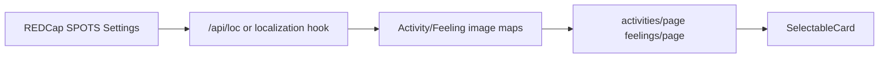

# SPOTS Accessibility 2nd Review — Fix Plan

## Fix list (from PDF)

| # | Finding | Page(s) | Status in codebase |
|---|---------|---------|-------------------|
| 1 | Footer logo links to wrong URL | Global footer | **Done** — `Footer_CSONLogo_Link_URL` + `Footer_CSONLogo_Alt_Text` in [`Footer.tsx`](app/_components/layout/Footer.tsx); fallback `https://nursing.uth.edu/` |
| 2 | Color contrast fails WCAG 2.0 AA | `/home`, `/report` | Likely offenders: orange section headers (`bg-orange-500` + white text ~3:1), `text-gray-500` section labels, chart legend/axis colors, `text-muted-foreground` in footer (undefined token) |
| 3 | Text clipped at 200% resize/zoom | `/body-parts` | Fixed heights (`h-[400px]`, `h-[600px]`, `md:max-h-[625px]`) + `overflow-hidden`; avatar hidden via `hidden lg:flex` when a body part is selected |
| 4 | Child avatar disappears after body-part select | `/body-parts` | Same responsive hide rule at [`InteractiveBody.tsx`](app/_components/body-parts/InteractiveBody.tsx) line 837 |
| 5 | Image alt text missing / not descriptive | `/body-parts`, `/activities`, `/feelings` | Body-part list images use `alt=""`; activities use `imageAlt={activity.name}`; feelings use short phrases in [`feelings-symptom-image-map.ts`](app/_lib/services/feelings/feelings-symptom-image-map.ts) |

Automated tools (Siteimprove, WAVE) already pass; manual keyboard/screen-reader re-test is a **QA deliverable** after fixes (not a separate code epic unless new issues surface).

---

## Architecture (data flow for new alt text)



**Your choice:** descriptive alt via **REDCap keys** + `getLocSetting()` (with English fallbacks in code until REDCap is populated).

---

## 1. Footer branding link — **Done**

**File:** [`app/_components/layout/Footer.tsx`](app/_components/layout/Footer.tsx)

- Logo URL from REDCap: `Footer_CSONLogo_Link_URL` via `getLocSetting()` (same pattern as `Footer_SitePolicy_Link_URL`, etc.).
- Logo alt from REDCap: `Footer_CSONLogo_Alt_Text` with English fallback.
- **REDCap value (EN + ES):** `https://nursing.uth.edu/` (per accessibility review; was hardcoded `https://www.uth.edu/`).
- Code fallback when key is missing: `https://nursing.uth.edu/`.
- Test: [`Footer.test.tsx`](app/_components/layout/__tests__/Footer.test.tsx) asserts logo link uses localized URL.

**Remaining (REDCap only):** Add `Footer_CSONLogo_Link_URL` and `Footer_CSONLogo_Alt_Text` in SPOTS Settings (EN + ES). App works via fallbacks until then.

---

## 2. Color contrast — home + report (+ shared deps)

**Approach:** Audit home/report in browser at 100% and 200% zoom with WebAIM Contrast Checker or axe DevTools; fix only combinations that fail on those routes and the shared components they render.

### Likely fixes

| Area | File(s) | Change |
|------|---------|--------|
| Past Problems orange header | [`home/page.tsx`](app/(pages)/home/page.tsx) | Darken header background (e.g. `bg-orange-600` / custom `--color-spots-orange-header`) or use dark text on lighter orange so white-on-orange meets 4.5:1 |
| Section labels “What’s new” / “Happens a lot” | `home/page.tsx` | Bump `text-gray-500` → `text-gray-600` or `text-spots-text` on light backgrounds |
| Page instructions | [`PageHeader.tsx`](app/_components/common/PageHeader.tsx) | Ensure `text-gray-600` meets AA on page background (used by report + many routes) |
| Summary chart | [`SummaryChart.tsx`](app/_components/reports/SummaryChart.tsx) | Verify legend swatches + `text-spots-text` on white; darken `CHART_AXIS_STROKE` / `CHART_TICK_FILL` if axis labels fail; check bar colors against white if labels overlap |
| Report helper copy | [`report/page.tsx`](app/(pages)/report/page.tsx) | Bump `text-gray-600` / `text-gray-400` (dark mode) where failing |
| Footer muted text | `Footer.tsx` | Replace `text-muted-foreground` (no theme definition in [`globals.css`](app/globals.css)) with explicit `text-gray-600 dark:text-gray-300`; verify footer link `text-spots-blue` on footer background |

### Token hygiene (minimal)

- Only add/adjust tokens in [`globals.css`](app/globals.css) if the same failing color appears in both home and report (e.g. a darker orange header token reused elsewhere).

### Verification

- Manual: home + report at 200% zoom, light and dark mode.
- Optional: extend [`e2e/a11y-public.spec.ts`](e2e/a11y-public.spec.ts) pattern later for authenticated routes (out of scope for this pass unless time permits).

---

## 3. Body parts — 200% resize + disappearing avatar

**Root cause:** [`InteractiveBody.tsx`](app/_components/body-parts/InteractiveBody.tsx) uses a mobile-first split layout:

```837:837:app/_components/body-parts/InteractiveBody.tsx
className={`avatar_container ...${displayedBodyPart ? ' hidden lg:flex' : ''}`}
```

Below `lg`, selecting a body part **hides the avatar entirely** — matches reviewer screenshot (“page shows empty”).

### Layout fixes

1. **Remove `hidden lg:flex` toggle** — always show avatar + symptom panel; stack vertically on narrow viewports (`flex-col`) instead of hiding either pane.
2. **Replace fixed heights** (`h-[400px]`, `md:h-[600px]`, `md:max-h-[625px]`) with `min-h-*` and allow containers to grow; avoid `overflow-hidden` on parents that clip text at 200% zoom.
3. **Use relative units** where possible (`min-h-[25rem]`) so content scales with user font settings (WCAG 1.4.4).
4. **Test matrix:** desktop 200% browser zoom, 320px mobile width, body-part selected vs not, front/back toggle, skin navigation.

---

## 4. Image alt text (REDCap keys)

### REDCap keys to add (coordinate with UTHealth / SPOTS Settings)

**Activities** (one key per activity slug):

| Key pattern | Example |
|-------------|---------|
| `alt_activity_{slug}` | `alt_activity_bathing` → “A cartoon illustration of a child taking a bubble bath…” |

Slugs from [`ACTIVITY_IMAGE_MAP`](app/_lib/services/activities/activity-symptom-service.ts): `bathing`, `eating`, `getting_ready`, `reading`, `running`, `screen_time`, `sleeping`, `talking`, `thinking`, `toileting`, `walking`.

**Feelings** (one key per symptom id):

| Key pattern | Example |
|-------------|---------|
| `alt_feeling_{symptom_id}` | `alt_feeling_anxiety` → descriptive cartoon illustration text |

Ids from [`FEELING_SYMPTOM_IMAGE_MAP`](app/_lib/services/feelings/feelings-symptom-image-map.ts).

**Body parts** (optional but addresses WAVE “missing alt”):

| Key pattern | Example |
|-------------|---------|
| `alt_bodypart_{id}` | `alt_bodypart_head` → “Cartoon illustration of a child’s head” |

Provide **English + Spanish** strings in REDCap for each key.

### Code changes

| File | Change |
|------|--------|
| [`activity-symptom-service.ts`](app/_lib/services/activities/activity-symptom-service.ts) | Add helper `getActivityImageAlt(slug, getLocSetting)` with fallbacks mirroring reviewer’s bathing example |
| [`activities/page.tsx`](app/(pages)/activities/page.tsx) | Pass `imageAlt={getActivityImageAlt(...)}` instead of `activity.name` |
| [`feelings-symptom-image-map.ts`](app/_lib/services/feelings/feelings-symptom-image-map.ts) | Replace static `imageAlt` with key reference; resolve at runtime in [`feelings/page.tsx`](app/(pages)/feelings/page.tsx) via `getLocSetting` |
| [`InteractiveBody.tsx`](app/_components/body-parts/InteractiveBody.tsx) | Set thumbnail `alt={getLocSetting(\`alt_bodypart_${part.id}\`, part.name)}`; add `role="img"` + `aria-label` on injected SVG container (e.g. localized “Interactive body map” key); change rotate icon to `alt=""` with `aria-hidden` (button already has `aria-label`) |
| [`ActivityModal.tsx`](app/_components/activities/ActivityModal.tsx) | Use same descriptive alt helper for modal hero image |

### Tests

- Update [`ActivityModal.a11y.test.tsx`](app/_components/activities/__tests__/ActivityModal.a11y.test.tsx) to assert descriptive alt.
- Add unit test for alt helper fallbacks when REDCap key missing.
- Extend [`InteractiveBody.a11y.test.tsx`](app/_components/body-parts/__tests__/InteractiveBody.a11y.test.tsx) if feasible beyond loading state.

---

## 5. Manual QA checklist (pre second review)

Run on `main` Amplify URL (or local) for each fixed route:

- **Keyboard:** Tab order reaches all interactive elements; Enter/Space activates body-part SVG regions and cards; no focus traps.
- **Screen reader:** VoiceOver/NVDA announces page title, instructions, card labels, and descriptive image alt.
- **200% zoom:** No clipped text on home, report, body-parts (avatar visible after selection).
- **Contrast:** WebAIM check on every text/button/link flagged during dev on home + report.
- **Footer:** Logo opens `https://nursing.uth.edu/` in new tab.

---

## Suggested implementation order

1. ~~Footer URL~~ **Done**
2. Body-parts layout/zoom (highest user impact)
3. REDCap alt keys drafted + code wiring with English fallbacks
4. Home/report contrast fixes + re-audit
5. Manual QA pass + handoff for UTHealth second review

---

## Out of scope (this pass)

- Full-site contrast token sweep (per your choice)
- axe CI on all authenticated routes
- Broader keyboard/SR audit beyond PDF-listed pages (note in PDF — schedule after these fixes)

## Dependency

**REDCap:** UTHealth must add `Footer_CSONLogo_Link_URL`, `Footer_CSONLogo_Alt_Text`, `alt_activity_*`, `alt_feeling_*`, and optionally `alt_bodypart_*` keys (EN + ES). Code ships with English fallbacks so the app is not blocked if REDCap lags.
