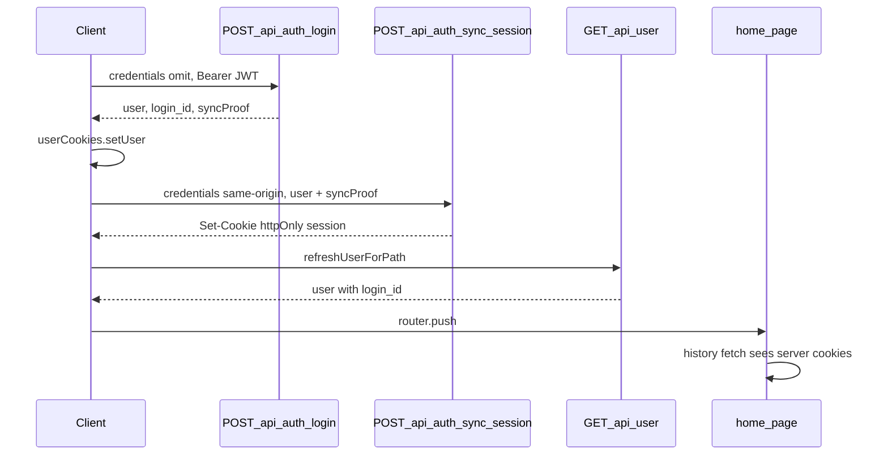

# POST /api/auth/sync-session follow-up PR

## Problem

[`POST /api/auth/login`](app/api/auth/login/route.ts) calls `SessionService.createSession`, but the browser **ignores `Set-Cookie`** because all login clients use `credentials: 'omit'` ([P0-03](docs/debugging/OAUTH_HEADER_SIZE_FIX.md)). Downstream server routes (`/api/user`, `/api/symptoms/history`) read **httpOnly** cookies via [`resolveSymptomIdentity`](app/_lib/server/identity-headers.ts).

Today’s branch fixes loading with client merge/gating; sync-session fixes the **root session split** so those workarounds become optional safety nets.

## Target flow



**Order (per your recommendation):** login success → `setUser` → **sync** → `refreshUserForPath` / prefetch → navigate.

**Failure policy (confirmed):** best-effort — log + RUM on sync failure, continue with today’s `mergeUserWithClientSession` fallback; do not block navigation.

---

## 1. Server: stateless sync proof from login

Add [`app/_lib/server/session-sync-proof.ts`](app/_lib/server/session-sync-proof.ts) (server-only):

- **`createSessionSyncProof(user, loginId)`** — HMAC-SHA256 over a stable payload (`login_id`, `individual_id`, `spots_user_id`, `iat` timestamp), keyed by `SPOTS_SESSION_SYNC_SECRET` (new env var; document in Amplify console).
- **`verifySessionSyncProof(user, loginId, proof, maxAgeMs)`** — constant-time compare; reject expired proofs (~60s TTL).

**Why HMAC instead of JWT-body matching alone:** parent/child reporting-as can share the same Cognito email; proof ties sync to the **exact** user record Lambda just returned without a second REDCap call.

Update [`app/api/auth/login/route.ts`](app/api/auth/login/route.ts) success response:

```typescript
{ success: true, user: userWithRepeatInstance, syncProof: createSessionSyncProof(...) }
```

Keep existing `SessionService.createSession` on login for now (harmless when client uses omit; no behavior change). Optional cleanup in a later PR: remove login-route `createSession` once sync is proven in prod.

---

## 2. Server: POST /api/auth/sync-session

New route: [`app/api/auth/sync-session/route.ts`](app/api/auth/sync-session/route.ts)

**Request**

- `Authorization: Bearer <idToken>` (required; same as login)
- JSON: `{ user: User, syncProof: string }`
- `credentials: 'same-origin'` on client (required so browser **accepts** `Set-Cookie`)

**Guards** (reuse patterns from login route)

- Extract shared helpers into [`app/_lib/server/auth-route-guards.ts`](app/_lib/server/auth-route-guards.ts): `validateOrigin`, `getRequestId` (currently duplicated in login route)
- Rate limit: reuse `loginRateLimiter` or add a lighter `sessionSyncRateLimiter` (same IP window)
- CSRF origin check in production (same `ALLOWED_ORIGINS`)

**Validation**

- Parse `user`; require `login_id`, `individual_id`, `spots_user_id`, `email_primary`
- Verify `syncProof` with `verifySessionSyncProof`
- Bearer header present (defense in depth; no full JWKS verify in this PR — matches existing app pattern)

**Success**

- `SessionService.createSession(user, user.login_id, response)`
- `{ success: true }` + httpOnly cookies
- `logSecurityEvent('auth.session.sync', ...)`

**Errors:** 400 invalid body/proof, 403 origin, 429 rate limit, 500 session write failure

---

## 3. Client: sync helper + wire all login success paths

Add [`app/_lib/services/auth/sync-session-service.ts`](app/_lib/services/auth/sync-session-service.ts):

```typescript
export async function syncServerSessionAfterLogin(
  idToken: string,
  user: User,
  syncProof: string
): Promise<boolean>
```

- `POST /api/auth/sync-session` with `credentials: 'same-origin'`
- Returns `true` on `response.ok && success`
- RUM: new `trackAuthSessionSync(durationMs, status, success, flow)` in [`app/_lib/monitoring/rum.ts`](app/_lib/monitoring/rum.ts)

**Call sites** (after `userCookies.setUser`, before refresh/navigate):

| Location | File |
|----------|------|
| Primary login | [`performValidation`](app/_lib/services/auth/login-service.ts) — before `onBeforeRedirect` |
| OAuth callback | [`app/auth/callback/page.tsx`](app/auth/callback/page.tsx) — before `refreshUserForPath` |
| Reporting-as selection | [`app/auth/reporting-as/page.tsx`](app/auth/reporting-as/page.tsx) — currently **missing** `refreshUserForPath`; add sync + `refreshUserForPath` before `router.push` |
| Inline switch | [`reporting-as-switch-service.ts`](app/_lib/services/auth/reporting-as-switch-service.ts) — after `setUser` |

Helper to normalize login API result:

```typescript
function userFromLoginResult(result: { user: User; login_id?: string; syncProof?: string })
```

Ensure `login_id` / `redcap_repeat_instance` are on the user object passed to sync (same shape as [`userWithRepeatInstance`](app/api/auth/login/route.ts) lines 428–433).

---

## 4. What we keep (not removed in this PR)

- `credentials: 'omit'` on [`POST /api/auth/login`](app/_lib/services/auth/login-service.ts) — unchanged
- [`mergeUserWithClientSession`](app/_components/auth/UserProvider.tsx) — keep as fallback when sync fails
- Home [`sessionReady`](app/(pages)/home/page.tsx) gating — keep until prod validation; can simplify in a later PR once sync is reliable

---

## 5. OAuth / header-size note

Sync uses `credentials: 'same-origin'`, so **Cognito cookies are sent** on the request (same class of issue as login-with-include). Mitigations:

- Production already documents `NODE_OPTIONS=--max-http-header-size=16384` ([OAUTH_HEADER_SIZE_FIX.md](docs/debugging/OAUTH_HEADER_SIZE_FIX.md))
- Best-effort fallback if sync returns 4xx/5xx or network error
- Document in [`docs/backend/performance/redcap-login-performance.md`](docs/backend/performance/redcap-login-performance.md)

---

## 6. Tests

- **Unit:** `session-sync-proof.test.ts` — create/verify, expiry, tamper rejection
- **Route audit:** `app/api/auth/sync-session/__tests__/route.test.ts` — mirrors [`login/route.audit.test.ts`](app/api/auth/login/__tests__/route.audit.test.ts): proof valid → `createSession`; invalid proof → 400; missing Bearer → 401
- **Client:** extend [`login-service.test.ts`](app/_lib/services/auth/__tests__/login-service.test.ts) — mock sync fetch; assert called before `onBeforeRedirect` on success

---

## 7. Manual QA

- Password login → `/home`: Past Problems + chart on first load; DevTools Application → httpOnly `spots-user`, `login_id` present
- Google OAuth login (staging with NODE_OPTIONS): same check
- Reporting-as parent/child selection: sync + data on first load
- Inline header switch: session cookies updated
- Simulate sync failure (block route in DevTools): login still reaches `/home` via fallback

---

## 8. Env / deploy

- Add `SPOTS_SESSION_SYNC_SECRET` to Amplify env (random 32+ bytes; rotate independently of Cognito)
- No backend Lambda changes

---

## Out of scope (future PRs)

- Remove `createSession` from login route
- Full Cognito JWKS signature verification on sync route
- Simplify/remove `mergeUserWithClientSession` and home `sessionReady` workarounds after prod soak
