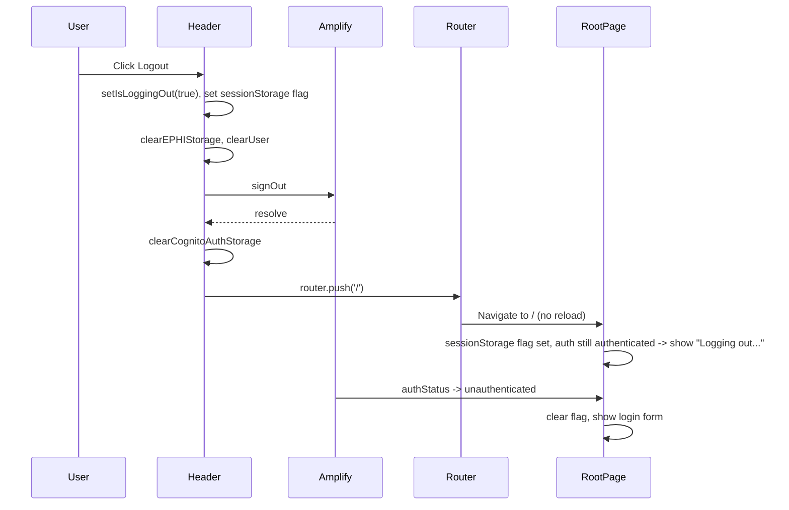

# Client-Side Logout Implementation Plan

## Current behavior (to replace)

- Header sets cookie + sessionStorage, runs `signOut()` and storage cleanup, then `**window.location.href = '/'**` (full reload).
- Root layout reads cookie and provides [LoggingOutProvider](spots-app/app/layout.tsx) so the server can render "Logging out..." on first paint.
- Root page [app/page.tsx](spots-app/app/page.tsx) contains extensive logout-specific logic: `initialLoggingOut`, `isLoggingOut`, refs (`showLoggingOutRef`, `hasRevealedLoginPageAfterLogoutRef`, `logoutFlagsClearedRef`), sessionStorage keys (`spots_logging_out`, `spots_login_page_revealed`), `inPostLogoutFlow`, `showLoggingOut`, `inLogoutFlow`, `stayOnLoginPage`, and branches that show "Logging out..." or guard loading with `stayOnLoginPage`.
- [LoginPageLayout](spots-app/app/_components/auth/LoginPageLayout.tsx) has `suppressSessionLoading` and optional `getLocSetting` to avoid post-logout loading/untranslated flash.
- [useAuthValidation](spots-app/app/_lib/hooks/auth/useAuthValidation.ts) skips post-login validation when `spots_logging_out` is in sessionStorage (so we don’t validate/redirect during logout).

## Target behavior

1. User clicks Logout → Header shows "Logging out..." (existing `isLoggingOut` state), runs the same cleanup and `signOut()`, then `**router.push('/')**` (no reload).
2. No cookie; no server-side "logout in progress." Optional: keep a single **client-only** sessionStorage flag so the root page and `useAuthValidation` can show "Logging out..." and skip validation until auth flips to unauthenticated.
3. Root page: simple loading rules only (configuring → "Loading...", authenticated+validating → "Setting up your session...", logout flag + not yet unauthenticated → "Logging out...", then main content). No latches, no `stayOnLoginPage`, no `initialLoggingOut`.
4. LoginPageLayout: can be simplified (e.g. remove `suppressSessionLoading` and optional `getLocSetting` used only for post-logout; layout uses its own `useLocalization()` again).
5. When `authStatus === 'unauthenticated'`, root page clears the sessionStorage flag so the next login flow is unaffected.

## Data flow (client-side logout)

## File-by-file changes

### 1. [app/_components/layout/Header.tsx](spots-app/app/_components/layout/Header.tsx)

- **Add** `useRouter` from `next/navigation`.
- In `handleSignOut`:
  - **Keep** `setIsLoggingOut(true)` and **keep** `sessionStorage.setItem('spots_logging_out', '1')` so [useAuthValidation](spots-app/app/_lib/hooks/auth/useAuthValidation.ts) can skip post-login validation when landing on `/` with auth still briefly authenticated.
  - **Remove** all `document.cookie = SPOTS_LOGGING_OUT_COOKIE` (both in try and catch).
  - **Remove** import of `SPOTS_LOGGING_OUT_COOKIE`.
  - **Replace** `window.location.href = '/'` with `router.push('/')` (or `router.replace('/')`) after cleanup, in both try and catch.
- No other behavioral changes (HIPAA cleanup and signOut order stay the same).

### 2. [app/layout.tsx](spots-app/app/layout.tsx)

- **Remove** cookie read: delete `const initialLoggingOut = cookieStore.get(SPOTS_LOGGING_OUT_COOKIE)?.value === '1'` and the `cookies()` usage if it’s only used for this.
- **Remove** `<LoggingOutProvider>` wrapper and its import; render children without it.
- **Remove** import of `LoggingOutProvider` and `SPOTS_LOGGING_OUT_COOKIE` from LoggingOutContext.
- **Optional:** If `cookies()` is used elsewhere in the layout, keep it and only remove the logout-cookie read and the provider.

### 3. [app/page.tsx](spots-app/app/page.tsx)

- **Remove** all logout-specific state and refs: `initialLoggingOut`, `isLoggingOut` (and its lazy initializer), `showLoggingOutRef`, `hasRevealedLoginPageAfterLogoutRef`, `LOGIN_PAGE_REVEALED_KEY`, `logoutFlagsClearedRef`, `inPostLogoutFlow`, `loginPageRevealed`, `showLoggingOut`, `inLogoutFlow`, `stayOnLoginPage`, and the effect that clears cookie/sessionStorage/refs (replace with a single small effect that only clears `spots_logging_out` when `authStatus === 'unauthenticated'`).
- **Remove** the mount effect that sets `isLoggingOut(true)` from sessionStorage.
- **Simplify** loading and "Logging out..." into a single, linear set of branches:
  - If `sessionStorage.getItem('spots_logging_out')` and `authStatus !== 'unauthenticated'`: show "Logging out..." (full-screen spinner).
  - If `authStatus === 'configuring'`: show "Loading...".
  - If error: show ErrorDisplay.
  - If `authStatus === 'authenticated' && isValidating`: show "Setting up your session...".
  - Else: render main content (login form in layout).
- **Remove** all uses of `stayOnLoginPage`, `inLogoutFlow`, and the ref-based "avoid second flash" logic (refs for stable callbacks and the `useMemo` for main content can stay or be simplified once there’s no reload).
- **Add** one effect: when `authStatus === 'unauthenticated'`, run `sessionStorage.removeItem('spots_logging_out')` so the next login isn’t affected.
- **Remove** imports: `useLoggingOut`, `SPOTS_LOGGING_OUT_COOKIE` from LoggingOutContext.
- **Simplify** props to `LoginPageLayout`: pass only `showLoading={!authChecked && authStatus !== 'unauthenticated'}`; remove `suppressSessionLoading` and `getLocSetting` (optional follow-up: remove from layout interface if unused elsewhere).

### 4. [app/_components/auth/LoginPageLayout.tsx](spots-app/app/_components/auth/LoginPageLayout.tsx)

- **Simplify** props: remove `suppressSessionLoading` and `getLocSetting` (or keep as optional and unused for now).
- **Behavior:** Use only `showLoading` and the layout’s own `useLocalization()`; when `showLoading` is true, show "Setting up your session...". No special-case for "post-logout" (with client-side logout, the root page will not render this layout until auth is unauthenticated or we’re showing "Logging out..." on the page, so no double loading).

### 5. [app/_lib/contexts/LoggingOutContext.tsx](spots-app/app/_lib/contexts/LoggingOutContext.tsx)

- **Remove** the file entirely (or reduce to an empty provider and no cookie constant) once no imports remain. After step 2 and 3, nothing should import it; delete the file and remove any remaining references.

### 6. [app/_lib/hooks/auth/useAuthValidation.ts](spots-app/app/_lib/hooks/auth/useAuthValidation.ts)

- **Keep** the existing check `window.sessionStorage.getItem('spots_logging_out')` so that when we navigate to `/` after logout and auth is still briefly `authenticated`, we do not run `validateAndRedirect` (which would redirect back to dashboard). No code change unless the constant is moved; if the cookie constant was the only export used here, use the string `'spots_logging_out'` directly or define a small constant in the hook file.

## Order of implementation

1. Header: add router, remove cookie, use `router.push('/')`.
2. Layout: remove cookie read and LoggingOutProvider.
3. Page: remove all logout latches/refs and simplify to the single "Logging out..." branch + one clear-flag effect; simplify LoginPageLayout props.
4. LoginPageLayout: remove `suppressSessionLoading` and `getLocSetting` (and their logic).
5. Delete (or stub) LoggingOutContext; fix useAuthValidation if it referenced the context constant.

## Testing

- Log in, then click Logout: header shows "Logging out...", then login page appears without a full reload (no white flash, no loss of localization).
- Confirm no "Setting up your session..." after logout; at most "Logging out..." until auth is unauthenticated, then the form.
- Confirm post-login validation still runs when logging in (no `spots_logging_out` set).
- Confirm logout from different routes (e.g. /dashboard, /search) all land on `/` with the same behavior.

## Risk / caveat

If anything else in the app relies on a full page load to reset state (e.g. a third-party script or SDK), that won’t happen with client-side navigation. Current design (Amplify signOut + existing storage cleanup) is sufficient for auth and ePHI; no such dependencies were found in the touched files.