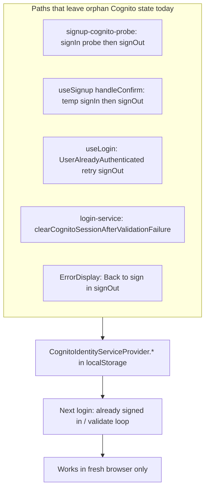

# Cognito Session Cleanup Plan

## Problem

Signup and login flows call `signOut()` alone in several places. Amplify can resolve before localStorage/sessionStorage keys are cleared ([`storage-cleanup.ts`](app/_lib/utils/storage-cleanup.ts) lines 102–105). Header logout already does the full sequence; signup/login paths do not.



**Recommended scope for this PR:** helper + wire all orphan paths + login escape hatch. **Defer:** removing the pre-signup existence probe (it still uses `signIn`; cleanup fixes the symptom without losing duplicate-email UX).

---

## 1. Add shared `releaseCognitoSession()`

**File:** [`app/_lib/utils/storage-cleanup.ts`](app/_lib/utils/storage-cleanup.ts)

Add an async helper that mirrors Header logout’s Cognito teardown (without ePHI clear or `clearUser()` unless callers need it):

```typescript
export async function releaseCognitoSession(options?: { global?: boolean }): Promise<void> {
  try {
    const { signOut } = await import('aws-amplify/auth');
    await signOut({ global: options?.global ?? true });
  } catch (error) {
    logErrorProductionSafe('signOut failed during releaseCognitoSession', error);
  }
  clearCognitoAuthStorage();
  clearAuthSessionCookies();
}
```

- Dynamic import of `signOut` keeps the module safe if ever imported server-side (guard with `typeof window` if needed; all current call sites are client-only).
- Export from the same module so existing `clearCognitoAuthStorage` / `clearAuthSessionCookies` docs stay the source of truth.

**Optional refactor (same PR, low risk):** replace duplicated post-`signOut` blocks in [`Header.tsx`](app/_components/layout/Header.tsx), [`useSessionTimeout.ts`](app/_lib/hooks/auth/useSessionTimeout.ts), and [`auth/callback/page.tsx`](app/auth/callback/page.tsx) with `releaseCognitoSession()` after their existing `clearEPHIStorage` / `clearUser` steps. Not required for the bug fix but reduces drift.

---

## 2. Wire cleanup into signup paths (highest impact)

### 2a. Post-confirm temporary session

**File:** [`app/_lib/hooks/auth/useSignup.ts`](app/_lib/hooks/auth/useSignup.ts) — `handleConfirm` (~lines 241–257)

Replace bare `await signOut()` with `await releaseCognitoSession()` inside the existing `finally` that clears `setSignupConfirmInProgress(false)`.

Use `try/finally` so cleanup runs even if `updateUserAttribute` throws after `signIn`:

```
setSignupConfirmInProgress(true)
try
  signIn → updateUserAttribute (if email username)
finally
  await releaseCognitoSession()
  setSignupConfirmInProgress(false)
```

This is the most likely path for the heuristic tester (signup → verify code → login stuck).

### 2b. Existence probe

**File:** [`app/_lib/services/auth/signup-cognito-probe.ts`](app/_lib/services/auth/signup-cognito-probe.ts) — `probeCognitoIdentifierExists`

When probe `signIn` succeeds, replace `await signOut()` with `await releaseCognitoSession()`.

Wrap probe in `try/finally`: if `signIn` succeeds but a later step throws, still release. Failed probes (`NotAuthorizedException`, etc.) do not create a session—no cleanup needed.

Remove direct `signOut` import if unused.

---

## 3. Wire cleanup into login / validation paths

| File | Change |
|------|--------|
| [`login-service.ts`](app/_lib/services/auth/login-service.ts) `clearCognitoSessionAfterValidationFailure` | After `userCookies.clearUser()`, call `releaseCognitoSession()` instead of bare `signOut({ global: true })` |
| [`useLogin.ts`](app/_lib/hooks/auth/useLogin.ts) ~lines 126–141 | On `UserAlreadyAuthenticatedException`, call `releaseCognitoSession()` before retry `signIn` |
| [`ErrorDisplay.tsx`](app/_components/auth/ErrorDisplay.tsx) `handleBackToSignIn` | Replace bare `signOut()` with `releaseCognitoSession()` |

---

## 4. Login-page “Reset sign-in” escape hatch

For users already stuck before deploy, and edge cases where Amplify Hub still reports `authenticated`:

**New hook or small handler** (e.g. `useResetSignIn.ts` under `app/_lib/hooks/auth/`) that:

1. Sets `SPOTS_LOGGING_OUT_STORAGE_KEY` briefly (same as Header) so [`useAuthValidation`](app/_lib/hooks/auth/useAuthValidation.ts) does not re-run validation mid-reset
2. Calls `releaseCognitoSession()`
3. Clears `userCookies.clearUser()` (lightweight SPOTS client state)
4. Clears logout gate flags when `authStatus` flips to `unauthenticated`

**UI placement:** [`LoginForm.tsx`](app/_components/auth/LoginForm.tsx) or [`page.tsx`](app/(landing)/page.tsx)

- Show a secondary/ghost **“Reset sign-in”** link when:
  - `authStatus === 'authenticated'` and login form is visible, **or**
  - login error message matches “already signed in” (`isAlreadyAuthenticatedError` pattern), **or**
  - user returns from [`ErrorDisplay`](app/_components/auth/ErrorDisplay.tsx) after REDCap rejection
- **Recommended:** new REDCap loc key `SignIn_ResetSession_Label` (fallback: `"Reset sign-in"`). Add to REDCap separately; code uses fallback until string exists.

Keep scope minimal: one button, no new page.

---

## 5. Tests

### Unit

1. **`storage-cleanup` test** (new `app/_lib/utils/__tests__/storage-cleanup.test.ts` or colocated):
   - Mock `aws-amplify/auth` `signOut`
   - Seed fake `localStorage` keys matching `CognitoIdentityServiceProvider.*`
   - Assert `releaseCognitoSession()` calls `signOut({ global: true })` and removes auth keys

2. **Update [`login-service.test.ts`](app/_lib/services/auth/__tests__/login-service.test.ts)**:
   - Mock `releaseCognitoSession` (or mock storage helpers)
   - Add case: validation failure with `clientAction: 'sign_out'` invokes full release, not just `signOut`
   - Existing “does not sign out on 502 when clientAction is none” stays unchanged

3. **Update [`signup-cognito-probe.test.ts`](app/_lib/services/auth/__tests__/signup-cognito-probe.test.ts)**:
   - Mock `signIn`/`signOut`/`releaseCognitoSession`
   - Assert successful probe path calls `releaseCognitoSession`

Skip E2E in this PR unless you already have a sandbox Cognito test user; manual matrix below is sufficient for QA sign-off.

---

## 6. Manual QA (close the heuristic ticket)

Same browser (mobile Safari + desktop Chrome), no browser switch:

| Step | Expected |
|------|----------|
| Sign up → confirm code → return to login | DevTools Application: **no** `CognitoIdentityServiceProvider.*` keys |
| Sign in with new credentials | Success or clear REDCap error—not “already signed in” loop |
| Force stuck state (optional: interrupt confirm before fix on old build) | “Reset sign-in” clears state without new browser |
| Duplicate email signup | Still blocked; no orphan session after probe |
| REDCap reject after Cognito login | Error screen → Back to sign in → clean login form |

---

## Out of scope (follow-up)

- **Remove pre-signup `signIn` probe** — rely on `signUp` exceptions only; eliminates probe risk entirely but loses early duplicate-email messaging. Revisit if orphan sessions persist after cleanup.
- **Confirm-step spam callout** — separate UX item from prior heuristic report.
- **Align password-change min length (8 vs 15)** — unrelated to session bug.

---

## Files touched (summary)

| Action | File |
|--------|------|
| Add helper | `app/_lib/utils/storage-cleanup.ts` |
| Signup confirm | `app/_lib/hooks/auth/useSignup.ts` |
| Signup probe | `app/_lib/services/auth/signup-cognito-probe.ts` |
| Login retry | `app/_lib/hooks/auth/useLogin.ts` |
| Validation fail | `app/_lib/services/auth/login-service.ts` |
| Error back button | `app/_components/auth/ErrorDisplay.tsx` |
| Reset UI | `app/_components/auth/LoginForm.tsx` (+ optional hook) |
| Tests | `storage-cleanup.test.ts`, `login-service.test.ts`, `signup-cognito-probe.test.ts` |
| Optional DRY | `Header.tsx`, `useSessionTimeout.ts`, `auth/callback/page.tsx` |
