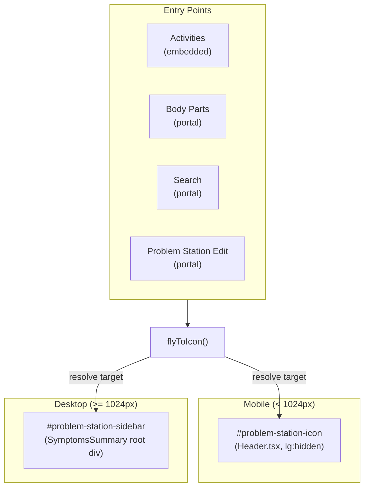

# Desktop Fly-to-Icon Animation

## Problem

The fly-to-icon animation currently only works on mobile. On desktop (>= 1024px):

- The mobile target `#problem-station-icon` in [Header.tsx](app/_components/layout/Header.tsx) has `lg:hidden`, making it `display: none`
- `getBoundingClientRect()` on a hidden element returns zeros, so the animation flies to `(0, 0)` with broken scale values
- Desktop uses a **sticky right sidebar** in [app/(pages)/layout.tsx](app/(pages)/layout.tsx) for the Problem Station, which has no animation target ID

## Architecture




## Changes

### 1. Add target ID to SymptomsSummary

In [app/_components/symptoms/SymptomsSummary.tsx](app/_components/symptoms/SymptomsSummary.tsx) line 491, add `id="problem-station-sidebar"` to the root `<div>`:

```tsx
<div id="problem-station-sidebar" className="bg-white dark:bg-spots-blue rounded-lg shadow-md overflow-hidden">
```

### 2. Extract target resolution into a helper

In [app/_components/symptoms/SymptomQuestionnaire.tsx](app/_components/symptoms/SymptomQuestionnaire.tsx), replace the hardcoded `document.getElementById('problem-station-icon')` in `flyToIcon` with a helper that picks the first *visible* target:

```tsx
const getFlyTarget = (): HTMLElement | null => {
  for (const id of ['problem-station-sidebar', 'problem-station-icon']) {
    const el = document.getElementById(id);
    if (!el) continue;
    const rect = el.getBoundingClientRect();
    if (rect.width > 0 && rect.height > 0) return el;
  }
  return null;
};
```

- Tries the sidebar first (visible on desktop, hidden on mobile)
- Falls back to the header icon (visible on mobile, hidden on desktop)
- Skips elements with zero dimensions (`display: none` from `lg:hidden`)
- Returns `null` if neither is visible (animation gracefully skips)

### 3. Update `flyToIcon` to use the helper

Replace `document.getElementById('problem-station-icon')` with `getFlyTarget()`. The rest of the animation math (deltas, scale, embedded clone path, portal path) stays identical -- it's all based on `getBoundingClientRect()` which works the same for both targets.

### 4. No changes needed to `runPostSubmitEffects`

The embedded vs portal branching and the save/close timing are independent of which target the animation flies toward. All three entry points (Activities, Body Parts, Search) continue working as-is.

## Files touched

- `app/_components/symptoms/SymptomsSummary.tsx` -- add `id` to root div (1 line)
- `app/_components/symptoms/SymptomQuestionnaire.tsx` -- add `getFlyTarget` helper, update `flyToIcon` call (small change)

