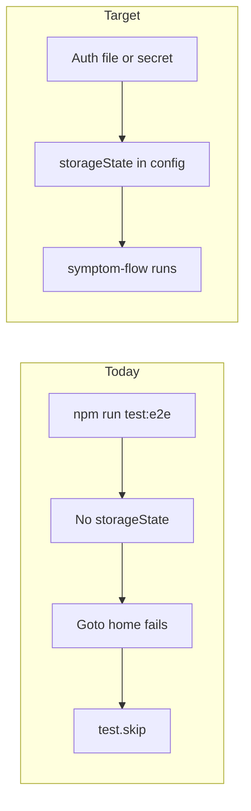

# E2E authenticated Playwright setup

## What you already have

- `[playwright.config.ts](playwright.config.ts)`: when `E2E_STORAGE_STATE` is set to a file path, Playwright loads that [storage state](https://playwright.dev/docs/auth#reusing-signed-in-state) for every test.
- `[e2e/symptom-flow.spec.ts](e2e/symptom-flow.spec.ts)`: opens `/`, waits for `/home`; if not authenticated within ~20s it **skips** (so runs without a state file do not fail—they also do not validate the flow).
- `[docs/testing/e2e.md](docs/testing/e2e.md)`: describes storage state and hypothetical `E2E_CHILD_EMAIL` / `E2E_CHILD_PASSWORD` (those env vars are **not referenced anywhere in code**).

## What is missing

| Gap                                                | Why it matters                                                                                                                                                                     |
| -------------------------------------------------- | ---------------------------------------------------------------------------------------------------------------------------------------------------------------------------------- |
| No `e2e/*.setup.ts` / Playwright **setup project** | No first-class “step 1: produce `user.json`” in-repo; today you must hand-roll saving state.                                                                                       |
| No `e2e/.auth/` convention + **gitignore**         | Risk of committing cookies/tokens; no standard path for local + docs.                                                                                                              |
| **Google OAuth** on `[app/page.tsx](app/page.tsx)` | Fully automated login in CI is hard without either (a) a saved storage file from a secret, or (b) a future test-only Cognito username/password path in the UI (not present today). |
| No **CI workflow** running Playwright              | `[amplify.yml](amplify.yml)` and `[.github/workflows/](.github/workflows/)` do not run `npm run test:e2e`; nothing enforces the critical path on merge.                            |
| Skip-on-no-auth hides failures                     | In CI, “all skipped” can look like success unless you check Playwright exit/reporter output.                                                                                       |

## Recommended approach (two layers)

### Layer A — Local developer workflow (minimal code)

1. **Ignore secrets**: add `e2e/.auth/` (or `e2e/.auth/*.json`) to `[.gitignore](.gitignore)`.
2. **Default path**: document and optionally support a conventional file, e.g. `e2e/.auth/user.json`, by either:
  - Setting `E2E_STORAGE_STATE=e2e/.auth/user.json` in docs / a small npm script, **or**
  - Extending `[playwright.config.ts](playwright.config.ts)` to default to that path when the file exists (still allow `E2E_STORAGE_STATE` override).
3. **One-time auth capture** (choose one pattern; both are valid):
  - **Playwright UI / headed**: run against the app, complete Google sign-in manually once, then call `page.context().storageState({ path: 'e2e/.auth/user.json' })` from a tiny setup test or the Playwright inspector workflow (document exact steps in `[docs/testing/e2e.md](docs/testing/e2e.md)`).
  - **Dedicated setup project**: add `e2e/auth.setup.ts` using `test as setup` from Playwright that navigates to `/`, uses `page.pause()` in headed mode the first time (developer completes OAuth), then saves `e2e/.auth/user.json`; mark `[playwright.config.ts](playwright.config.ts)` `projects` so **authenticated** tests `dependOn` setup **or** use `storageState` pointing at that file when present.

### Layer B — CI (protect beta)

1. **Store the auth JSON as a CI secret** (e.g. GitHub Actions: entire file contents or base64). Before `playwright test`, write it to a path (e.g. `e2e/.auth/user.json`) and set `E2E_STORAGE_STATE` to that path.
2. **Add a workflow** (e.g. `.github/workflows/e2e.yml`) that:
  - Checks out repo, installs deps, installs Playwright browsers.
  - Builds/starts the app (or sets `E2E_BASE_URL` to a fixed staging URL your team controls).
  - Injects backend/REDCap-related env if the Next server needs them for the symptom API (align with `[docs/testing/e2e.md](docs/testing/e2e.md)` “test project / staging” rule).
3. **Fail if auth is required but missing**: e.g. in CI set `CI=true` and either remove the skip in favor of `expect` on `/home`, or add an env like `E2E_REQUIRE_AUTH=1` that makes the spec **fail** when not logged in (so “skipped critical path” cannot masquerade as green). `[playwright.config.ts](playwright.config.ts)` already sets `forbidOnly` in CI.

### Optional follow-up (larger product change)

- Implement a **test-only login** (username/password or magic link) gated by env and **only enabled in non-prod**, then wire `E2E_CHILD_EMAIL` / `E2E_CHILD_PASSWORD` in a real setup spec. That avoids OAuth in CI but requires Cognito/app changes and security review—not required if Layer B is acceptable.

## Doc fixes

- Update `[docs/testing/e2e.md](docs/testing/e2e.md)`: add `E2E_STORAGE_STATE` to the env table; clarify that `E2E_CHILD_`* are **future / unused** unless you build that path; add “generate auth file” and “CI secret” steps; note **token expiry** (refresh token lifetime)—regenerate the file when sessions stop working.

## Success criteria

- A new developer can follow docs once, produce `e2e/.auth/user.json`, run `npm run test:e2e`, and see **symptom-flow execute** (not skipped).
- CI (when enabled) runs the same spec with a secret-provided file and **fails** if the app never reaches `/home` or the flow breaks.

