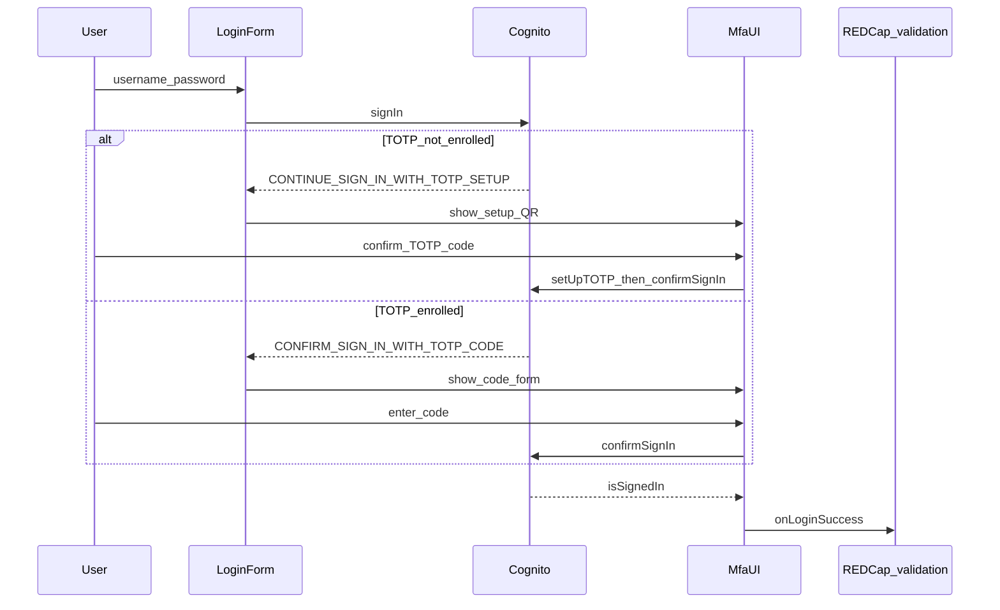

# Enforce MFA in Cognito + app login flow

## Context

From [UTH security concerns](LOCAL/security/from-UTH/security-concerns.md) and [prior checklist](315ae8ca-0ff6-4ed2-afc5-177f281cfb65): **SSO + MFA** is blocking remediation #1. [TODO.md](docs/todo/TODO.md) already says: Cognito pool **REQUIRED** + login `confirmSignIn` UI.

**Current gaps**

- Auth is [`referenceAuth`](amplify/auth/resource.ts) against a shared Cognito pool — MFA cannot be set in Amplify Gen2 resource code; it must be changed on the **existing User Pool** (Console/CLI).
- Pool create script still uses `--mfa-configuration OPTIONAL` ([`docs/cognito/create-user-pool/create-new-pool.sh`](docs/cognito/create-user-pool/create-new-pool.sh)).
- [`useLogin`](app/_lib/hooks/auth/useLogin.ts) detects `CONFIRM_SIGN_IN_WITH_SMS_CODE` / `CONFIRM_SIGN_IN_WITH_TOTP_CODE` but only sets an error; [`LoginForm`](app/_components/auth/LoginForm.tsx) never switches to an MFA view (`requiresChallenge` is ignored).
- No `CONTINUE_SIGN_IN_WITH_TOTP_SETUP` / `setUpTOTP` path — required once MFA is REQUIRED for users who have not enrolled yet.
- Forced password change already shows the pattern to copy: [`PasswordChangeForm`](app/_components/auth/PasswordChangeForm.tsx) + [`usePasswordChange`](app/_lib/hooks/auth/usePasswordChange.ts) + landing view switch in [`app/(landing)/page.tsx`](app/(landing)/page.tsx).

**Recommended product defaults (for this PR)**

- **Method:** TOTP (authenticator app) only — no SMS MFA in-app (avoids phone/PHI friction and SNS cost).
- **Pool:** `MfaConfiguration = ON` (REQUIRED) with `SoftwareTokenMfaSettings` enabled.
- **Scope:** Native Cognito username/password users. Federated Google users satisfy MFA at Google; document that for UTH SSO+MFA.
- **Children:** MFA is per **Cognito account**, not per REDCap child. Shared parent/child login already signs into the parent Cognito user in many cases — one MFA enrollment per account. Stacey’s child-policy negotiation stays a policy note, not a separate code path.

## Implementation

### 1. Cognito pool (ops + docs)

- Document and run (when you have AWS access) something equivalent to:
  - `aws cognito-idp set-user-pool-mfa-config --user-pool-id $POOL_ID --mfa-configuration ON --software-token-mfa-configuration Enabled=true`
- Update [`create-new-pool.sh`](docs/cognito/create-user-pool/create-new-pool.sh) from `OPTIONAL` → `ON` and enable software-token MFA so future pools match.
- Short runbook under `docs/cognito/` (or extend existing create-user-pool doc): how to verify MFA config, that Google IdP users are excluded from Cognito MFA challenges, and that flipping REQUIRED forces first-login TOTP setup for existing native users.
- **Order:** ship app UI **before** or **with** flipping the live pool to REQUIRED (otherwise users hit a dead-end error).

### 2. Login challenge wiring

- Extend [`useLogin`](app/_lib/hooks/auth/useLogin.ts) to treat and return distinct next steps:
  - `CONFIRM_SIGN_IN_WITH_TOTP_CODE` → MFA code UI
  - `CONTINUE_SIGN_IN_WITH_TOTP_SETUP` → MFA setup UI
  - Optionally keep SMS detection as a clear “unsupported / contact support” message (do not build SMS UI unless pool enables SMS).
- Stop treating MFA as a hard error (`getSignInAdditionalAuthRequiredMessage`); navigate to the MFA view instead.
- Wire [`LoginForm`](app/_components/auth/LoginForm.tsx) → `onMfaRequired(step)` and landing page view (same pattern as `passwordChange`).

### 3. MFA UI + hooks (mirror password-change)

- Add `useMfaChallenge` (confirm TOTP via `confirmSignIn({ challengeResponse: code })`, then `onLoginSuccess`).
- Add `useMfaSetup` using Amplify `setUpTOTP` / `verifyTOTPSetup` / `updateMFAPreference` (or the Amplify v6 equivalents already in the project) for first-time enrollment, then continue sign-in.
- Add `MfaChallengeForm` and `MfaSetupForm` under `app/_components/auth/`, styled like existing login forms (labels, `aria-*`, focus, localized copy).
- Extend `LoginView` in [`app/(landing)/page.tsx`](app/(landing)/page.tsx) with `mfaChallenge` | `mfaSetup`.

### 4. Localization

- Add REDCap setting keys + EN/ES fallbacks for: MFA code prompt, setup instructions, invalid code, cancel/back to sign-in, QR helper text.
- Provide the key list + EN/ES strings in the PR notes so they can be added to REDCap (per project convention).

### 5. Tests

- Unit tests: `useLogin` returns MFA steps instead of only error; MFA hooks call `confirmSignIn` / setup APIs and call `onLoginSuccess` on success.
- Component a11y smoke for MFA forms (labels, error association) using existing `expectNoA11yViolations` pattern.
- Manual QA checklist: existing user with TOTP; new REQUIRED user first login setup; Google OAuth still works; password-change then MFA if Cognito chains steps (handle chained `nextStep` after password change if observed).

### 6. TODO / checklist updates

- Mark MFA TODO done in [`docs/todo/TODO.md`](docs/todo/TODO.md) after pool flip + UI land.
- Note UTH #1 remaining non-code piece: confirm with Stacey/security that Google SSO + Cognito TOTP satisfies “SSO and MFA,” and document child/account MFA policy.

## Out of scope (next checklist items)

- Cookie/`spots-user` authZ hardening
- Prod vulnerability scan
- SMS MFA, Okta/SAML
