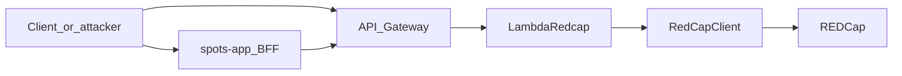

# Fix client-supplied `individual_id` IDOR across stack

## Threat model

Anyone with a **valid JWT** can call **API Gateway directly** and supply arbitrary `individual_id` values. **100% closure of that attack surface** requires the **Lambda / `[RedCapClient](SPOTS_backend/redcap_client.py)`** layer to never query or write REDCap for an `individual_id` outside the caller’s family. Hardening `**[spots-app](spots-app/app/api)**` routes is **defense in depth** (wrong ids fail fast with 403, misconfigured Gateway still protected by backend).

## 1. Mandatory: `[SPOTS_backend/redcap_client.py](SPOTS_backend/redcap_client.py)`

**Add a single enforcement primitive** (name can vary, e.g. `require_individual_in_family(account_id, individual_id: str) -> str`):

- Load allowlist via existing `[_get_family_individual_ids](SPOTS_backend/redcap_client.py)` (already parent + children).
- Normalize both sides to string (strip); treat missing user / empty allowlist as **deny** (raise `ValueError` or return a result the Lambda maps to **403**).
- **No silent fallback** to another id when the requested id is not in the set.

**Apply it everywhere a client-controlled id can select a record:**

| Method / area                                                 | Change                                                                                                                                                                                                                                                                                                                                                                          |
| ------------------------------------------------------------- | ------------------------------------------------------------------------------------------------------------------------------------------------------------------------------------------------------------------------------------------------------------------------------------------------------------------------------------------------------------------------------- |
| `[_resolve_individual_id](SPOTS_backend/redcap_client.py)`    | When `provided_individual_id` is set, **validate** before returning; never return a raw client id unchecked.                                                                                                                                                                                                                                                                    |
| `[get_symptom_responses](SPOTS_backend/redcap_client.py)`     | If `individual_id` is passed, require it in the family set before building filters / `records`.                                                                                                                                                                                                                                                                                 |
| `[get_reports_summary_data](SPOTS_backend/redcap_client.py)`  | Same when `individual_id` is set.                                                                                                                                                                                                                                                                                                                                               |
| `[get_reports_generate_data](SPOTS_backend/redcap_client.py)` | When `for_child` is true and an explicit child id is passed, **do not** trust it blindly: resolve through `[get_child_id](SPOTS_backend/redcap_client.py)` (same validation as symptom create) or `require_individual_in_family`. Today Lambda passes `child_individual_id` straight through (`[LambdaRedcap.py` `/reports/generate](SPOTS_backend/LambdaRedcap.py)` ~427–437). |
| `[create_symptom_record](SPOTS_backend/redcap_client.py)`     | After computing `final_individual_id` (from param, `data['individual_id']`, or account resolution), **assert** it is in the family set before import.                                                                                                                                                                                                                           |
| `[post_tracking](SPOTS_backend/redcap_client.py)`             | Validate `data["individual_id"]` with `require_individual_in_family` before `get_cur_login_id` / import.                                                                                                                                                                                                                                                                        |

**Edge cases to decide in implementation (same file):**

- **Symptom history “parent vs children” semantics** when `individual_id` is omitted: keep current filter logic; only tighten the branch where a **specific** `individual_id` is supplied.
- **Updates** (`create_symptom_record` overwrite): allowlist on `final_individual_id` still prevents attaching writes to arbitrary people’s records.

## 2. Mandatory: `[SPOTS_backend/LambdaRedcap.py](SPOTS_backend/LambdaRedcap.py)`

- `**/reports/generate`**: Prefer fixing behavior inside `get_reports_generate_data` so all callers get validation; if any logic stays in Lambda, mirror the `**/symptoms**` pattern: when `for_child` and `child_individual_id`, call `get_child_id(account_id, child_individual_id)` and map failures to **400/403** with a stable error body (consistent with existing `_build_error_response`).
- **Optional consistency**: If `parsed_body` ever gains `individual_id` for `/reports/summary`, run it through the same validation path as header/query (today only header/query are read ~328–334).

No Terraform change required unless you intentionally change the HTTP contract.

## *3. Recommended (defense in depth):* `[spots-app](spots-app)`

Backend fix stops **direct Gateway** abuse. To harden the **first-party BFF** and avoid forwarding obviously invalid ids:

- Add a small server-only helper (new file under e.g. `[spots-app/app/_lib/server/](spots-app/app/_lib/server/)` or extend `[spots-app/app/_lib/services/spots/family-service.ts](spots-app/app/_lib/services/spots/family-service.ts)`) that builds the allowlist: current user’s `individual_id` plus children from the same source the UI uses (e.g. `/api/family` / `FamilyService`), then `**403`** if the requested id is not listed.
- Wire it into routes that currently forward client-controlled ids to Lambda:
  - `[spots-app/app/api/symptoms/history/route.ts](spots-app/app/api/symptoms/history/route.ts)`
  - `[spots-app/app/api/reports/summary/route.ts](spots-app/app/api/reports/summary/route.ts)`
  - `[spots-app/app/api/reports/generate/route.ts](spots-app/app/api/reports/generate/route.ts)`
  - `[spots-app/app/api/symptoms/route.ts](spots-app/app/api/symptoms/route.ts)` (POST/PATCH bodies)
  - `[spots-app/app/api/analytics/page-visit/route.ts](spots-app/app/api/analytics/page-visit/route.ts)`
  - `[spots-app/app/api/user/child-customization/route.ts](spots-app/app/api/user/child-customization/route.ts)` (comment claims access check; implement it)
  - `[spots-app/app/api/user/profile/route.ts](spots-app/app/api/user/profile/route.ts)` POST when body includes `individual_id`
- Update `[spots-app/app/_lib/services/spots/user-settings-service.ts](spots-app/app/_lib/services/spots/user-settings-service.ts)` only if you centralize “call Lambda with optional `individual_id`” there—either validate inside this service or ensure every caller validates first.

## 4. Same bug class, different field: `[spots-app/app/api/family/child-id/route.ts](spots-app/app/api/family/child-id/route.ts)`

**POST** uses `family_id` from the body; when `user.family_id` is falsy, the guard `user.family_id && user.family_id !== family_id` **skips** and can allow querying another family. Tighten to: **deny** if session user has no `family_id` **or** `family_id` does not match (fail closed).

## 5. Verification

- **Manual**: Re-run the original `curl` against `/reports/summary` with another `individual_id` — expect **403** (or **400** with clear message), not another user’s rows.
- **Automated**: Add focused tests where the repo already tests Python (e.g. extend `[SPOTS_backend/rc_tester.py](SPOTS_backend/rc_tester.py)` patterns or add pytest) for `require_individual_in_family` + one Lambda-path integration mock if feasible. For Next, a small unit test on the new allowlist helper with mocked `User` + children.

## 6. Out of scope unless you explicitly want it

- `**[SpotSymptoms](SpotSymptoms)`** (.NET): different host; not exercised by the Gateway curl. Separate audit if legacy is still deployed with overlapping data.
- **Docs / wiki**: Update API contract docs under `[spots-app/docs/backend/](spots-app/docs/backend/)` only if you want the written contract to match “server validates all ids.”

## Summary: files to touch for “fully fixed” vs “backend-only”

| Goal                                                                | Files                                                                                                                                                                                                                                                                              |
| ------------------------------------------------------------------- | ---------------------------------------------------------------------------------------------------------------------------------------------------------------------------------------------------------------------------------------------------------------------------------- |
| **Stop IDOR at Gateway (required)**                                 | `[SPOTS_backend/redcap_client.py](SPOTS_backend/redcap_client.py)`, optionally small edits in `[SPOTS_backend/LambdaRedcap.py](SPOTS_backend/LambdaRedcap.py)` for error mapping / `/reports/generate` if not fully encapsulated in `RedCapClient`                                 |
| **BFF + family_id hardening (recommended for “all files” / depth)** | Routes listed in section 3 + `[spots-app/app/_lib/services/spots/user-settings-service.ts](spots-app/app/_lib/services/spots/user-settings-service.ts)` if needed + new server helper + `[spots-app/app/api/family/child-id/route.ts](spots-app/app/api/family/child-id/route.ts)` |

