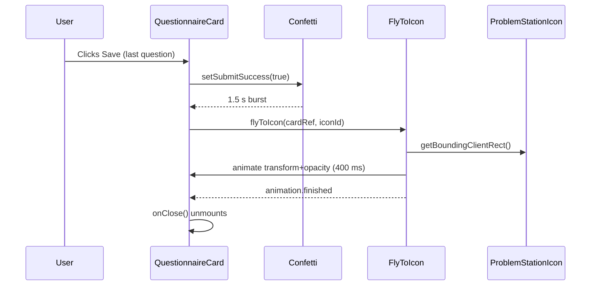

# Fly-to-Icon Animation for Symptom Questionnaire

## How it works today

1. User answers all PRO-CTCAE questions in `SymptomQuestionnaire`.
2. On save success, `setSubmitSuccess(true)` triggers a 3-second confetti burst (lines 216-255 of [SymptomQuestionnaire.tsx](spots-app/app/_components/symptoms/SymptomQuestionnaire.tsx)).
3. After a 1.5 s `setTimeout`, `onClose()` unmounts the modal (lines 535-537 for updates, 892-894 for new submissions).

## What changes

After confetti finishes, the card visually shrinks and slides into the Problem Station icon before the modal unmounts. No new npm packages -- just the Web Animations API (`element.animate()`), which is GPU-composited for smooth performance.




## File changes

### 1. Header.tsx -- add a stable ID to the Problem Station icon button

In [Header.tsx](spots-app/app/_components/layout/Header.tsx) (line ~522), add `id="problem-station-icon"` to the mobile Problem Station `<Button>`. This gives the animation a DOM target to fly toward without needing cross-component refs or context.

```tsx
<Button
  id="problem-station-icon"       // <-- add this
  variant="ghost"
  size="small"
  onClick={toggleProblemStation}
  ...
>
```

One-line change.

### 2. SymptomQuestionnaire.tsx -- add ref, flyToIcon helper, and wire into close flow

**a) Add a `useRef` on the card wrapper**

Attach a `ref` to the `.questionnaireCard` div (line ~932) so we can grab its bounding rect:

```tsx
const cardRef = useRef<HTMLDivElement>(null);
// ...
<div ref={cardRef} className={styles.questionnaireCard}>
```

**b) Create `flyToIcon` utility function**

A ~20-line helper that:

1. Looks up `#problem-station-icon` via `document.getElementById`.
2. Computes the delta and scale from card rect to icon rect.
3. Calls `element.animate()` with `transform` + `opacity` (GPU-composited, no layout thrashing).
4. Returns `animation.finished` (a native Promise).
5. Falls back gracefully (resolves immediately) if the icon isn't in the DOM.

```typescript
const flyToIcon = async (cardEl: HTMLElement): Promise<void> => {
  const target = document.getElementById('problem-station-icon');
  if (!target) return;

  const from = cardEl.getBoundingClientRect();
  const to = target.getBoundingClientRect();

  const deltaX = to.left + to.width / 2 - (from.left + from.width / 2);
  const deltaY = to.top + to.height / 2 - (from.top + from.height / 2);
  const scaleX = to.width / from.width;
  const scaleY = to.height / from.height;

  const anim = cardEl.animate(
    [
      { transform: 'translate(-50%, -50%) translate(0, 0) scale(1)', opacity: '1' },
      { transform: `translate(-50%, -50%) translate(${deltaX}px, ${deltaY}px) scale(${scaleX}, ${scaleY})`, opacity: '0' },
    ],
    { duration: 400, easing: 'cubic-bezier(0.4, 0, 0.2, 1)', fill: 'forwards' }
  );

  await anim.finished;
};
```

Note the `translate(-50%, -50%)` prefix in the keyframes -- this preserves the card's existing CSS centering transform so the start position is correct.

**c) Replace both `setTimeout(() => onClose(), 1500)` calls**

Currently there are two identical `setTimeout` blocks (line 535 for updates, line 892 for new submissions). Both become:

```typescript
setTimeout(async () => {
  if (cardRef.current) {
    await flyToIcon(cardRef.current);
  }
  onClose();
}, 1500);
```

The 1.5 s delay stays so confetti plays first, then the fly animation runs for 400 ms, then `onClose()` unmounts. Total perceived time stays roughly the same (confetti overlaps with the delay, then 400 ms fly -- users see the card "whoosh" away instead of a hard cut).

### 3. SymptomQuestionnaire.module.css -- no changes needed

The existing `slideIn` keyframe handles the entrance. The exit is handled entirely by the Web Animations API at runtime, which overrides CSS animations. No new CSS needed.

## Edge cases handled

- **Icon not visible (desktop sidebar layout)**: `getElementById` returns `null`, `flyToIcon` resolves immediately, modal closes normally with no animation.
- **Error on save**: `submitSuccess` stays `false`, confetti never fires, the setTimeout/fly code path is never reached. Existing error display logic is untouched.
- **Browser doesn't support WAAPI**: All modern browsers support `element.animate()`. The app already requires modern browser features (e.g., `createPortal`, CSS custom properties). No polyfill needed.
- **Reduced motion preference**: We could optionally wrap the animation in a `prefers-reduced-motion` check to skip it for accessibility (recommended but not blocking).

## Optional enhancement: respect `prefers-reduced-motion`

Add one line at the top of `flyToIcon`:

```typescript
if (window.matchMedia('(prefers-reduced-motion: reduce)').matches) return;
```

This skips the animation for users who have system-level motion reduction enabled -- good accessibility practice for a healthcare app.