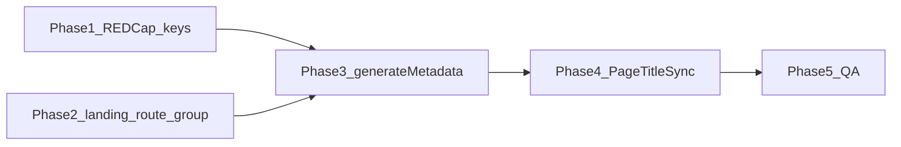

# Plan: Full title and meta description coverage

## Current gaps (what “fixed” means)

| Bucket | Titles | Meta `description` |
|--------|--------|---------------------|
| 6 instruction routes | REDCap + layout | Instruction Parent/Child ([page-instruction-meta.ts](spots-app/app/_lib/i18n/page-instruction-meta.ts)) |
| Other signed-in `(pages)` (home, dashboard, help, settings, privacy) | REDCap + layout | Still **root** only ([app/layout.tsx](spots-app/app/layout.tsx)) |
| `/` (login) | Root `metadata.title.default` | Root global (mentions “Next.js”) |
| `/unauthorized`, `/auth/*` | Static English in segment layouts | Root global |
| Client language toggle | [page-titles.ts](spots-app/app/_lib/i18n/page-titles.ts) + [PageTitleSync.tsx](spots-app/app/_components/i18n/PageTitleSync.tsx) | Sync only for instruction routes + same guard as titles (no pathname-only DOM writes) |

## Phase 1 — REDCap and copy (blocking for “real” localization)

- **Inventory new `settings_id` rows** (English + `settings_text_es_other`) for anything not already in General:
  - **Landing** `/`: title (consider new row vs reusing `IndexTitle` — doc already flags this in [redcap-page-title-keys.md](spots-app/docs/uthealth/redcap-page-title-keys.md)); one-sentence **site** description (replace Next.js-centric blurb for SEO and families).
  - **Privacy** `/privacy`: `description` key (e.g. `PrivacyMetaDescription`) — short summary; legal may prefer distinct from full policy body.
  - **Home, dashboard, help, settings**: one description key each (no `instructionKeyBase` on those pages).
  - **Auth shells**: `/auth/error`, `/auth/callback`, `/auth/reporting-as` — title + description keys (doc notes no shipped keys today).
  - **Unauthorized**: wire to existing **`UnauthorizedTitle`** (tab currently says “Unauthorized” but REDCap has `UnauthorizedTitle`) and **`UnauthorizedText`** or a shorter **`UnauthorizedMetaDescription`** for meta if the full text is too long for `<meta>`.
- **Update** [docs/uthealth/redcap-page-title-keys.md](spots-app/docs/uthealth/redcap-page-title-keys.md) with a single table: route, title `settings_id`, description `settings_id`, fallbacks.
- **Optional:** mirror new keys into SpotSymptoms `GeneralEng.json` / `GeneralEsp.json` for parity with legacy tooling (if that repo stays the reference export).

## Phase 2 — App structure for `/` metadata

The login page lives at [app/page.tsx](spots-app/app/page.tsx) (client). Root [app/layout.tsx](spots-app/app/layout.tsx) cannot express “only for `/`” without affecting merge behavior for all children.

**Recommended approach:** introduce a **route group** so `/` has its own segment layout:

- Move `app/page.tsx` → `app/(landing)/page.tsx` (URL stays `/` because `(landing)` is omitted from the path).
- Add `app/(landing)/layout.tsx` exporting `generateMetadata` for that segment’s title + description (REDCap via `getServerLocSetting`).
- Keep [app/layout.tsx](spots-app/app/layout.tsx) for providers, fonts, and a **neutral** `metadata` fallback: either a short care-focused default `description` only, or move `description` entirely to children and set a minimal default on `(landing)` + every other top-level segment that needs one (avoid empty meta on edge routes).

## Phase 3 — Server metadata in code

- **Signed-in layouts missing `description`:** extend `generateMetadata` in [home/layout.tsx](spots-app/app/(pages)/home/layout.tsx), [dashboard/layout.tsx](spots-app/app/(pages)/dashboard/layout.tsx), [help/layout.tsx](spots-app/app/(pages)/help/layout.tsx), [settings/layout.tsx](spots-app/app/(pages)/settings/layout.tsx), [privacy/layout.tsx](spots-app/app/(pages)/privacy/layout.tsx) with `getServerLocSetting(descriptionKey, fallback)` in parallel with existing title fetches.
- **Auth / unauthorized:** replace static `export const metadata` with async `generateMetadata` in:
  - [app/unauthorized/layout.tsx](spots-app/app/unauthorized/layout.tsx)
  - [app/auth/error/layout.tsx](spots-app/app/auth/error/layout.tsx)
  - [app/auth/callback/layout.tsx](spots-app/app/auth/callback/layout.tsx)
  - [app/auth/reporting-as/layout.tsx](spots-app/app/auth/reporting-as/layout.tsx)
- **Root [app/layout.tsx](spots-app/app/layout.tsx):** update `description` (and optionally `title.default`) to the approved **global fallback** once landing owns `/`-specific strings; remove “Next.js” from user-facing default.
- **Developer `/test` routes:** decide policy (static EN only vs REDCap); lowest priority for UTHealth.

## Phase 4 — Client sync (`PageTitleSync` + maps)

Goal: language toggle updates **title and description** wherever SSR already set REDCap-backed values, without writing `document.title` / `meta` on **pathname-only** navigations (preserves the duplicate-`<title>` fix).

- Extend [page-titles.ts](spots-app/app/_lib/i18n/page-titles.ts) (or add `page-meta.ts`) with **description** entries:
  - Simple routes: `{ descriptionKey, descriptionFallback }` alongside existing title entries.
  - Instruction routes: keep using [PAGE_INSTRUCTION_META_BY_PATH](spots-app/app/_lib/i18n/page-instruction-meta.ts) + `userBusiness.role` (already in [PageTitleSync.tsx](spots-app/app/_components/i18n/PageTitleSync.tsx)).
- Add entries for **`/`, `/unauthorized`, `/auth/error`, `/auth/callback`, `/auth/reporting-as`** once keys exist (same effect object shape or parallel map).
- **Optional hardening:** `querySelector('meta[name="description"]')` can miss if Next emits multiple; prefer `document.querySelector` with first match or align with how Next 15 injects head (verify in dev after changes).

## Phase 5 — QA and regression

- Manual: DevTools on `/` → `/privacy` → signed-in home: **exactly one** `<title>`; `meta[name=description]` matches route after navigation and after EN/ES toggle.
- Automated: extend Playwright **a11y-public** or add a small metadata smoke spec that fetches HTML for `/`, `/privacy`, `/unauthorized` (and one auth route) with `Accept-Language` / cookie if tests support it.
- Run `npm run lint` on touched files.

## Dependency order

## Risks / constraints

- **HIPAA:** meta descriptions must stay high-level; no PHI in strings.
- **`/loc` cache:** one-hour `unstable_cache` on strings — document for stakeholders ([redcap-page-title-keys.md](spots-app/docs/uthealth/redcap-page-title-keys.md) already has caching note).
- **Route group move** for landing: update any imports or tests that referenced `app/page.tsx` path literally (grep after move).
