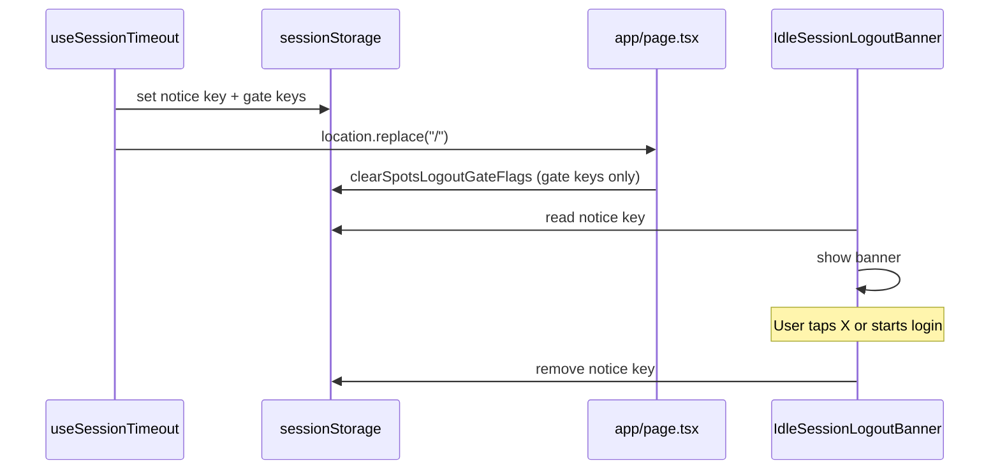

# Idle session logout banner on login page

## Context

- Idle timeout already sets `[SPOTS_IDLE_TIMEOUT_LOGOUT_KEY](app/_lib/constants/spots-logout.ts)` and redirects with `window.location.replace("/")` in `[useSessionTimeout.ts](app/_lib/hooks/auth/useSessionTimeout.ts)`.
- `[app/page.tsx](app/page.tsx)` runs `clearSpotsLogoutGateFlags()` in a `useEffect` when `authStatus === 'unauthenticated'`, which **removes** `SPOTS_IDLE_TIMEOUT_LOGOUT_KEY` immediately. That key is only meant to gate the “Logging out…” spinner vs. federated-auth edge cases—not to persist UX after landing.
- **Conclusion:** You cannot use the existing idle-timeout gate key to show a post-landing banner. Add a **separate** sessionStorage key that is **not** cleared by `clearSpotsLogoutGateFlags()`, and clear it only when the user dismisses the banner or starts a new login attempt.

## Implementation

### 1. Constants and helpers (`[app/_lib/constants/spots-logout.ts](app/_lib/constants/spots-logout.ts)`)

- Add something like `SPOTS_SESSION_TIMEOUT_NOTICE_KEY = 'spots_session_timeout_notice'` (name is arbitrary; keep it exported next to related logout constants).
- Add `clearSessionTimeoutNotice(): void` that `removeItem`s only that key.
- **Do not** fold this key into `clearSpotsLogoutGateFlags()` — that function is invoked on every unauthenticated transition in `[app/page.tsx](app/page.tsx)` (lines 82–87) and would wipe the banner before the user sees it.

### 2. Set the flag on timeout (`[app/_lib/hooks/auth/useSessionTimeout.ts](app/_lib/hooks/auth/useSessionTimeout.ts)`)

- In the same client block where you already set `SPOTS_IDLE_TIMEOUT_LOGOUT_KEY` (before `DELETE /api/user` / cleanup / `location.replace`), also `sessionStorage.setItem(SPOTS_SESSION_TIMEOUT_NOTICE_KEY, '1')`.
- Ensures the login page can detect “you were sent here by idle logout” after gate flags are cleared.

### 3. Clear the flag when starting login (`[app/_components/auth/LoginForm.tsx](app/_components/auth/LoginForm.tsx)`)

- Where `clearSpotsLogoutGateFlags()` is already called from `onLoginAttempt`, also call `clearSessionTimeoutNotice()` so a stale banner does not linger after the user commits to signing in again.

### 4. New UI component (implementation under `app/_components/`, not under `docs/`)

- Add a client component, e.g. `[app/_components/auth/IdleSessionLogoutBanner.tsx](app/_components/auth/IdleSessionLogoutBanner.tsx)` (name can be adjusted for consistency with `SessionTimeoutWarning`).
- **Behavior:** On mount, if `sessionStorage` has the notice key, set local state to visible. Close (X) removes the key and hides the banner.
- **Layout (per your spec):** Parent should be `relative` (already true on the main wrapper in `[app/page.tsx](app/page.tsx)` line 136: `className="relative min-h-screen"`). Banner: `absolute bottom-0 left-0 right-0 w-full`, sensible `z-index` (e.g. `z-50`), full-width bar with padding, optional top border / background aligned with login accent (`#5AA1D9` appears in `[LoginPageLayout.tsx](app/_components/auth/LoginPageLayout.tsx)`).
- **A11y:** `role="status"` or `role="alert"` for the message; dismiss control with `type="button"` and `aria-label` (e.g. “Dismiss”).
- **Copy:** Start with a clear default English string (e.g. that the session ended due to inactivity and they should sign in again). Optional improvement: wire `[useLocalization](app/_lib/hooks/loc/useLocalization.ts)` + a new REDCap/General string key later (requires SpotSymptoms JSON changes).

### 5. Mount on the login page (`[app/page.tsx](app/page.tsx)`)

- Render the banner inside the outer `relative min-h-screen` container in the main success path (same block as `LoginPageLayout`), so it sits at the bottom of that page shell.
- **Note:** Early returns (configuring spinner, error display, validating spinner) will not show the banner; that is acceptable because the notice key remains until dismiss/login, so when the user reaches the normal login layout the banner appears.

### 6. Documentation (`[docs/components/](docs/components/)`)

- Add a short markdown file, e.g. `docs/components/idle-session-logout-banner.md`, describing: purpose (parity with legacy auto-logout notice), trigger (idle timeout → redirect to `/`), storage key name, dismiss and login-attempt clearing, file path of the React component, and optional screenshot placeholder.
- Optionally add one line in `[docs/components/components.md](docs/components/components.md)` linking to it if you want it discoverable from the index (only if you want that file updated).

## Flow (mermaid)

## Non-goals

- Changing timeout durations in `[useSessionTimeout.ts](app/_lib/hooks/auth/useSessionTimeout.ts)` (your branch currently has dev-short values; revert separately if unintended).
- Putting the React component **inside** `docs/components/` — that folder is for documentation; keep TSX under `app/_components/`.

