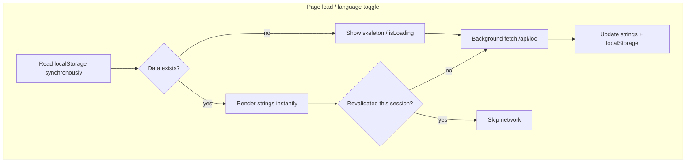

# Instant Language Switching Fix

## Answers to your three questions

### Why `blockOnLocalization={false}` on login/signup?

It was a deliberate tradeoff documented in [`LoginPageLayout.tsx`](app/_components/auth/LoginPageLayout.tsx):

```19:22:app/_components/auth/LoginPageLayout.tsx
   * When true (default), also block on localization loading (full-page spinner until strings load).
   * When false, show content as soon as showLoading is false; strings can load in background (e.g. login page).
```

The landing page already gates on auth (`showLoading={!authChecked && ...}`). With the default `blockOnLocalization={true}`, users would wait on **two** serial spinners: auth check, then REDCap `/api/loc`. Setting it to `false` let the login form appear while strings loaded in the background.

That tradeoff only made sense when loc was slow. It is the **wrong** choice once localStorage is instant — it exposes raw `settings_id` keys during network waits. After this fix, we can revert to `blockOnLocalization={true}` (or remove the prop) because strings will be available on first paint.

### Why doesn't initial state read localStorage?

Inconsistency, not intent. Two cache helpers evolved separately:

| Helper | Used for | Reads localStorage? |
|--------|----------|---------------------|
| `getCachedStringsIfValid()` | `useState` initializer | No (memory + sessionStorage only; can fall back to **other** language) |
| `getExactCachedStrings()` | `useEffect` on language change | Yes |

The initializer uses the older helper, so the first render starts with `{}` and `hasLoadedStrings=false` even when `spots_loc_persistent_*` is full. A `useEffect` fixes it one frame later — but on login (`blockOnLocalization={false}`) that frame shows raw keys.

### Why is localStorage ignored after 5 minutes?

The same `CACHE_DURATION` (5 min) is applied to **display** and **freshness**:

```43:43:app/_lib/hooks/loc/useLocalizedStrings.ts
    if (Number.isNaN(ts) || Date.now() - ts >= CACHE_DURATION) return null;
```

After 5 minutes the JSON stays in DevTools but the code treats it as a cache miss → blocking network fetch to `/api/loc` with retries (1s + 2s ≈ **3 seconds**). That contradicts why persistent storage exists.

**Correct model:** localStorage is always shown immediately; TTL only controls whether to refresh in the background.

---

## Target architecture



**Your chosen policy:** revalidate from REDCap **at most once per browser session** per language (tracked in `sessionStorage`, not localStorage TTL).

---

## Implementation plan

### 1. Extract cache utilities — new [`app/_lib/hooks/loc/loc-cache.ts`](app/_lib/hooks/loc/loc-cache.ts)

Move module-level cache maps and helpers out of `useLocalizedStrings.ts` for clarity and testing:

- `readPersistentLocCache(lang)` — parse localStorage, **no TTL**; return strings or `null`
- `writePersistentLocCache(lang, strings)` — existing write logic
- `hasRevalidatedThisSession(lang)` / `markRevalidatedThisSession(lang)` — sessionStorage flags `spots_loc_revalidated_en` / `spots_loc_revalidated_es`
- `readSyncCache(lang)` — unified synchronous read for first paint: memory → sessionStorage → localStorage (exact language only, no cross-language fallback)
- Keep in-memory `stringCache` for hot path after first load

Remove TTL-based **display** invalidation for persistent cache entirely. Keep a short in-memory TTL (5 min) only as a micro-optimization within the same tab session — not for blocking UI.

### 2. Refactor [`useLocalizedStrings.ts`](app/_lib/hooks/loc/useLocalizedStrings.ts)

**Initial state (fix the localStorage gap):**
```typescript
const initial = readSyncCache(language);
const [strings, setStrings] = useState(() => initial ?? {});
const [hasLoadedStrings, setHasLoadedStrings] = useState(() => !!initial);
const [isLoading, setIsLoading] = useState(() => !initial);
```

**Load strategy (stale-while-revalidate):**
1. If `readSyncCache(language)` has data → set state synchronously, `isLoading=false`
2. If `!hasRevalidatedThisSession(language)` → fire **non-blocking** `symptomService.getAllStrings(language)`, update state + caches on success, call `markRevalidatedThisSession(language)`
3. If no cache at all → blocking fetch (true first visit only); show skeleton via `isLoading && !hasLoadedStrings`

**Language toggle:**
- On `language` change, immediately `setStrings(readSyncCache(newLang) ?? {})` — no `useEffect`-only path
- Never set `isLoading=true` when stale localStorage exists for the target language
- Guard in-flight fetches with a `loadGeneration` ref so a slow fetch for `en` cannot overwrite state after user switched to `es`

**Remove** the `setTimeout` retry backoff for language loads (or cap at 1 fast retry). Retries turning a slow API into a 3s freeze is unacceptable when cache exists; on true first visit a single retry is enough.

### 3. Add `LocalizationProvider` — new [`app/_lib/contexts/LocalizationContext.tsx`](app/_lib/contexts/LocalizationContext.tsx)

Today every `useLocalization()` call (40+ components) creates a **separate** `useLocalizedStrings` instance with its own React state and effects. That means duplicate network work and inconsistent `isLoading` across `LoginPageLayout`, `SignupForm`, and `LanguageToggle`.

```
LanguageProvider
  └── LocalizationProvider   ← new, calls useLocalizedStrings once
        └── AuthProvider / rest of app
```

- Provider owns the single `useLocalizedStrings(language)` call
- [`useLocalization.ts`](app/_lib/hooks/loc/useLocalization.ts) becomes a thin consumer: `useLanguage()` + `useLocalizationContext()`
- Wire provider in [`app/layout.tsx`](app/layout.tsx) inside `LanguageProvider`

### 4. Preload the other language on first successful load

When either language is fetched or read from cache, opportunistically warm the other:

```typescript
const otherLang = language === 'en' ? 'es' : 'en';
if (readPersistentLocCache(otherLang)) {
  stringCache.set(otherLang, readPersistentLocCache(otherLang)!);
}
```

This makes the first toggle to the other language a sync `readSyncCache` hit with zero network.

### 5. Update `LanguageToggle` and `LoginPageLayout`

**[`LanguageToggle.tsx`](app/_components/ui/LanguageToggle.tsx):**
- `isLoading` should mean "no strings at all for this language" — not "background revalidate in progress"
- Remove `disabled={isLoading}` on toggle buttons when stale cache is showing (toggle must never be blocked after first visit)

**[`LoginPageLayout.tsx`](app/_components/auth/LoginPageLayout.tsx) + [`(landing)/page.tsx`](app/(landing)/page.tsx):**
- Revert `blockOnLocalization={false}` → default `true` (or delete the prop)
- With instant localStorage, login form and skeleton logic align: skeleton only on true first visit with empty cache

### 6. Tests — expand [`useLocalizedStrings.test.tsx`](app/_lib/hooks/loc/__tests__/useLocalizedStrings.test.tsx)

Add cases for the bugs being fixed:

| Test | Asserts |
|------|---------|
| Stale persistent cache (timestamp > 5 min ago) | Strings available on first render; `isLoading=false`; network not awaited |
| Language switch with stale `es` in localStorage | Instant `setStrings`, no 3s wait |
| Session revalidation flag | Network called once per lang per session; second mount skips fetch |
| In-flight race | Switch `en→es` while `en` fetch pending; final state is Spanish |
| `readSyncCache` initial state | `hasLoadedStrings=true` when only localStorage populated (no sessionStorage) |

Add provider test: two `useLocalization()` consumers share the same `strings` reference.

---

## Files touched (estimated)

| File | Change |
|------|--------|
| `app/_lib/hooks/loc/loc-cache.ts` | **New** — cache read/write/session revalidation |
| `app/_lib/hooks/loc/useLocalizedStrings.ts` | Stale-while-revalidate, sync init, race guard |
| `app/_lib/contexts/LocalizationContext.tsx` | **New** — single strings provider |
| `app/_lib/hooks/loc/useLocalization.ts` | Consume context |
| `app/layout.tsx` | Add `LocalizationProvider` |
| `app/_components/ui/LanguageToggle.tsx` | Don't block toggle during background refresh |
| `app/(landing)/page.tsx` | Remove `blockOnLocalization={false}` |
| `app/_lib/hooks/loc/__tests__/useLocalizedStrings.test.tsx` | New cases |
| `app/_lib/hooks/loc/__tests__/loc-cache.test.ts` | **New** — unit tests for cache helpers |

No backend or REDCap changes required.

---

## Expected outcome

| Scenario | Before | After |
|----------|--------|-------|
| Return visit, toggle language | Up to ~3s network wait; raw keys | Instant from localStorage |
| First visit (empty cache) | Skeleton + network | Skeleton + network (unchanged) |
| Page refresh with cache | 1-frame raw keys possible | Strings on first paint |
| REDCap refresh | Every 5 min blocks UI | Once per session, background only |
| 40+ hook instances | Duplicate fetches/effects | Single provider |
