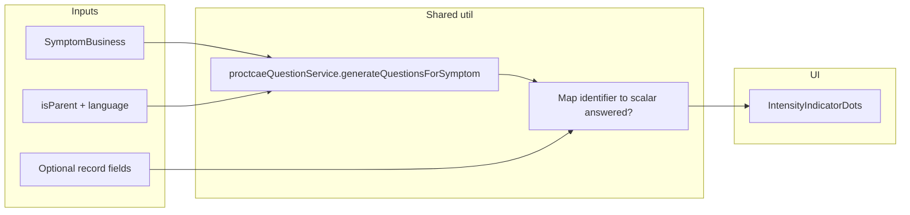

# Legacy-aligned symptom question dots

## Legacy reference (confirmed)

- [SpotSymptoms/Views/Shared/_SymptomCard.cshtml](SpotSymptoms/Views/Shared/_SymptomCard.cshtml): one SVG circle per `Model.questions` entry; green `#93C504` when `responses.Find(identifier).response != ""`, else lightgray.
- Question list = parent vs child from symptom JSON ([SpotSymptoms/Common/DataUtil.cs](SpotSymptoms/Common/DataUtil.cs) `createSymptomCard`).

## Modern gap

- [app/_lib/utils/count-proctcae-answered-fields.ts](spots-app/app/_lib/utils/count-proctcae-answered-fields.ts) counts up to four scalar fields **without** the symptom’s question template → wrong dot **count** vs legacy when a symptom has fewer questions.
- [app/(pages)/feelings/page.tsx](spots-app/app/(pages)/feelings/page.tsx) uses [SelectableCard](spots-app/app/_components/common/SelectableCard.tsx) with default `indicatorCount = 3` and no record → always three grey dots.
- [app/_components/symptoms/SymptomsSummary.tsx](spots-app/app/_components/symptoms/SymptomsSummary.tsx) and [app/(pages)/past-problems/page.tsx](spots-app/app/(pages)/past-problems/page.tsx) render only **filled** green dots (`answeredCount` length), not grey placeholders for unanswered questions.

## Approach: single helper + reuse PRO-CTCAE ordering

**Source of question order and count:** Reuse [app/_lib/services/pro-ctcae/question-service.ts](spots-app/app/_lib/services/pro-ctcae/question-service.ts) `proctcaeQuestionService` the same way [SymptomQuestionnaire.tsx](spots-app/app/_components/symptoms/SymptomQuestionnaire.tsx) does: `setLanguage(lang)` → `generateQuestionsForSymptom(symptom)` → pick `parent` or `child` array (same `isParent()` rule as the questionnaire). That keeps **dot count = progress bar segment count** and stays aligned with PPC/template ordering (including fallbacks inside the service).

**Per-dot “answered”:** For each generated question’s `identifier`, map to `RedcapSymptomRecord` / past-problem scalars (`symptom_presence`, `symptom_frequency`, `symptom_severity`, `symptom_interference`) and treat as answered when `String(value).trim() !== ''` (matches legacy empty check; `'0'` remains answered, consistent with existing [count-proctcae-answered-fields tests](spots-app/app/_lib/utils/__tests__/count-proctcae-answered-fields.test.ts)).

## Implementation steps

1. **Add pure utility module** (e.g. [app/_lib/utils/legacy-symptom-question-dot-states.ts](spots-app/app/_lib/utils/legacy-symptom-question-dot-states.ts))
   - Export something like `getLegacySymptomQuestionDotStates(symptom, { isParent, language, record? }): boolean[]` (or `{ answered: boolean }[]`).
   - Internally: `proctcaeQuestionService.setLanguage(language)`; `const list = isParent ? generate(...).parent : generate(...).child`; for each question, read the matching scalar from `record` (when `record` omitted, all `false` for menu cards).
   - Optional small export: `legacyDotColorsFromStates(states: boolean[])` → `(string | undefined)[]` for [IntensityIndicatorDots](spots-app/app/_components/common/IntensityIndicatorDots.tsx) (`#93C504` / `#D3D3D3` or project tokens if you prefer CSS variables—keep parity with legacy hex unless design says otherwise).

2. **Adjust `IntensityIndicatorDots` only if needed**
   - Today it supports `indicatorColors` per slot; likely sufficient.
   - Optional: `size="sm" | "md"` (e.g. `w-2 h-2` vs `h-3 w-3`) so list rows can match legacy ~16px circles without duplicating markup—only if you want visual parity with legacy cards vs feelings corners.

3. **Feelings page**
   - Use `useUser` / same `isParent()` pattern as `SymptomQuestionnaire`.
   - For each grid item, read `symptomMap[f.key]` (already [SymptomBusiness](spots-app/app/_lib/types/business/symptoms.ts) with `questions`).
   - Pass into `SelectableCard`: `indicatorCount={states.length}`, `indicatorColors={legacyDotColorsFromStates(states)}` (menu = no record → all grey), or keep `indicatorLevel` API if simpler—prefer one prop path (`indicatorColors`) to avoid double semantics.

4. **SymptomsSummary (Problem Station rows)**
   - Extend the existing `symptomService.getAllSymptoms` load to retain a **`Map<symptomId, SymptomBusiness>`** (not only term strings) so each `SymptomItem` row can resolve a template.
   - Replace the `Array.from({ length: countProctcaeAnsweredFields(...) })` block with `IntensityIndicatorDots` (or a 3-line wrapper) driven by `getLegacySymptomQuestionDotStates(template, { isParent, language, record: symptom.record })`.
   - **Edge:** missing template for `symptomId` → show **no dots** (or 0-width) rather than guessing; log in dev if useful.

5. **Past Problems page**
   - Add a one-time load of `symptomService.getAllSymptoms(language)` (same service as elsewhere) into a `Map<symptomId, SymptomBusiness>` keyed by id.
   - Build `record`-like object from `PastProblem` scalars (same fields as today’s `answeredFieldsFromPastProblem`) and pass into the same helper with `isParent()` + language.
   - Replace the current green-only `Array.from({ length: answeredCount })` with full grey+green slots.

6. **Tests**
   - New [app/_lib/utils/__tests__/legacy-symptom-question-dot-states.test.ts](spots-app/app/_lib/utils/__tests__/legacy-symptom-question-dot-states.test.ts): fixture `SymptomBusiness` with 2 vs 4 questions; partial records; `'0'` counted answered; empty record → all false.

7. **Cleanup**
   - Remove or narrow use of `countProctcaeAnsweredFields` for **UI dots only**; keep the util if still referenced elsewhere, or add a short comment that it is **not** legacy dot semantics.

## Files touched (expected)

| Area | File |
|------|------|
| New util + tests | `app/_lib/utils/legacy-symptom-question-dot-states.ts`, `app/_lib/utils/__tests__/legacy-symptom-question-dot-states.test.ts` |
| Optional UI tweak | `app/_components/common/IntensityIndicatorDots.tsx` |
| Feelings | `app/(pages)/feelings/page.tsx` |
| Problem Station | `app/_components/symptoms/SymptomsSummary.tsx` |
| Past Problems | `app/(pages)/past-problems/page.tsx` |

## QA checklist

- Symptom with **two** generated questions → **two** dots on feelings card, Problem Station, Past Problems, and **two** progress segments in `SymptomQuestionnaire`.
- Parent vs child templates differ → dot **count** changes when switching reporter role (same as questionnaire).
- `search_unmatched` / missing template → no misleading dot strip.
