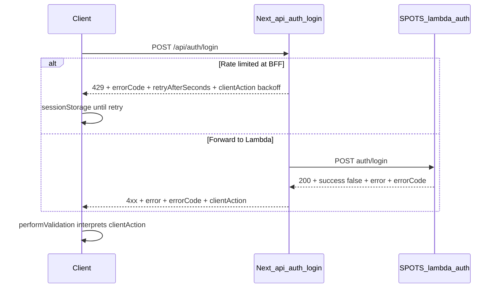

# Server-driven login outcomes + sessionStorage backoff

## Goal

After a failed login validation, the app should behave predictably **even after refresh**:

- **Not in REDCap / forbidden**: treat as definitive—clear SPOTS cookies and Cognito session (already largely handled in [`performValidation`](spots-app/app/_lib/services/auth/login-service.ts)); keep behavior explicit via `clientAction: 'sign_out'`.
- **Rate limited (429)** from [`app/api/auth/login/route.ts`](spots-app/app/api/auth/login/route.ts): **do not** sign out; persist **until when** to skip auto `validateAndRedirect`, using `Retry-After` / `retryAfterSeconds` already computed server-side (lines 200–214).

Optional refinement (recommended in this work): **5xx / network-style failures** should **`sign_out: false`** so a transient outage does not wipe Cognito when the user could retry.

## 1. Contract (JSON shape)

Add optional fields on **failed** responses from `POST /api/auth/login` (success responses unchanged):

| Field | Type | Purpose |
|-------|------|---------|
| `errorCode` | string | Stable enum, e.g. `RATE_LIMIT`, `USER_NOT_IN_REDCAP`, `FORBIDDEN`, `INVALID_ORIGIN`, `UPSTREAM_ERROR`, `LOGIN_FAILED` |
| `clientAction` | `'sign_out' \| 'backoff' \| 'none'` | What the SPA must do after this response |
| `retryAfterSeconds` | number | Only when `clientAction === 'backoff'` (or `errorCode === RATE_LIMIT`) |

**Recommended:** Document the contract in one place, e.g. [`docs/backend/spots-app-api-routes.md`](spots-app/docs/backend/spots-app-api-routes.md) or a short `docs/auth/login-response-contract.md`.

## 2. SPOTS_backend (Lambda) — [`lambda_auth.py`](SPOTS_backend/lambda_auth.py)

**Why:** Today failures use human `message` only ([`RedCapClient.login`](SPOTS_backend/lambda_auth.py) returns `User not found in REDCap`, `Forbidden`, etc.; handler maps to `error` at line ~523). String matching in the Next app is brittle.

**Changes:**

- When returning `success: False`, include **`errorCode`** alongside existing `error` / `message`:
  - No user row: `errorCode: "USER_NOT_IN_REDCAP"` (from `{"success": False, "message": "User not found in REDCap"}`).
  - Email mismatch on enforced selection: `errorCode: "FORBIDDEN"` (from `"Forbidden"`).
  - Identifier missing / unknown endpoint / generic: `errorCode: "LOGIN_FAILED"` or more specific codes as you prefer.
- Keep **`needsReportingAs`** payloads unchanged (no `clientAction` required; client already handles).
- **500** exception handler: add `errorCode: "INTERNAL_ERROR"`.

No API Gateway path change—body shape extension only.

## 3. Next.js BFF — [`app/api/auth/login/route.ts`](spots-app/app/api/auth/login/route.ts)

- **429 branch** (existing rate limiter): add to JSON body:
  - `errorCode: "RATE_LIMIT"`
  - `clientAction: "backoff"`
  - `retryAfterSeconds: resetSeconds` (already computed; aligns with `Retry-After` header)
- **Lambda non-2xx / JSON error** forwarding: pass through `errorCode` if present; else **derive** from HTTP status (`502` → `UPSTREAM_ERROR`, etc.).
- **Lambda `success: false`** (lines 339–365): include `errorCode` from `result.errorCode` when forwarding; set **`clientAction`** in BFF:
  - `USER_NOT_IN_REDCAP`, `FORBIDDEN` → `sign_out`
  - `INTERNAL_ERROR`, upstream 5xx → `none` (recommended) or `sign_out` per product choice—**recommended `none`** to avoid logging users out on transient failures.
- **403 invalid origin**: `errorCode: "INVALID_ORIGIN"`, `clientAction: "none"` (sign-out is optional; user may not be in a coherent Cognito flow).

## 4. Client — [`login-service.ts`](spots-app/app/_lib/services/auth/login-service.ts) and [`spots-logout.ts`](spots-app/app/_lib/constants/spots-logout.ts)

- Add sessionStorage helpers (pattern matches idle timeout / signup notice), e.g.:
  - Keys: `spots_login_backoff_until` (timestamp ms), optional `spots_login_backoff_message`
  - `setLoginBackoffUntil(timestampMs)`, `clearLoginBackoff()`, `getLoginBackoffRemainingMs()`
- In **`performValidation`** after parsing JSON:
  1. If `response.status === 429` or `clientAction === 'backoff'`: `setLoginBackoffUntil(Date.now() + retryAfterSeconds * 1000)`, `setError(...)`, **return false** without `signOut`.
  2. If `clientAction === 'sign_out'` (or fallback: `errorCode` in `USER_NOT_IN_REDCAP`, `FORBIDDEN`): **existing** `clearCognitoSessionAfterValidationFailure()`.
  3. If `clientAction === 'none'`: `setError` only, **no** `signOut` (new behavior for 5xx / generic).

Backward compatibility: if `clientAction` is missing, keep current behavior (**sign out on any non-429 failure**) unless you intentionally map legacy responses—prefer always sending `clientAction` from BFF after this change.

## 5. Client — [`useAuthValidation.ts`](spots-app/app/_lib/hooks/auth/useAuthValidation.ts)

At the start of **`runValidationGuarded`** (or at the top of **`validateAndRedirect`**):

- If `getLoginBackoffRemainingMs() > 0`, **skip** calling the network (optional: surface error from storage or a generic “try again later”). This fixes **refresh** after 429.

Clear backoff when:

- User explicitly starts login again (e.g. [`LoginForm`](spots-app/app/_components/auth/LoginForm.tsx) `handleLoginAttempt` / landing `onLoginAttempt`) — mirror `clearSignupVerifiedNotice` pattern.
- Backoff window expired (lazy clear on read is enough).

## 6. Tests

- **Jest** [`login-service.test.ts`](spots-app/app/_lib/services/auth/__tests__/login-service.test.ts): mock fetch returning `429` + `retryAfterSeconds`; assert **no** `signOut`, assert backoff setter called (mock storage).
- Add test for `clientAction: 'none'` + 502 → no signOut.
- **Lambda** (optional): extend [`local_auth_test.py`](SPOTS_backend/local_auth_test.py) or unit test for `errorCode` on synthetic failure payload.

## 7. Out of scope / follow-ups

- Changing rate-limit thresholds (still [`loginRateLimiter`](spots-app/app/_lib/utils/rate-limiter.ts)).
- i18n for new generic backoff copy (can use `getLocSetting` + fallback).

## Files touched (summary)

| Area | Files |
|------|--------|
| Backend | [`SPOTS_backend/lambda_auth.py`](SPOTS_backend/lambda_auth.py) (`RedCapClient.login` return dicts + failure JSON body) |
| BFF | [`spots-app/app/api/auth/login/route.ts`](spots-app/app/api/auth/login/route.ts) |
| Client | [`spots-app/app/_lib/constants/spots-logout.ts`](spots-app/app/_lib/constants/spots-logout.ts), [`spots-app/app/_lib/services/auth/login-service.ts`](spots-app/app/_lib/services/auth/login-service.ts), [`spots-app/app/_lib/hooks/auth/useAuthValidation.ts`](spots-app/app/_lib/hooks/auth/useAuthValidation.ts), [`spots-app/app/(landing)/page.tsx`](spots-app/app/(landing)/page.tsx) (`onLoginAttempt` clears backoff) |
| Docs | New or existing API doc |
| Tests | [`login-service.test.ts`](spots-app/app/_lib/services/auth/__tests__/login-service.test.ts), optional `local_auth_test.py` |

**Deployment note:** Deploy Lambda (or however `lambda_auth` ships) before or together with the Next.js change so `errorCode` is present; BFF should tolerate missing `errorCode` during rollout via safe defaults.
