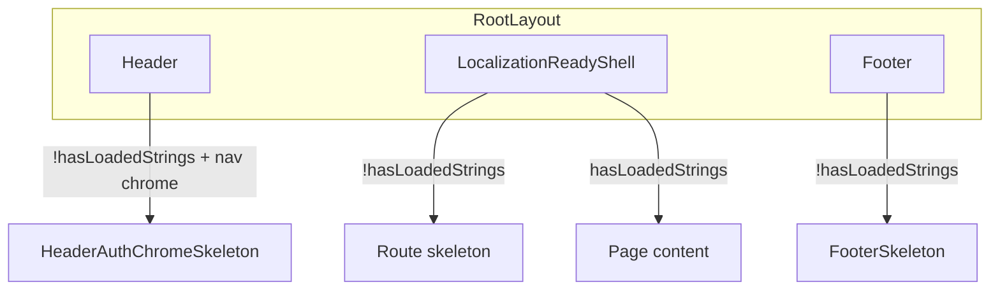

# App-wide standard: skeleton until localization loads

## Policy

**No frontend user should ever see a raw REDCap localization key** (e.g. `SignIn_Header`, `PastProblemTitle`, `Footer_QuickLinks_Text`). This applies on all network conditions — not only Slow 4G — and on every route.

Until REDCap strings are fully loaded (`hasLoadedStrings === true`), show route-appropriate skeleton UI instead of localized content.

Returning visitors with a warm `localStorage` cache (`spots_loc_persistent_en` / `_es`) should still see content immediately — `hasLoadedStrings` is `true` on first render when cache hits.

## How keys leak today

`getLocSetting()` returns the key when strings are not ready and no fallback is passed:

```159:166:app/_lib/hooks/loc/useLocalizedStrings.ts
  const getLocSetting = useMemo(
    () => (key: string, fallback?: string) => {
      if (!hasLoadedStrings) {
        return fallback ?? key;
      }
```

**Known gaps:**

| Surface | Issue |
|---------|-------|
| [`app/(landing)/page.tsx`](app/(landing)/page.tsx) | Explicit `blockOnLocalization={false}` on `LoginPageLayout` |
| [`app/_components/auth/ErrorDisplay.tsx`](app/_components/auth/ErrorDisplay.tsx) | Renders outside `LoginPageLayout`; no loc gate |
| [`app/auth/error/page.tsx`](app/auth/error/page.tsx) | `AuthErrorLoading` calls `getLocSetting('Loading')` with no fallback |
| [`app/_components/auth/ProtectedRoute.tsx`](app/_components/auth/ProtectedRoute.tsx) | Auth skeleton only; page content can mount before strings load |
| [`app/_components/layout/Header.tsx`](app/_components/layout/Header.tsx) | Nav/account labels use `getLocSetting` without fallbacks (`ReportingAs_ReportingFor`, `User`, nav instruction keys) |
| Most feature components | Widespread `getLocSetting('SomeKey')` with no fallback — safe only if a parent gate blocks render |

**Already correct (reference patterns):**

- [`Footer`](app/_components/layout/Footer.tsx) → `FooterSkeleton` when `!hasLoadedStrings`
- [`AboutFaqFromRedcapBody`](app/_components/about/AboutFaqFromRedcapBody.tsx), [`PrivacyPolicyRedcapBody`](app/_components/privacy/PrivacyPolicyRedcapBody.tsx) → inline skeleton when `isLoading && !hasLoadedStrings`
- [`LoginPageLayout`](app/_components/auth/LoginPageLayout.tsx) → `LoginSkeleton` when `blockOnLocalization && isLoading && !hasLoadedStrings` (default `true`, but login page opts out)
- [`PageTitleSync`](app/_components/i18n/PageTitleSync.tsx) → skips until `hasLoadedStrings`

## Recommended approach

Use a **central gate + defense in depth**, not per-component patches everywhere.



### 1. Central gate — `LocalizationReadyShell`

Add a client component (e.g. [`app/_components/i18n/LocalizationReadyShell.tsx`](app/_components/i18n/LocalizationReadyShell.tsx)) and wrap `<main>{children}</main>` in [`app/layout.tsx`](app/layout.tsx):

```tsx
<LocalizationReadyShell>{children}</LocalizationReadyShell>
```

Behavior:

- Read `hasLoadedStrings` / `isLoading` from `useLocalization()`
- When `isLoading && !hasLoadedStrings`, render a **route-aware skeleton** (reuse logic from [`app/loading.tsx`](app/loading.tsx)):

| Path pattern | Skeleton |
|--------------|----------|
| `/` | `LoginSkeleton` |
| `/auth/callback`, `/auth/reporting-as` | `ReportingAsSkeleton` |
| `/home` (if ever hit in main) | `HomeLoading` |
| Public `(pages)` routes (`/about`, `/privacy`, …) | `PagesLoadingSkeleton` inside minimal wrapper |
| Protected `(pages)` routes | `PagesLoadingSkeleton` (layout grid provided by `(pages)` shell when mounted) |
| Other auth routes (`/auth/error`, `/unauthorized`) | Generic centered pulse skeleton |

- When `hasLoadedStrings`, render `children` unchanged

This makes the standard automatic for all pages without auditing every `getLocSetting` call.

### 2. Header gate

In [`useHeaderController`](app/_components/layout/header/useHeaderController.ts) or [`HeaderDesktopNav`](app/_components/layout/header/HeaderDesktopNav.tsx) / [`HeaderDesktopAccountMenu`](app/_components/layout/header/HeaderDesktopAccountMenu.tsx):

- When `!hasLoadedStrings && showAppNavChrome`, reuse existing [`HeaderAuthChromeSkeleton`](app/_components/layout/header/HeaderAuthChromeSkeleton.tsx) (same pattern as `isAuthPendingUser`)
- Public-page Login button already has fallback `'Login'` — low risk; optional skeleton on entire header chrome for consistency

Footer is already handled.

### 3. Remove opt-outs

- [`app/(landing)/page.tsx`](app/(landing)/page.tsx): remove `blockOnLocalization={false}`
- [`LoginPageLayout`](app/_components/auth/LoginPageLayout.tsx): remove `blockOnLocalization` prop entirely (always block when `isLoading && !hasLoadedStrings`); update [`LoginPageLayout.test.tsx`](app/_components/auth/__tests__/LoginPageLayout.test.tsx) to drop the `false` case

Login-specific auth skeletons (`authStatus === 'configuring'`, post-login handoffs) stay in the login page — they are orthogonal to localization.

### 4. Auth error surfaces

- [`ErrorDisplay`](app/_components/auth/ErrorDisplay.tsx): show `LoginSkeleton` (or a small auth-error skeleton) until `hasLoadedStrings`, then render error UI
- [`app/auth/error/page.tsx`](app/auth/error/page.tsx): replace `AuthErrorLoading` spinner text with a pulse skeleton (no `getLocSetting` until ready)

### 5. Defense in depth — `getLocSetting` safety net

In [`useLocalizedStrings.ts`](app/_lib/hooks/loc/useLocalizedStrings.ts), change the pre-load branch:

```ts
if (!hasLoadedStrings) {
  return fallback ?? '';  // never return raw key to UI while loading
}
```

Update [`useLocalizedStrings.test.tsx`](app/_lib/hooks/loc/__tests__/useLocalizedStrings.test.tsx) for the new contract. This catches any component that slips through the gate without showing keys (may show brief empty text instead — acceptable vs leaking keys).

**Note:** After strings load, missing REDCap keys may still resolve to the key string — that is a data/config issue, not a loading flash. Out of scope unless you want a separate dev-only behavior.

### 6. ProtectedRoute (optional belt-and-suspenders)

[`ProtectedRoute`](app/_components/auth/ProtectedRoute.tsx) could also treat `!hasLoadedStrings` as loading and keep `AuthLoadingShell`. Likely redundant once the central shell gates `<main>`, but low-cost if you want double coverage during auth transitions on `/`.

## Test plan

1. **Cold cache (primary):** Clear `spots_loc_persistent_*` in localStorage (or `NEXT_PUBLIC_LOC_DISABLE_CACHE=true`). Throttle network optionally. Visit:
   - `/` — skeleton only, then translated login form
   - `/about`, `/privacy` — content skeleton, no `About_*` / `PrivacyPolicy_*` keys
   - Sign in → `/home` — no `PastProblemTitle`-style keys during load
   - `/auth/error?error=access_denied` — no `AuthenticationError` key flash
2. **Warm cache:** Repeat with cached strings — pages should appear immediately (no extra skeleton delay).
3. **Automated:** Extend `useLocalizedStrings` test for empty-string pre-load behavior; keep `LoginPageLayout` blocking test; add `LocalizationReadyShell` unit test with mocked pathname + `hasLoadedStrings`.

## Files to change

| File | Change |
|------|--------|
| `app/_components/i18n/LocalizationReadyShell.tsx` | **New** — central gate + route skeleton picker |
| `app/layout.tsx` | Wrap `<main>` children with `LocalizationReadyShell` |
| `app/(landing)/page.tsx` | Remove `blockOnLocalization={false}` |
| `app/_components/auth/LoginPageLayout.tsx` | Remove `blockOnLocalization` prop; always gate |
| `app/_components/auth/ErrorDisplay.tsx` | Skeleton until `hasLoadedStrings` |
| `app/auth/error/page.tsx` | Skeleton fallback without `getLocSetting` |
| `app/_lib/hooks/loc/useLocalizedStrings.ts` | Pre-load: `fallback ?? ''` not `fallback ?? key` |
| `app/_components/layout/header/HeaderDesktopNav.tsx` (and/or account menu) | Skeleton when `!hasLoadedStrings` |
| Tests | `LoginPageLayout`, `useLocalizedStrings`, new shell test |

**Recommended implementation order:** defense-in-depth `getLocSetting` change → central shell → remove login opt-out → header/auth surfaces → tests/QA.
