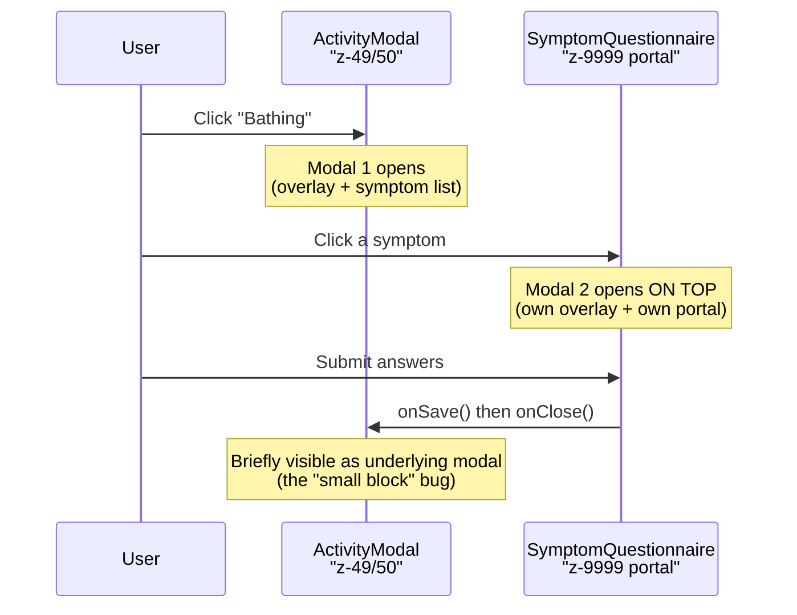
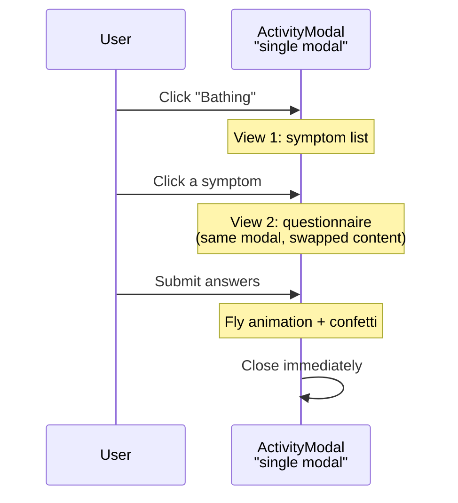

# Merge ActivityModal and SymptomQuestionnaire into a Single Modal

## Problem

Currently, clicking an activity card opens `ActivityModal` (symptom picker), and then clicking a symptom opens `SymptomQuestionnaire` as a **second stacked modal** on top with its own `ModalOverlay` and `createPortal`. This causes:

1. Two overlapping modals with separate overlays (z-49 and z-9999)
2. A messy teardown sequence leaving the ActivityModal's header briefly visible after the questionnaire closes (the "small block" bug)

## Current Flow



## Target Flow



## Changes

### 1. Add `embedded` prop to SymptomQuestionnaire

**File:** [app/_components/symptoms/SymptomQuestionnaire.tsx](app/_components/symptoms/SymptomQuestionnaire.tsx)

- Add `embedded?: boolean` to `QuestionnaireProps` (defaults to `false`)
- When `embedded` is `true`:
  - **Skip** rendering `<ModalOverlay>`
  - **Skip** `createPortal` and render questionnaire content inline
  - Apply a different CSS class (e.g., `questionnaireCardEmbedded`) that removes `position: fixed`, `top/left: 50%`, and the centering `transform`
- When `embedded` is `false` or omitted: behavior is identical to today (no impact on search, feelings, body-parts, or summary pages)

### 2. Add embedded CSS variant

**File:** [app/_components/symptoms/SymptomQuestionnaire.module.css](app/_components/symptoms/SymptomQuestionnaire.module.css)

- Add `.questionnaireCardEmbedded` class that inherits the look of `.questionnaireCard` but replaces the fixed/centered positioning with `position: relative` and no transform offset. Remove the border (the parent ActivityModal already has a green border) and box-shadow to avoid visual doubling.

### 3. Render SymptomQuestionnaire inside ActivityModal's container

**File:** [app/_components/activities/ActivityModal.tsx](app/_components/activities/ActivityModal.tsx)

- Move the `<SymptomQuestionnaire>` from **outside** the modal container to **inside** the content area, replacing the `null` branch when `showSymptoms` is false:

```tsx
{showSymptoms ? (
  <div>{/* symptom list + image */}</div>
) : selectedSymptom ? (
  <SymptomQuestionnaire
    embedded={true}
    symptomId={selectedSymptom.id}
    // ... other props
  />
) : null}
```

- **Hide the ActivityModal header** ("Bathing") when the questionnaire is shown, since the questionnaire already displays the symptom name as its own title. This avoids a redundant header.
- Keep existing immediate-close behavior on save (already implemented) and preserve `handleQuestionnaireClose` for back navigation to symptom list.

### 4. Adjust fly-to-icon animation for embedded mode

**File:** [app/_components/symptoms/SymptomQuestionnaire.tsx](app/_components/symptoms/SymptomQuestionnaire.tsx)

- In `flyToIcon()`, the animation keyframes currently include `translate(-50%, -50%)` because the card is centered with CSS transforms. When `embedded` is true, the card is positioned normally (no centering transform), so the keyframes should omit the `translate(-50%, -50%)` prefix.
- Read `embedded` from props/closure and conditionally set the transform prefix.
- `getBoundingClientRect()` works the same in both modes, so `deltaX`/`deltaY`/`scaleX`/`scaleY` calculations remain unchanged.
- Ensure `runPostSubmitEffects()` continues using `flyToIcon()` consistently in both standalone and embedded modes.

### 5. Make error rendering embedded-aware

**File:** [app/_components/symptoms/SymptomQuestionnaire.tsx](app/_components/symptoms/SymptomQuestionnaire.tsx)

- `renderBlockingError()` currently renders its own overlay/portal.
- In embedded mode, return an inline error card to avoid introducing a second modal stack on error paths.
- In non-embedded mode, keep current overlay/portal behavior.

### 6. Keep compatibility and scope tight

- No changes to symptom submission payload shape or business logic.
- No changes to non-activity callers beyond optional prop compatibility.
- Preserve existing confetti + close sequencing.

## Files NOT changed (backward compatibility)

These consumers pass no `embedded` prop, so they get the default `false` behavior -- no impact:

- `app/(pages)/search/page.tsx`
- `app/(pages)/feelings/page.tsx`
- `app/_components/body-parts/InteractiveBody.tsx`
- `app/_components/symptoms/SymptomsSummary.tsx`
