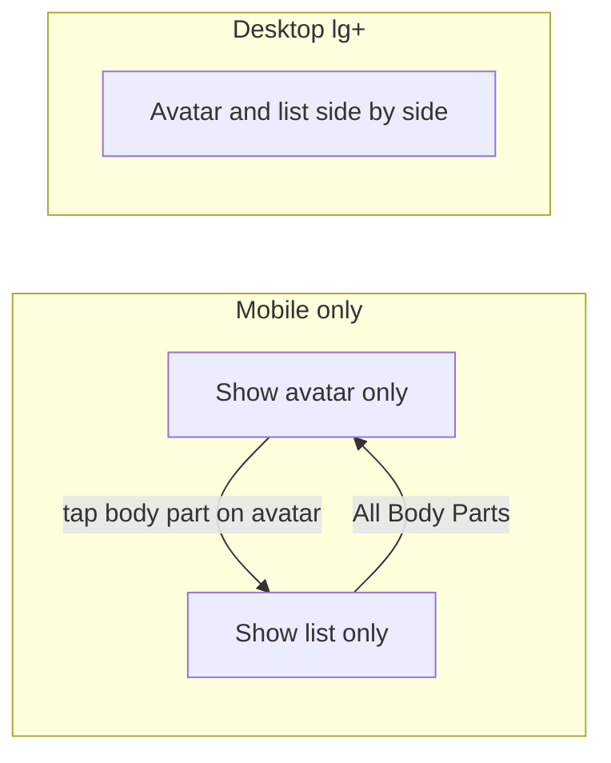

# Mobile body parts: replace avatar with list on selection

## Goal

On mobile, avoid the symptom list being partially hidden below the avatar. Instead: show only the avatar until a body part is selected, then show only the list (same content as today) in that same area. "← All Body Parts" returns to the avatar view.

## Current behavior (reference)

- [app/_components/body-parts/InteractiveBody.tsx](app/_components/body-parts/InteractiveBody.tsx): single flex container (lines 791–1042) with `flex-col lg:flex-row` containing:
  - **Avatar block** (lines 793–863): `.body_parts_avatar` — body map + "Show Back" button.
  - **List block** (lines 865–1040): `.body_parts_list` — when no selection shows "All Body Parts" list; when `displayedBodyPart` set shows body part name, image, skin nav, and symptom buttons (opening `SymptomQuestionnaire`).
- Selection: from avatar (SVG click → `setSelectedPart`) or from "All Body Parts" list. "← All Body Parts" (lines 876–884) clears selection with `setSelectedPart(null)` etc.

## Intended behavior

- **Below `lg` (mobile):**
  - No selection (`!displayedBodyPart`): render **only** the avatar section. Do not render the list (so no "All Body Parts" list on mobile; selection is via avatar only).
  - Has selection (`displayedBodyPart`): render **only** the list section (same content as now: header, body part image, skin nav, symptom list). Do not render the avatar.
- `**lg` and up (desktop):** unchanged — both sections rendered side by side as today.

## Implementation

**File:** [app/_components/body-parts/InteractiveBody.tsx](app/_components/body-parts/InteractiveBody.tsx)

1. **Wrap avatar section in a condition** (around the existing `
` at line 793):
  - **Mobile:** render only when `!displayedBodyPart` (so when there is a selection, avatar is not rendered).
  - **Desktop:** always render. Use a wrapper that is hidden on mobile when `displayedBodyPart` is set, e.g. `className` including `hidden lg:block` when `displayedBodyPart` is set, and `lg:flex` (or current classes) when not — or use a single wrapper div that applies:
    - `hidden lg:flex` when `displayedBodyPart` is set (mobile: hide; desktop: show).
    - No `hidden` when `displayedBodyPart` is null (show on all sizes).
  - Clean approach: one wrapper around the avatar block with conditional classes, e.g. `className={displayedBodyPart ? 'hidden lg:flex ...' : 'flex ...'}`, preserving the rest of the existing classes so desktop layout is unchanged.
2. **Wrap list section in a condition** (around the existing `
` at line 865):
  - **Mobile:** render only when `displayedBodyPart` is set (list appears only after a body part is selected).
  - **Desktop:** always render. Same pattern: wrapper with `className={displayedBodyPart ? 'flex ...' : 'hidden lg:flex ...'}`, so on mobile the list is hidden when there is no selection, and on lg+ both blocks are visible.
3. **Preserve layout and a11y:**
  - Keep the parent flex container and its `flex-col lg:flex-row` and gap classes unchanged so desktop layout is identical.
  - Ensure "← All Body Parts" remains the way to clear selection on mobile (already calls `setSelectedPart(null)` etc.), so no code changes there.
  - No new state or hooks required; `displayedBodyPart` (and thus `selectedPart` / `viewingSkin`) already drive what the list shows.
4. **Optional: list header when no selection on desktop**
  - When `!displayedBodyPart`, the list shows the "All Body Parts" list (lines 991–1037). On desktop we keep that; on mobile we never render that branch because the list block is not rendered at all when `!displayedBodyPart`. So no extra change needed.

## Summary of edits

- **One file:** `InteractiveBody.tsx`.
- **Two conditional wrappers:** add a wrapper (or conditional class) around the avatar block so it is hidden on mobile when `displayedBodyPart` is set; add a wrapper (or conditional class) around the list block so it is hidden on mobile when `displayedBodyPart` is null. Use Tailwind `hidden` and `lg:flex` (or `lg:block` as appropriate) so desktop always shows both.
- **No changes** to `SymptomQuestionnaire`, event handlers, or state shape.

## Testing

- **Mobile (e.g. iPhone 14 Pro Max or narrow viewport):** Initial view is avatar only; tap a body part on the avatar → list replaces avatar; "← All Body Parts" → avatar returns.
- **Desktop (lg and up):** Avatar and list always visible side by side; "All Body Parts" list and selection flow unchanged.
- **SymptomQuestionnaire:** Still opens when a symptom is clicked from the list (mobile or desktop); no change to modal behavior.

