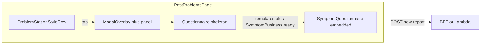

# Past Problems: SymptomQuestionnaire modal refactor

## Context from prior chat ([transcript](file:///Users/lukey/.cursor/projects/Users-lukey-Sites-UT-SPOTS-spots-app/agent-transcripts/a889548a-5fc3-4731-97c0-b85f0d16f93e/a889548a-5fc3-4731-97c0-b85f0d16f93e.jsonl))

Decisions already agreed:

| Area | Direction |
|------|-----------|
| Historical data | **POST only** — never PATCH the history row |
| Modal | **Parent owns** `ModalOverlay` + centered panel; questionnaire uses **`embedded={true}`** |
| Submit | **Inside [`SymptomQuestionnaire.tsx`](app/_components/symptoms/SymptomQuestionnaire.tsx)** (same as Feelings / Activities / Problem Station) |
| Rows | **Thin tappable row**; **shared component** with Problem Station; **no delete** on Past Problems |
| Loading | **Skeleton** in the modal while templates / `SymptomBusiness` resolve |
| `SymptomBusiness` | **`symptomService.getSymptomById`** / template cache (one fetch per language via existing singleton) |

## Current state

- [`app/(pages)/past-problems/page.tsx`](app/(pages)/past-problems/page.tsx): Renders [`ProblemCard`](app/_components/past-problems/ProblemCard.tsx) inside a wrapper; [`ModalOverlay`](app/_components/common/ModalOverlay.tsx) only dims the page when a card is “selected”—the actual PRO-CTCAE UI still lives inside `ProblemCard`, not `SymptomQuestionnaire`.
- [`app/_components/symptoms/SymptomsSummary.tsx`](app/_components/symptoms/SymptomsSummary.tsx): Problem Station row is inline JSX (~630–726); edit opens `SymptomQuestionnaire` **without** `embedded` (full-screen overlay inside the component). Past Problems will differ: **page-owned** shell + **`embedded`** inner questionnaire.

## Implementation plan

### 1. Extend `SymptomQuestionnaire` for “new report + prefill from history”

**Gap:** Prefill today only runs when `isUpdate && existingRecord` (see `useEffect` around lines 240–287 in `SymptomQuestionnaire.tsx`). For Past Problems you need **`isUpdate: false`** (POST) **and** prefill from the history row.

**Change:**

- Broaden the prefill effect so it runs when **`existingRecord` is present** and **`!isPreFilled`** and **`questions.length > 0`**, with behavior split by `isUpdate`:
  - **`isUpdate: true`** — keep current behavior (set answers, `setIsPreFilled(true)`, `setUpdateBaselineFields(existingRecordToPatchFields(...))`).
  - **`isUpdate: false`** — set answers from `existingRecord` the same mapping way, `setIsPreFilled(true)`, but **do not** set `updateBaselineFields` (leave `null` so POST path and “no unintended PATCH” stay safe).

- When passing `existingRecord` from Past Problems, include **only** fields needed for PRO-CTCAE prefill (`symptom_frequency`, `symptom_severity`, `symptom_interference`, `symptom_presence` if available). **Omit** `symptom_report_id`, `redcap_repeat_instance`, `individual_id` so nothing in submit logic can treat the row as an update target.

- **Edge case (from chat):** Confirm history payload includes `symptom_presence` when the symptom’s template uses a presence-first flow; if absent, prefill may be partial—document or handle with existing “SymptomDataUnavailable” / empty-question UX.

- **Optional:** Add **`onSubmitSuccess`** callback if you need `symptom_report_id` / repeat id for [`sessionSymptomService`](lib/services/spots/) without peering inside the component; otherwise reuse **`onClose` + `onSave`** if the current contract is enough after code review.

### 2. Shared row component (Problem Station + Past Problems)

**New file** (name per team convention; transcript suggested `app/_components/common/ProblemStationStyleRow.tsx`):

- **Props:** `title`, optional `contextSubtext`, `onClick`, `disabled` + optional `disabledTitle`, **`trailing?: ReactNode`** (or structured “answered dots”), optional **`showDelete`, `onDelete`, …** mirroring Problem Station delete button behavior.
- **[`SymptomsSummary`](app/_components/symptoms/SymptomsSummary.tsx):** Replace the duplicated row `div` (classes, title tooltips, delete button) with this component; pass **`countAnsweredQuestions`-based green dots** as `trailing`.
- **Past Problems:** Use the same row; **`showDelete={false}`**; **`trailing`** = same **green answered-count dots** pattern derived from the history row’s filled PRO-CTCAE fields (align with transcript: visual parity with Problem Station, not per-level “rainbow” dots unless product changes).

Keep [`IntensityIndicatorDots`](app/_components/common/IntensityIndicatorDots.tsx) as-is unless you explicitly want a single-strip “completion level” model (transcript favored shared answered-dots for honesty across both lists).

### 3. Past Problems page: modal shell + lazy questionnaire

In [`app/(pages)/past-problems/page.tsx`](app/(pages)/past-problems/page.tsx):

- **Row interaction:** One tap sets `selectedProblemId` (or a richer `selectedProblem` object) and opens the **page-level** modal.
- **Shell:** Retain or adjust **one** `ModalOverlay` + centered panel (max width, padding, close button). Show a **questionnaire-shaped skeleton** inside the panel until:
  - `SymptomBusiness` is resolved via **`symptomService.getSymptomById(displayProblem.symptomId, language)`** (or equivalent already used elsewhere), and
  - any hard failure surfaces in-panel (no silent fallback per project rules).
- **Mount `SymptomQuestionnaire`** with:
  - `embedded`
  - `isUpdate: false`
  - `category` / `subcategory`: **`prior_problems`** (match existing REDCap reporting conventions used on this route)
  - `symptom` / `symptomId` / `symptomName` as elsewhere
  - `existingRecord`: prefill-only shape from the `PastProblem` / history row
  - `onClose`: clear selection + reset local modal state
  - `onSave`: refresh session / list, remove the row from the visible list (`removedProblemIds` or equivalent), dispatch **`problem-station-changed`** / **`symptom-submitted`** as today’s product behavior requires (mirror what `ProblemCard` + page did on successful save)

### 4. Remove `ProblemCard` and dead page logic

- [`ProblemCard.tsx`](app/_components/past-problems/ProblemCard.tsx) is **only imported from** the past-problems page — safe to **delete** after migration or reduce to exported types only if something must stay.
- Remove obsolete state/handlers: **`editingStates`**, per-field **`handleResponseSelect`**, inline **`handleSave`** validation that duplicated `ProblemCard`, **`getSymptomQuestionsSync` for inline UI**, **`interactedFields`**, and any scroll-to-expanded-card logic tied to inline editing **if** no longer needed for the modal-only flow. Keep **scroll-into-view** only if still useful when opening the modal from a row.
- Move **`FrequencyLevel`** (if still needed) to a small types module if the page stops importing from `ProblemCard`.

### 5. QA / verification

- Parent vs child reporting: preserve **`targetIndividualId` / `family_id`** behavior already on the page when the questionnaire POST runs (confirm `SymptomQuestionnaire` or session layer still receives the right context).
- Regression: Problem Station edit still **`isUpdate`** + PATCH; Past Problems **never** PATCHes the historical repeat instance.
- Manual: open Past Problems row → skeleton → prefill matches history → save creates **new** report → row disappears / list updates → header badge events still fire.

## Architecture sketch

## Files likely touched

- [`app/_components/symptoms/SymptomQuestionnaire.tsx`](app/_components/symptoms/SymptomQuestionnaire.tsx) — prefill for `!isUpdate` + optional success callback
- [`app/(pages)/past-problems/page.tsx`](app/(pages)/past-problems/page.tsx) — modal shell, row swap, state cleanup
- **New** `app/_components/common/ProblemStationStyleRow.tsx` (or chosen name)
- [`app/_components/symptoms/SymptomsSummary.tsx`](app/_components/symptoms/SymptomsSummary.tsx) — consume shared row
- **Delete or gut** [`app/_components/past-problems/ProblemCard.tsx`](app/_components/past-problems/ProblemCard.tsx)
