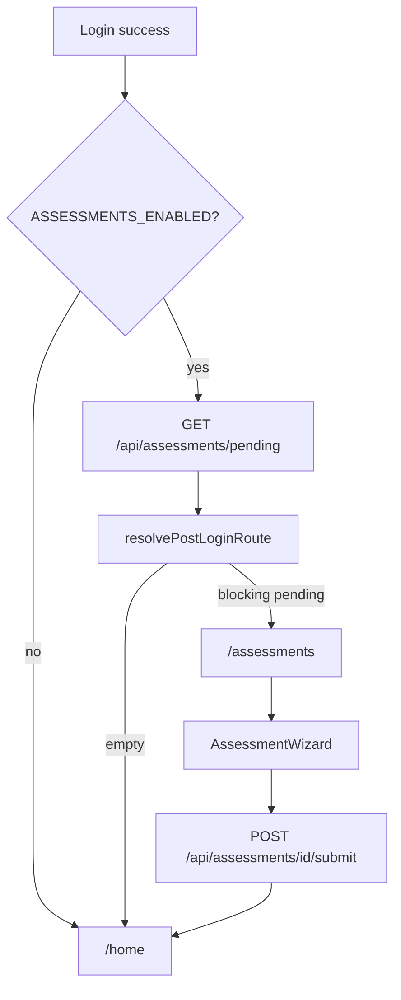

# Pending Assessments Phase 1 Scaffold

**Git branch:** `feature/pending-assessments-scaffold`

Matches your existing convention (e.g. `feature/signup-verification`). Short, scoped to Phase 1 — not claiming full intro/interval implementation.

---

## Goal

Build the **plumbing** for provider-requested / first-login PRO-CTCAE assessments without faking REDCap data. When the flag is OFF (default), behavior is unchanged. When ON and backend returns pending items, login redirects to `/assessments` instead of `/home`.



---

## What we build (Phase 1)

| Layer | Deliverable |
|-------|-------------|
| Types | `PendingAssessment`, `AssessmentKind`, item/question shapes |
| Pure logic | Post-login route resolver + unit tests |
| Service | `assessment-service.ts` — fetch pending, submit responses |
| Hook | `usePendingAssessments.ts` |
| BFF | Proxy routes to Lambda (fail explicitly if Gateway/endpoint missing) |
| UI | `/assessments` page + minimal wizard shell (loading / error / empty / item loop) |
| Auth integration | Centralize post-login redirect in 3 call sites |
| Docs | Feature doc + proposed backend API contract for Dev 1 |
| Config | `NEXT_PUBLIC_ASSESSMENTS_ENABLED=false` default |

## What we defer

- REDCap instrument design and Lambda handlers (Dev 1)
- Hardcoded question content or SymptomsEng.json fallbacks
- Interval scheduling logic on the client
- Provider assignment UI
- Reusing full [`SymptomQuestionnaire`](spots-app/app/_components/symptoms/SymptomQuestionnaire.tsx) until item shape from backend is confirmed (Phase 2)

---

## New files

```
app/_lib/types/business/assessments.ts
app/_lib/services/assessments/assessment-service.ts
app/_lib/services/assessments/post-login-route.ts
app/_lib/services/assessments/__tests__/post-login-route.test.ts
app/_lib/hooks/assessments/usePendingAssessments.ts
app/_lib/config/assessments-config.ts          # isAssessmentsEnabled()
app/api/assessments/pending/route.ts
app/api/assessments/[assessmentId]/submit/route.ts
app/(pages)/assessments/page.tsx
app/(pages)/assessments/layout.tsx             # generateMetadata pattern like home
app/_components/assessments/AssessmentWizard.tsx
docs/features/pending-assessments.md           # layman flow + API contract
```

---

## Types (sketch)

```typescript
export type AssessmentKind = 'intro' | 'interval';
export type AssessmentStatus = 'not_started' | 'in_progress' | 'completed';

export interface PendingAssessmentItem {
  itemId: string;
  symptomId?: string;
  titleKey?: string;
  questionIds: PROCTCAEQuestionIdentifier[];
}

export interface PendingAssessment {
  assessmentId: string;
  kind: AssessmentKind;
  blocking: boolean;
  dueAt: string | null;
  titleKey: string;
  status: AssessmentStatus;
  items: PendingAssessmentItem[];
}
```

Export from [`app/_lib/types/index.ts`](spots-app/app/_lib/types/index.ts).

---

## Post-login redirect (centralize)

Today `/home` is pushed from three auth success paths:

- [`app/_lib/services/auth/login-service.ts`](spots-app/app/_lib/services/auth/login-service.ts) (~L414)
- [`app/auth/callback/page.tsx`](spots-app/app/auth/callback/page.tsx) (~L242)
- [`app/auth/reporting-as/page.tsx`](spots-app/app/auth/reporting-as/page.tsx) (~L379, L404)

Add shared helper:

```typescript
// post-login-route.ts
export function resolvePostLoginRoute(
  pending: PendingAssessment[],
  defaultRoute = '/home',
): string {
  const blocking = pending.find((a) => a.blocking && a.status !== 'completed');
  return blocking ? `/assessments?assessmentId=${encodeURIComponent(blocking.assessmentId)}` : defaultRoute;
}

export async function resolvePostLoginRouteAfterAuth(): Promise<string> {
  if (!isAssessmentsEnabled()) return '/home';
  const pending = await fetchPendingAssessments(); // returns [] on empty; throws on hard failure
  return resolvePostLoginRoute(pending);
}
```

Replace direct `router.push('/home')` with `router.push(await resolvePostLoginRouteAfterAuth())` in all three sites. `/auth/reporting-as` runs **after** identity selection — correct place to check pending for the resolved child/parent context.

---

## BFF routes

Follow patterns from [`app/api/symptoms/delete/route.ts`](spots-app/app/api/symptoms/delete/route.ts):

- Require `Authorization` header
- Use [`resolveSymptomIdentity()`](spots-app/app/_lib/server/identity-headers.ts) for `x-user-individual-id` / `x-reporting-for-individual-id`
- Proxy to `${API_GATEWAY_BASE_URL}assessments/pending` and `assessments/{id}/submit`
- Return 500 if `API_GATEWAY_BASE_URL` missing; forward upstream status/body otherwise — **no canned JSON**

Proposed Lambda contract (document in `docs/features/pending-assessments.md` for Dev 1):

- `GET assessments/pending` → `{ pending: PendingAssessment[] }`
- `POST assessments/{assessmentId}/submit` → body `{ responses: Record<string, string>; family_id?: string }`

Until Lambda exists, BFF returns upstream 404/502; with flag OFF the client never calls it.

---

## `/assessments` page

- Protected via existing [`PagesLayoutClient`](spots-app/app/(pages)/PagesLayoutClient.tsx) / `ProtectedRoute`
- **No sidebar** on assessments (similar to `/report` full-width treatment) — user should focus on required questions
- Read `assessmentId` from query; load pending list via hook; show:
  - Loading skeleton
  - Error with retry (explicit failure, not silent skip)
  - Empty: redirect to `/home` (stale bookmark)
  - Wizard: intro copy (REDCap loc keys), progress bar, placeholder per item (“Questions will load from REDCap when configured”)
- On submit success → `router.push('/home')`

Add page title entry to [`app/_lib/i18n/page-titles.ts`](spots-app/app/_lib/i18n/page-titles.ts) and note in [`docs/uthealth/redcap-page-title-keys.md`](spots-app/docs/uthealth/redcap-page-title-keys.md) for future REDCap keys (`AssessmentsTitle`, etc.).

---

## Feature flag

```typescript
// assessments-config.ts
export function isAssessmentsEnabled(): boolean {
  return process.env.NEXT_PUBLIC_ASSESSMENTS_ENABLED === 'true';
}
```

Document in feature doc; do **not** add to `.env` committed files — Amplify console / local `.env.local` only when testing.

---

## Tests

- Unit: `resolvePostLoginRoute` — empty pending, non-blocking pending, blocking intro, blocking interval, completed skipped
- Unit: `assessment-service` — mock `fetch`, verify auth headers and error propagation
- Optional a11y smoke: assessments page renders heading + loading state

No E2E until backend returns real pending data.

---

## Backend coordination (out of scope for this branch)

Share `docs/features/pending-assessments.md` with Dev 1. They need REDCap fields for: assignment, kind, due date, completion timestamp, and which PPC items are included. Frontend branch can merge independently.

---

## Rollout

1. Merge scaffold with flag OFF — zero user impact
2. Dev 1 implements Lambda + REDCap
3. Enable flag in staging; verify login → `/assessments` → submit → `/home`
4. Phase 2: wire `AssessmentWizard` items to real question definitions (likely reuse `SymptomQuestionnaire` per symptom-shaped item)
