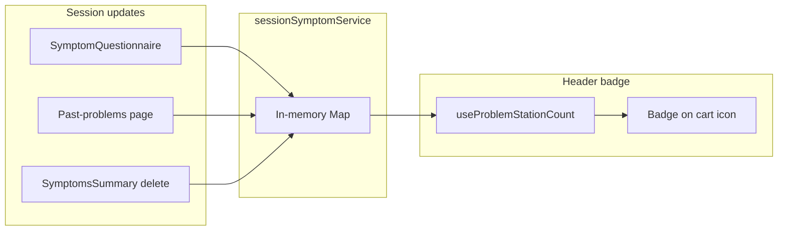

# Problem Station symptom count badge (mobile)

## Goal

On mobile, when the Problem Station is closed, show a badge on the cart icon with the number of symptoms currently in the Problem Station (matching the list inside the panel). When the panel is open, the button shows the X icon and no badge.

## Data source

The count must match what [SymptomsSummary](app/_components/symptoms/SymptomsSummary.tsx) displays: session symptoms for the current user (`login_id`) and selected child (`selectedChildId`), deduplicated by `symptom_id` (keeping the latest record per symptom by `symptom_date_time_selected`). Data comes from [sessionSymptomService](app/_lib/services/symptoms/session-symptom-service.ts) via `getSessionSymptoms(loginId, individualId)`.

## Implementation

### 1. New hook: `useProblemStationCount`

**File:** [app/_lib/hooks/symptoms/useProblemStationCount.ts](app/_lib/hooks/symptoms/useProblemStationCount.ts) (new)

- **Dependencies:** `useUser()` for `user?.login_id`, `useChildSelection()` for `selectedChildId`, `sessionSymptomService` from [session-symptom-service.ts](app/_lib/services/symptoms/session-symptom-service.ts).
- **Logic:**
  - Call `sessionSymptomService.getSessionSymptoms(loginId, selectedChildId ?? undefined)`.
  - Deduplicate by `symptom_id` keeping the latest per symptom (same rule as SymptomsSummary lines 180–206): use `symptom_date_time_selected` with a small `normalizeDateStr` helper (copy the logic from [SymptomsSummary.tsx](app/_components/symptoms/SymptomsSummary.tsx) lines 103–114 into the hook file to avoid coupling).
  - Count = size of the deduplicated set.
- **Reactivity:** Keep count in `useState`. Recompute on mount and when `loginId` or `selectedChildId` change. Subscribe to a custom event `problem-station-changed` (and existing `symptom-deleted`) so the badge updates when symptoms are added or removed elsewhere; in the effect cleanup, remove listeners.
- **Return:** `{ count: number }`.
- **Export:** Add to [app/_lib/hooks/index.ts](app/_lib/hooks/index.ts) if you want central hook exports.

### 2. Dispatch `problem-station-changed` when session symptoms change

So the Header’s count stays in sync without polling:

- **SymptomQuestionnaire.tsx:** After each call to `sessionSymptomService.addSymptom` (around lines 640, 902, 957), dispatch:
  - `window.dispatchEvent(new CustomEvent('problem-station-changed'))`
  - Guard with `typeof window !== 'undefined'` if needed.
- **past-problems/page.tsx:** After `sessionSymptomService.addSymptom(loginId, symptomRecord)` (around line 931), dispatch the same event.
- **SymptomsSummary.tsx:** Already dispatches `symptom-deleted` after delete; the hook will listen for that. Optionally also dispatch `problem-station-changed` after `updateSymptomsFromSession()` in the delete handler and after initial load so any consumer (including the badge) refreshes after load.

No changes to the session service itself; keep it free of DOM/window.

### 3. Header: badge UI and accessibility

**File:** [app/_components/layout/Header.tsx](app/_components/layout/Header.tsx)

- **Import** `useProblemStationCount` and call it near the other hooks (e.g. after `useChildSelection`).
- **Problem Station button (mobile, ~521–537):**
  - Add `relative` to the Button `className` so the badge can be positioned.
  - When **not** `problemStationOpen` (cart icon visible): wrap the `FaCartShopping` icon in a fragment and render a badge when `count > 0`:
    - Absolutely positioned (e.g. top-right of the icon): small circle/pill, white background, dark text and border to match the provided design.
    - Display `count`; optionally cap at 99 and show `"99+"`.
    - Use `aria-hidden="true"` on the badge (the button’s label will convey the count).
  - Update `aria-label` to include count when relevant, e.g. when `count > 0`: `Problem Station (${count} symptom${count !== 1 ? 's' : ''})` so screen readers get the count.

### 4. Testing / QA

- **Mobile viewport:** Badge appears only when cart is shown (Problem Station closed) and count > 0; disappears when panel opens (X icon) or when count is 0.
- **Add symptom** (e.g. from body-parts or search) and submit: badge updates without full reload.
- **Delete symptom** from Problem Station: badge count decreases (and disappears at 0).
- **Switch child:** Count updates to match the selected child’s session symptoms.
- **Accessibility:** Button has an accurate `aria-label` including count when > 0.

## Files to add

- [app/_lib/hooks/symptoms/useProblemStationCount.ts](app/_lib/hooks/symptoms/useProblemStationCount.ts)

## Files to modify

- [app/_components/layout/Header.tsx](app/_components/layout/Header.tsx) — use hook, add badge, update aria-label
- [app/_components/symptoms/SymptomQuestionnaire.tsx](app/_components/symptoms/SymptomQuestionnaire.tsx) — dispatch `problem-station-changed` after each `addSymptom` (3 call sites)
- [app/(pages)/past-problems/page.tsx](app/(pages)/past-problems/page.tsx) — dispatch `problem-station-changed` after `addSymptom`
- [app/_components/symptoms/SymptomsSummary.tsx](app/_components/symptoms/SymptomsSummary.tsx) — optionally dispatch `problem-station-changed` after `updateSymptomsFromSession` in delete flow and after initial load
- [app/_lib/hooks/index.ts](app/_lib/hooks/index.ts) — optional: export `useProblemStationCount`

## Out of scope

- Desktop header: Problem Station is mobile-only; no badge on desktop.
- `useSymptomCart`: That hook and the PRO-CTCAE cart are a different flow; the badge reflects session symptoms (what’s shown in the Problem Station panel), not the cart service.

