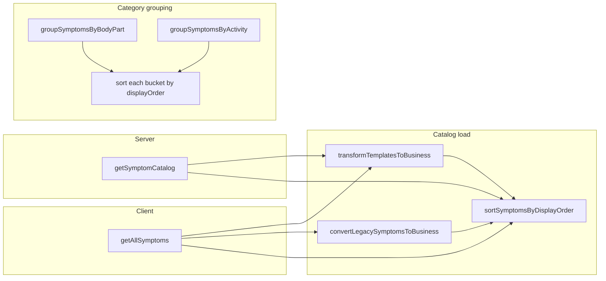

# Respect REDCap `symptom_display_order` in the modern app

## Context

- REDCap defines **lower** `symptom_display_order` = **earlier** in the list (higher number = lower in list). Legacy SpotSymptoms sorts with `OrderBy(x => x.symptom_display_int)` in `[SpotSymptoms/Common/DataUtil.cs](SpotSymptoms/Common/DataUtil.cs)` for normal menus.
- The Next app already maps the field to `displayOrder` via `[app/_lib/services/symptoms/symptom-template-transform.ts](spots-app/app/_lib/services/symptoms/symptom-template-transform.ts)` and `[app/_lib/services/symptoms/symptom-service.ts](spots-app/app/_lib/services/symptoms/symptom-service.ts)` (`getLocalizedDisplayOrder`). **What’s missing** is consistent **sorting** after load and for grouped lists.

## Approach

### 1. Shared helper

Add a small module, e.g. `[app/_lib/services/symptoms/symptom-sort.ts](spots-app/app/_lib/services/symptoms/symptom-sort.ts)`:

- Export `**sortSymptomsByDisplayOrder(symptoms: SymptomBusiness[]): SymptomBusiness[]**` (returns a **new** sorted array; do not mutate input).
- Sort key: `displayOrder` **ascending**; **tie-break** with `symptomId` for stable ordering.
- Short doc comment referencing REDCap semantics and legacy parity.

### 2. Sort full catalog at load boundaries (two call sites)

These are the only places the full template list is assembled:

| Location                                                                                                                    | Change                                                                                                                                                                                           |
| --------------------------------------------------------------------------------------------------------------------------- | ------------------------------------------------------------------------------------------------------------------------------------------------------------------------------------------------ |
| `[app/_lib/services/symptoms/symptom-service.ts](spots-app/app/_lib/services/symptoms/symptom-service.ts)` `getAllSymptoms` | After `businessSymptoms` is built (either from `transformTemplatesToBusiness` or `convertLegacySymptomsToBusiness`), run `sortSymptomsByDisplayOrder` **before** `symptomsCache.set` and return. |
| `[app/_lib/server/symptom-template-cache.ts](spots-app/app/_lib/server/symptom-template-cache.ts)` `getSymptomCatalog`      | After `transformTemplatesToBusiness(...)`, assign `symptoms = sortSymptomsByDisplayOrder(symptoms)` before caching.                                                                              |

**Do not** sort inside `transformTemplatesToBusiness` itself to avoid redundant double-sorts on the client path (transform is called, then we’d sort again if we added it in both places).

Effects (automatic once catalog is ordered):

- `[app/api/symptoms/categories/[category]/route.ts](spots-app/app/api/symptoms/categories/[category]/route.ts)` — filtered lists keep relative REDCap order.
- `[app/api/symptoms/catalog/route.ts](spots-app/app/api/symptoms/catalog/route.ts)` — full JSON is ordered.
- `[getSymptomsBySubcategory](spots-app/app/_lib/services/symptoms/symptom-service.ts)`, hooks like `[useSymptoms](spots-app/app/_lib/hooks/symptoms/useSymptoms.ts)`, body-part path via `[BodyPartSymptomService.getBodyPartSymptoms](spots-app/app/_lib/services/body-parts/body-part-symptom-service.ts)` — all inherit order from `getAllSymptoms`.
- `[SearchBusinessService](spots-app/app/_lib/services/search/search-service.ts)` — `updateSymptomsData` / constructor receive a consistently ordered corpus (tie-breaker by `displayOrder` already exists in `sortByRelevance`).

### 3. Sort grouped buckets (body parts and activities)

`[BodyPartSymptomService.groupSymptomsByBodyPart](spots-app/app/_lib/services/body-parts/body-part-symptom-service.ts)` and `[ActivitySymptomService.groupSymptomsByActivity](spots-app/app/_lib/services/activities/activity-symptom-service.ts)` build arrays in **iteration order** over `data.symptoms`. That order is **not** guaranteed to be REDCap order **within each body part / activity**, so after the `forEach` completes, **for each key** in `grouped`, sort that array by `item.symptom.displayOrder` then `item.id` (same tie-break idea).

Optional small helper in `symptom-sort.ts`, e.g. `sortGroupedSymptomRows<T extends { id: string; symptom: SymptomBusiness }>(rows: T[]): T[]`, to avoid duplicating compare logic.

### 4. Align simple search with advanced search (small)

`[symptom-service.ts` `searchSymptoms](spots-app/app/_lib/services/symptoms/symptom-service.ts)` currently sorts only by `relevanceScore`. Add the same **secondary** sort as `SearchBusinessService`: when scores are equal, compare `displayOrder` (then optionally `symptomId`).

### 5. Report page filter list (product-aligned optional)

`[app/(pages)/report/page.tsx](spots-app/app/(pages)`/report/page.tsx) builds `availableSymptoms` and sorts **alphabetically** by `symptom_term`. If stakeholders want REDCap order there too, replace that sort with ordering by `displayOrder` from the template map (you already load `getAllSymptoms` / term map nearby — use `displayOrder` from the same source). **Confirm with UX/study** whether alphabetical or REDCap order is preferred for that dropdown.

### 6. Tests

- Unit tests for `sortSymptomsByDisplayOrder` (ordering, ties, immutability).
- Optionally one test that grouped sorting orders two symptoms in the same bucket correctly.

## Files touched (summary)

- New: `app/_lib/services/symptoms/symptom-sort.ts` (+ `__tests__` or colocated test per project convention).
- Edit: `app/_lib/services/symptoms/symptom-service.ts` (catalog sort + `searchSymptoms` tie-break).
- Edit: `app/_lib/server/symptom-template-cache.ts` (catalog sort).
- Edit: `app/_lib/services/body-parts/body-part-symptom-service.ts` (per-bucket sort).
- Edit: `app/_lib/services/activities/activity-symptom-service.ts` (per-bucket sort).
- Optional: `app/(pages)/report/page.tsx` (dropdown order).

## Out of scope / unchanged

- **Feelings** — already sorts by `displayOrder` in `[app/(pages)/feelings/page.tsx](spots-app/app/(pages)`/feelings/page.tsx); no change required unless you want to remove duplicate logic later.
- **Search ranking** — primary sort remains relevance; `displayOrder` stays a **tie-breaker** only (matches current `SearchBusinessService` behavior).
- **Backend/Lambda** — no change required if templates already include `symptom_display_order`; the app only needs to sort client/server BFF responses.

