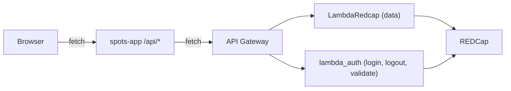

# Remove direct REDCap HTTP calls from spots-app

## Goal

Make the only path from `spots-app` to REDCap be **Next.js API route → API Gateway → Lambda → REDCap**. Audit confirmed exactly **4 call sites** still bypass that:

- [app/api/auth/validate/route.ts](app/api/auth/validate/route.ts) — `redcapClient.getDataAsync` (validate user)
- [app/api/auth/logout/route.ts](app/api/auth/logout/route.ts) — `redcapClient.writeDataAsync` (logout row write)
- [app/api/user/route.ts](app/api/user/route.ts) — `redcapClient.writeDataAsync` (same logout write on `DELETE`)
- [app/_lib/services/spots/family-service.ts](app/_lib/services/spots/family-service.ts) — `redcapClient.getDataAsync` x2 (`getChildID`, `getChildren`), reachable via `POST /api/family/child-id`

## Architecture target



After the migration, no module in `spots-app/` may import `redcapClient`, `getRedcapConfig`, or talk to `redcap.uth.tmc.edu`.

---

## Backend (SPOTS_backend)

`/auth/login` already runs in [SPOTS_backend/lambda_auth.py](../SPOTS_backend/lambda_auth.py); `/auth/logout` resource exists in API Gateway but the handler returns `501`. There is no `/auth/validate` yet. `/family` already exists in [SPOTS_backend/LambdaRedcap.py](../SPOTS_backend/LambdaRedcap.py) and supports child lookup, so no new endpoint is needed for the family case.

### B1. Implement `/auth/logout` in `lambda_auth.py`

Replace the 501 stub at the end of `lambda_auth`:

```python
# /auth/logout (not currently implemented here)
return {"statusCode": 501, ...}
```

with a handler that:

- Reads JSON body: `login_id`, `redcap_repeat_instance`, `individual_id`, `logout_type` (default `button`).
- Validates all three identifiers are present (parity with current Next-side guard in [app/api/auth/logout/route.ts](app/api/auth/logout/route.ts)).
- Calls a new `RedCapClient.logout(individual_id, login_id, repeat_instance, logout_type)` that mirrors the current Next payload (only logout fields, `spots_logins_complete = 2`, no `login_date_time`) so REDCap UPDATEs the existing repeat instance instead of creating a new one. The shape already exists in `lambda_auth.login()` and in [SPOTS_backend/redcap_client.py](../SPOTS_backend/redcap_client.py) `login()`.

### B2. Add `/auth/validate` to `lambda_auth.py`

`get_user_information_record` already exists in `redcap_client.py`. Add a new endpoint case:

- Accepts JSON `{ email }` (called "email" but used as `spots_user_id` per the Next route's docstring).
- Calls `rc_client.get_user_information_record(email)`; returns `{success, user}`. Enforce `spots_access == '1'` server-side, matching the current logic in [app/api/auth/validate/route.ts](app/api/auth/validate/route.ts) lines 90-91.

### B3. Terraform / API Gateway

`auth_logout` resource already exists in [SPOTS_backend/terraform/api_gateway.tf](../SPOTS_backend/terraform/api_gateway.tf) (lines 62-66); only the method/integration may need wiring (mirror `auth_login`). Add a new `auth_validate` resource + POST method + integration to `redcap_auth` Lambda (with Cognito authorizer, same pattern as `auth_login`).

---

## spots-app changes

### A1. Migrate `POST /api/auth/validate`

In [app/api/auth/validate/route.ts](app/api/auth/validate/route.ts):

- Drop imports of `redcapClient`, `FilterBuilder`, `createRedcapExportParams`.
- Replace `getUserFromRedcap` with `fetch(`${API_GATEWAY_BASE_URL}auth/validate`, { method: 'POST', headers: { Authorization: authHeader, 'Content-Type': 'application/json' }, body: JSON.stringify({ email }) })`.
- Pass through 200/4xx/5xx from Lambda; rate limiter logic and `createRedcapErrorResponse` (generic helper, no REDCap I/O) stay.

### A2. Migrate `POST /api/auth/logout` and `PUT` (timeout) in [app/api/auth/logout/route.ts](app/api/auth/logout/route.ts)

- Delete `createLogoutRecord` and the `redcapClient.writeDataAsync` path.
- Both `POST` and `PUT` forward the validated body to `${API_GATEWAY_BASE_URL}auth/logout` with the request's `Authorization` header. `PUT` (timeout) sets `logout_type: "timeout"` before forwarding.
- Keep `SessionService.clearSession(response)` so the cookie clear behaviour does not regress.

### A3. Migrate `DELETE /api/user` logout

In [app/api/user/route.ts](app/api/user/route.ts) the dynamic `import()` of `redcapClient` and the inline logout payload (lines 305-345) are duplicated logic. Replace with a single call to a small shared helper, e.g. `postLogoutToLambda(authHeader, { loginId, redcapRepeatInstance, individualId, logoutType })`, used by both `A2` and `A3`. Suggested location: `app/_lib/server/auth-logout-client.ts`.

### A4. Reroute family lookup, then delete `FamilyService`

[app/_lib/services/spots/family-service.ts](app/_lib/services/spots/family-service.ts) is only consumed by `POST` in [app/api/family/child-id/route.ts](app/api/family/child-id/route.ts) (line 163). The `GET` handler in the same route already calls Lambda `/family`. Refactor:

- `POST /api/family/child-id` calls `${API_GATEWAY_BASE_URL}family` (same shape as `GET`), then derives `child_individual_id` and `all_children` from the returned array (and validates the requested `family_id` matches).
- Delete `FamilyService.getChildID` and `FamilyService.getChildren`. The whole file goes; nothing else imports `FamilyService` (verified via grep).

### A5. Delete REDCap-direct infrastructure

After A1–A4 there are zero call sites for these modules. Delete:

- [app/_lib/services/redcap/redcap-client.ts](app/_lib/services/redcap/redcap-client.ts)
- [app/_lib/services/redcap/redcap-filter-builder.ts](app/_lib/services/redcap/redcap-filter-builder.ts)
- [app/_lib/config/redcap-config.ts](app/_lib/config/redcap-config.ts) (Secrets-Manager loader for REDCap tokens; no longer needed since Lambda holds the tokens)
- From [app/_lib/utils/redcap-utils.ts](app/_lib/utils/redcap-utils.ts): `createRedcapExportParams`, `createRedcapImportParams`, `createPageVisitParams` (unused), `formatDateTimeForRedcap` if it has no other consumers. Keep `createRedcapErrorResponse` (generic error helper, no REDCap I/O).

Then in [package.json](package.json), remove `axios` if no other code uses it (currently only `redcap-client.ts` imports `axios`). Also remove `NEXT_PUBLIC_REDCAP_ENDPOINT` from env config and `.env.example`.

### A6. Verification grep (must be empty)

Final grep — all of these patterns must return zero matches inside `spots-app/app/`:

- `redcapClient`
- `getDataAsync\|writeDataAsync`
- `getRedcapConfig`
- `redcap\.uth\.tmc\.edu`
- `import.*redcap-client`

---

## Tests / QA

- Update existing route tests where mocks reference the deleted modules (search for `redcapClient` and `createRedcapExportParams` in `__tests__`; current run shows none, but rerun after edits).
- Add a Jest contract test per migrated route asserting it `fetch`es the corresponding `${API_GATEWAY_BASE_URL}auth/validate|auth/logout|family` URL with the expected method/body, mirroring the style in [app/api/auth/login/__tests__/route.audit.test.ts](app/api/auth/login/__tests__/route.audit.test.ts).
- Manual: open DevTools Network, run the QA matrix in [Auth-Login-QA-Matrix.md](../spots-app.wiki/Auth-Login-QA-Matrix.md): login (single child / single parent / multi), reporting-as switch, symptom submit + delete, button logout, idle timeout. No request should hit `redcap.uth.tmc.edu`.
- Run [e2e/symptom-flow.spec.ts](e2e/symptom-flow.spec.ts).

---

## Docs to update

- [docs/backend/spots-app-api-routes.md](docs/backend/spots-app-api-routes.md) — flip "REDCap (`spots_logins`)" to "Lambda" for `/api/auth/logout`; correct `POST /api/family/child-id` (already says Lambda; the code is what needs to match).
- [docs/backend/redcap-integration-guide.md](docs/backend/redcap-integration-guide.md) and [docs/backend/lambda-integration-guide.md](docs/backend/lambda-integration-guide.md) — remove the "Direct REDCap or server-side cache (not Lambda)" callouts for validate/logout/family.

## Out of scope

- Symptom catalog / category / history caches that read Lambda (they already do not bypass it).
- Refactoring `lambda_auth.py` to share more code with `LambdaRedcap.py` (separate concern).
- Changing the cookie/session model.