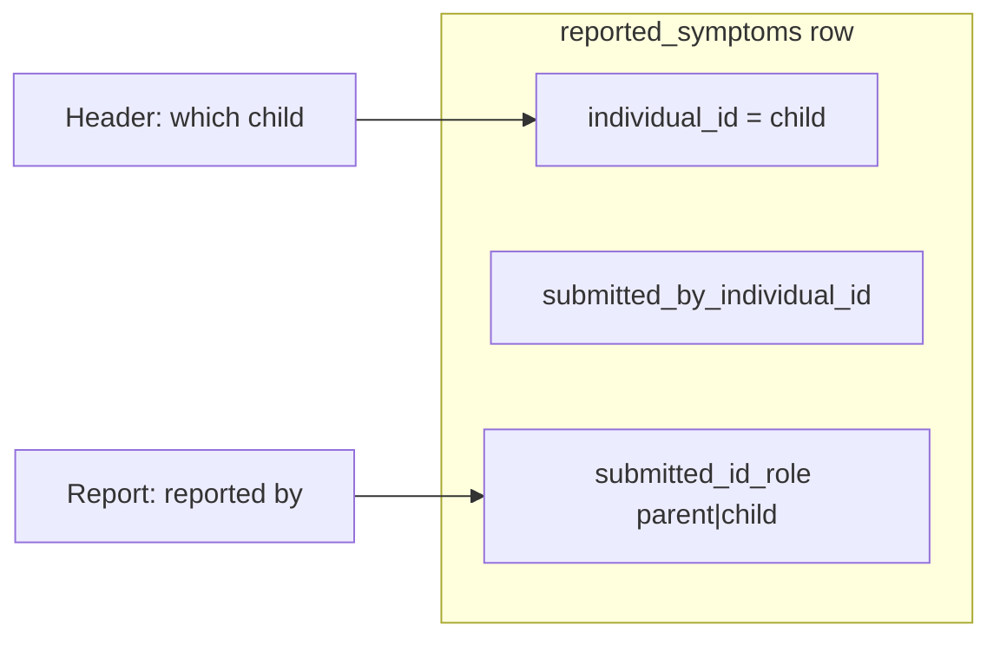

# Report page: filter by who reported (parent vs child)

## Goal

Parents viewing a selected child’s report can switch between:

- **Reported by Child** — symptoms the child entered for themselves
- **Reported by Parent** — symptoms the parent entered while reporting for that child

Not combined on one chart. Child accounts see no toggle. Scope: [`app/(pages)/report/page.tsx`](app/(pages)/report/page.tsx) only (not home summary).

## Data model (already in REDCap)



- **Subject:** `individual_id` = header `reporting_for_individual_id` (child)
- **Submitter:** `submitted_by_individual_id` + `submitted_id_role` (set on write in [`SPOTS_backend/redcap_client.py`](SPOTS_backend/redcap_client.py) / [`SPOTS_backend/symptom_submitter_role.py`](SPOTS_backend/symptom_submitter_role.py))

Legacy `for_child` on [`FilterRequest`](app/_lib/types/business/reports.ts) is unrelated to this; Lambda already ignores it. Keep sending it for now; new field drives filtering.

## Classification rules (hide ambiguous)

Add a small pure helper in **SPOTS_backend** (e.g. `symptom_reporter_filter.py`) with unit tests (mirror style of [`test_submitted_id_role.py`](SPOTS_backend/test_submitted_id_role.py)):

| Step | Rule |
|------|------|
| 1 | Normalize `submitted_id_role` to `parent` / `child` if present |
| 2 | If role is `child` or `parent`, use it **unless** `submitted_by_individual_id` is present and contradicts that role vs known parent/child IDs → **ambiguous, exclude** |
| 3 | If no usable role, infer from `submitted_by_individual_id`: match child ID → child; match parent ID → parent |
| 4 | Otherwise **ambiguous, exclude** |

`symptom_matches_reported_by_view(symptom, view, parent_individual_id, child_individual_id)` returns bool.

**Post-filter in Lambda** (after REDCap export, before aggregation) so ambiguous handling stays in one place. Existing queries in [`get_reports_summary_data`](SPOTS_backend/redcap_client.py) / [`get_reports_generate_data`](SPOTS_backend/redcap_client.py) stay `individual_id = reporting_for` + date range.

## API contract

**Request body** (both `/reports/summary` and `/reports/generate`):

```ts
reported_by?: 'child' | 'parent'  // required when parent filters for a child
```

**Headers** (reports BFF routes must align with symptoms routes):

- `x-reporting-for-individual-id` — child (already sent)
- `x-user-individual-id` — logged-in parent (add to [`app/api/reports/generate/route.ts`](app/api/reports/generate/route.ts) and [`app/api/reports/summary/route.ts`](app/api/reports/summary/route.ts))

Lambda [`LambdaRedcap.py`](SPOTS_backend/LambdaRedcap.py) for `/reports/summary` and `/reports/generate`:

- Parse `reported_by` from body; validate `child` | `parent` when present
- When `reported_by` is set: require `user_individual_id` + `reporting_for_individual_id` (parent ≠ child); apply post-filter in existing loops (~lines 361 and 443)
- When omitted (child self-report): no submitter filter (all rows on own record are child-entered)

## Frontend changes (spots-app)

### Types and validation

- [`app/_lib/types/business/reports.ts`](app/_lib/types/business/reports.ts): add `ReportedByFilter = 'child' | 'parent'`; optional `reported_by?: ReportedByFilter` on `FilterRequest`
- [`app/_lib/services/spots/report-service.ts`](app/_lib/services/spots/report-service.ts): extend `validateFilter` — when `reported_by` present, must be `child` | `parent`

### Report page UI and state

[`app/(pages)/report/page.tsx`](app/(pages)/report/page.tsx):

- `useUser().isParent()` + `useChildSelection()`: show radio group only when `isParent() && isReportingForChild && selectedChildId`
- State: `reportedBy`, default `'child'`
- `useEffect` on `selectedChildId`: reset `reportedBy` to `'child'`; clear generated report / re-trigger summary load
- Place control near date range panel (above summary), **not** in header
- i18n: `getLocSetting('ReportForChild')` / `getLocSetting('ReportForSelf')` with fallbacks matching legacy copy (“Symptoms reported by my child” / “Symptoms reported by me”) — keys exist in SpotSymptoms [`GeneralEng.json`](SpotSymptoms/Services/Redcap/Data/GeneralEng.json); confirm they are in REDCap general LOC (add to REDCap if missing)

### Wire API calls

- Summary `postReportsSymptomSummary` body: include `reported_by` when toggle visible
- [`useReportGeneration`](app/_lib/hooks/reports/useReportGeneration.ts) / `handleFilterSubmit`: pass `reported_by` in `FilterRequest`
- Add `reportedBy` to `useEffect` dependency arrays for summary, symptom list, and report generation

### Empty and print

- Reuse existing empty block (`GenerateReport_NoProblems`) when summary + detailed report have no rows for the active `reportedBy`
- Print already targets visible DOM; only one view loaded at a time — no change beyond ensuring toggle/summary reload on switch

### Optional small component

[`app/_components/reports/ReportedByFilter.tsx`](app/_components/reports/ReportedByFilter.tsx) — accessible radio group (fieldset + labels) to keep page lean.

## Testing

| Layer | What |
|-------|------|
| Backend | `test_symptom_reporter_filter.py` — role match, ID fallback, ambiguous/conflict cases |
| Frontend | Extend report-service `validateFilter` tests if present; light test for filter builder including `reported_by` |
| Manual | Parent dev account: select child → toggle → summary + detailed charts differ; switch child → resets to child; child login → no toggle; print shows active view only |

## Deployment note

Backend Lambda change deploys separately from Amplify frontend. Ship backend first (or together); older frontend without `reported_by` continues to return unfiltered data until upgraded.

## Out of scope

- Home summary chart
- Combined parent+child report
- Parent self-symptom record (explicitly N/A)
- REDCap backfill of legacy rows (ambiguous rows stay hidden)
