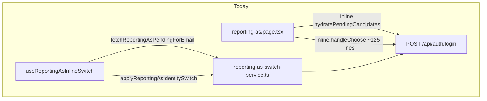
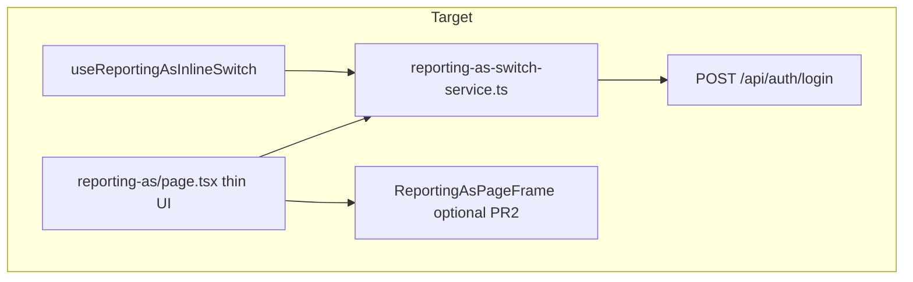

# Reporting-as deeper issues fix plan

## Current state

The page ([`app/auth/reporting-as/page.tsx`](app/auth/reporting-as/page.tsx)) reimplements logic that already exists in [`app/_lib/services/auth/reporting-as-switch-service.ts`](app/_lib/services/auth/reporting-as-switch-service.ts) and is used correctly by [`app/_lib/hooks/auth/useReportingAsInlineSwitch.ts`](app/_lib/hooks/auth/useReportingAsInlineSwitch.ts).



**Recommended target:**



---

## Phase 1 — Service + page logic (PR 1)

### 1. Generalize identity selection in the switch service

Extend [`applyReportingAsIdentitySwitch`](app/_lib/services/auth/reporting-as-switch-service.ts) (or extract a shared `applyReportingAsSelection` used by both callers) with options so page and header keep distinct telemetry:

| Option | Inline switch (header) | Reporting-as page |
|--------|------------------------|-------------------|
| `loginRumFlow` | `inline_switch` | `reporting_as_select` |
| `syncSessionFlow` | `inline_switch` | `reporting_as_select` |
| `trackIdentitySwitch` | `true` | `false` |

**Add selection-loop handling** (page-only today, lines 417–429):

- When login returns `needsReportingAs` + `candidates` after a selection POST, return a typed failure instead of a generic error:

```typescript
type ApplyReportingAsSelectionResult =
  | { ok: true; user: User }
  | { ok: false; error: string }
  | { ok: false; errorCode: 'selection_loop' };
```

- Page maps `errorCode: 'selection_loop'` to `getLocSetting('ReportingAs_SelectionBackendRequired', ...)`.
- Inline hook keeps current generic error string (no behavior change).

**Unify child-cookie + event dispatch** inside the service (already present in `applyReportingAsIdentitySwitch` lines 380–422). Remove duplicate page helpers: `persistSelectedChildId`, `notifyChildSelectionPersisted`, and the parent/child branches inside `handleChoose`.

**Keep page-only post-selection steps in the page** (not in service):

- `resolvePostLoginRouteAfterAuth()`
- `clearPostLoginRedirectTarget()`
- `refreshUserForPath(nextRoute)`
- `router.push(nextRoute)`

### 2. Reuse candidate bootstrap helper

Add optional `rumFlow` to [`fetchReportingAsPendingForEmail`](app/_lib/services/auth/reporting-as-switch-service.ts) (default `reporting_as_init` for header backward compatibility).

Replace inline `hydratePendingCandidates` in the page with:

```typescript
const nextPending = await fetchReportingAsPendingForEmail(idToken, email, {
  rumFlow: 'reporting_as_page',
});
```

Preserve existing page state flags (`isBootstrappingCandidates`, `hasBootstrapCheckCompleted`, `reportingAsPendingStore.set`).

Remove unused imports from the page: `buildLoginDiscoveryRequestBody`, `postAuthLogin`, `REPORTING_AS_LOGIN_SELECTION_*`, `syncSessionFromLoginResult`, `userFromLoginResult`, and local `AuthLoginReportingAsResponse` type.

### 3. Slim down `handleChoose`

After Phase 1, `handleChoose` should be roughly:

1. **Pending path:** get id token → call generalized selection service → on success, navigate; on `selection_loop`, set localized error; else set generic error.
2. **Direct-visit path (no pending):** keep thin parent/admin child bootstrap via `fetchFirstFamilyChildId` + `selectedChildCookie` (or export a small `ensureDefaultChildSelectionForParent` from service), set `reportingAsCookie`, redirect.

Target: **~40–50 lines** in `handleChoose`, down from ~125.

### 4. Unit tests (Phase 1)

Add [`app/_lib/services/auth/__tests__/reporting-as-switch-service.test.ts`](app/_lib/services/auth/__tests__/reporting-as-switch-service.test.ts):

- `fetchReportingAsPendingForEmail` passes correct `rumFlow` when overridden.
- Selection success: sync called before `userCookies.setUser` (order regression from commit `660fd06`).
- Selection loop: returns `errorCode: 'selection_loop'` when API re-sends `needsReportingAs`.
- Inline path still fires `trackReportingAsIdentitySwitch`; page path does not.

Mock `fetch`, `syncSessionFromLoginResult`, and cookie utils per existing patterns in [`login-service.test.ts`](app/_lib/services/auth/__tests__/login-service.test.ts).

---

## Phase 2 — UI shell + docs (PR 2)

### 5. DRY loading layout

Add [`app/auth/reporting-as/ReportingAsPageFrame.tsx`](app/auth/reporting-as/ReportingAsPageFrame.tsx):

```tsx
// Outer column used by all four loading/choice branches
<ReportingAsPageFrame footer={logoutAboveFooter}>
  {body}
</ReportingAsPageFrame>
```

Bodies vary: `ReportingAsSkeleton embedded`, loading `<p role="status">`, or choice UI. Removes four copies of `className="flex flex-1 flex-col w-full min-h-0"`.

### 6. Update backend workaround docs/comments

- In page: shorten the block comment at the selection-loop handler to note the **backend fix exists** (`match_spots_user_id_only` in `SPOTS_backend/lambda_auth.py`) and this branch is a **safety net for stale deployments**.
- Update [`docs/auth/reporting-as-backend-dependency.md`](docs/auth/reporting-as-backend-dependency.md) with a “Selection step” subsection documenting `X-Reporting-As-Selection` and the strict `spots_user_id` lookup—so the inline comment does not carry all the context.

No logic change; documentation only.

---

## Out of scope (intentionally)

- **`<main>` landmark** — already provided by [`app/layout.tsx`](app/layout.tsx) (`id="main-content"`). No work needed.
- **Broader post-login sync dedup** across `login-service.ts` and `callback/page.tsx` — separate refactor; Phase 1 only unifies reporting-as selection paths.
- **Renaming RUM flows** (`reporting_as_page` vs `reporting_as_init`) — keep distinct labels for monitoring.

---

## Verification checklist

**Phase 1 manual QA** (use accounts from [`LOCAL/tests/Login-Dev-Test-Accounts.md`](LOCAL/tests/Login-Dev-Test-Accounts.md)):

- OAuth/login → reporting-as splash → pick parent → lands on correct post-login route.
- OAuth/login → pick child → child cookie + route correct.
- Header “Switch user” still loads options and switches without visiting `/auth/reporting-as`.
- Direct navigation to `/auth/reporting-as` without pending store bootstraps candidates then shows buttons.
- Sign out from reporting-as page still clears session and returns to `/`.

**Automated:** `npm test -- reporting-as-switch-service` (and existing `reporting-as-utils` tests).

---

## Risk notes

- **Session sync order** must remain: `syncSessionFromLoginResult` before `userCookies.setUser` (regression risk if reordered during extraction).
- **RUM dashboards** rely on distinct `reporting_as_page` / `reporting_as_init` / `reporting_as_select` flows—preserve via options, do not collapse.
- **Localized selection-loop error** stays in the page (service returns `errorCode`, not UI strings).
