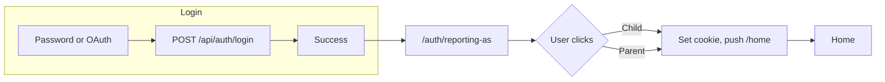

# Reporting-as splash page (frontend-only)

## Goal

After successful login (password or OAuth), show a splash screen with "Reporting as:" and two large buttons: **Child** and **Parent**. Every user must pick one. On click, store the choice and redirect to `/home`. When the backend supports the flow, we will branch on `needsReportingAs` and optionally send the chosen identity on a second login call; for now we only implement the UI and client-side storage.

## Current flow (to change)

- **Password login:** [app/_lib/services/auth/login-service.ts](spots-app/app/_lib/services/auth/login-service.ts) — `performValidation` on success does `userCookies.setUser(result.user)`, `onBeforeRedirect?.()`, then `router.push('/home')`.
- **OAuth callback:** [app/auth/callback/page.tsx](spots-app/app/auth/callback/page.tsx) — on login API success: `userCookies.setUser(result.user)`, `refreshUserForPath('/home')`, `router.push('/home')`.

Both currently redirect to `/home`; we will redirect to the new splash route instead.

## Implementation

### 1. New route: splash page

- **File:** `app/auth/reporting-as/page.tsx` (client component).
- **Behavior:**
  - On mount: if `userCookies.getUser()` is null, redirect to `/` (no session).
  - Render: heading "Reporting as:" and two prominent buttons, "Child" and "Parent".
  - On Child click: set reporting-as choice, then `router.push('/home')`.
  - On Parent click: same with the other value.
- **Styling:** Use existing design system ([app/_components/ui/Button.tsx](spots-app/app/_components/ui/Button.tsx), Tailwind). Keep layout simple and accessible (clear labels, focus states). No auth layout under `app/auth` today; the page will use the root layout.

### 2. Persist "reporting as" choice

- **Where:** Reuse [app/_lib/utils/cookie-utils-client.ts](spots-app/app/_lib/utils/cookie-utils-client.ts).
- **Approach:** Add a small helper (e.g. `reportingAsCookie`) with:
  - `set(value: 'child' | 'parent')` — uses `clientCookies.set('spots-reporting-as', value)` with same path/options as other app cookies.
  - `get(): 'child' | 'parent' | null`
  - `clear()` — delete the cookie.
- Cookie name in one place so logout and future backend use stay consistent.

### 3. Redirect to splash after login

- **login-service.ts:** In `performValidation`, on success replace `router.push('/home')` with `router.push('/auth/reporting-as')`. Keep `userCookies.setUser(result.user)` and `onBeforeRedirect?.()` as-is (or call `onBeforeRedirect` with a path of `/auth/reporting-as` if that hook is path-aware; otherwise keep current behavior and just change the push target).
- **auth/callback/page.tsx:** After `userCookies.setUser(result.user)`, replace `refreshUserForPath('/home')` and `router.push('/home')` with `router.push('/auth/reporting-as')`. Optional: still call `refreshUserForPath('/home')` before pushing so /home is warm after they click; otherwise leave it and let /home load when they land.

### 4. Clear choice on logout

- **UserProvider:** Where [userCookies.clearUser()](spots-app/app/_components/auth/UserProvider.tsx) is called (around line 203), also call the new `reportingAsCookie.clear()` so the next login gets a fresh splash.

### 5. Optional: expose choice for app use

- **Later:** If any component needs to read "who is reporting" (e.g. dashboard, copy), they can call `reportingAsCookie.get()`. No need to add this to UserProvider or context until a feature needs it. Plan only the cookie API here.

## Flow diagram

## Files to add

| File                             | Purpose                                |
| -------------------------------- | -------------------------------------- |
| `app/auth/reporting-as/page.tsx` | Splash UI and redirect on button click |

## Files to change

| File                                                                                         | Change                                                                                                                    |
| -------------------------------------------------------------------------------------------- | ------------------------------------------------------------------------------------------------------------------------- |
| [app/_lib/utils/cookie-utils-client.ts](spots-app/app/_lib/utils/cookie-utils-client.ts)     | Add `reportingAsCookie` (set/get/clear)                                                                                   |
| [app/_lib/services/auth/login-service.ts](spots-app/app/_lib/services/auth/login-service.ts) | On success, `router.push('/auth/reporting-as')` instead of `/home`                                                        |
| [app/auth/callback/page.tsx](spots-app/app/auth/callback/page.tsx)                           | On success, `router.push('/auth/reporting-as')` instead of `/home`; optionally keep or drop `refreshUserForPath('/home')` |
| [app/_components/auth/UserProvider.tsx](spots-app/app/_components/auth/UserProvider.tsx)     | On logout, call `reportingAsCookie.clear()`                                                                               |

## Out of scope (for later)

- Checking backend for `needsReportingAs` and only showing splash when multiple candidates exist.
- Second login request with chosen `spots_user_id`; cookie is enough for now so the app can show the screen and store the choice.

