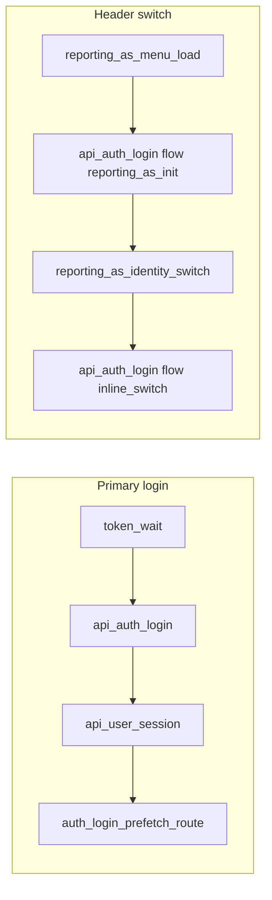

# Close RUM gaps for login and profile switching

## Current state

- `**[app/_lib/monitoring/rum.ts](spots-app/app/_lib/monitoring/rum.ts)**` initializes AWS RUM and exposes `**trackAuthLoginApi**` → custom event `**api_auth_login**` (`duration_ms`, `status_code`, `success`).
- `**api_auth_login` is only emitted from** `[performValidation](spots-app/app/_lib/services/auth/login-service.ts)` (email/password path via `validateAndRedirect`).
- `**[app/auth/callback/page.tsx](spots-app/app/auth/callback/page.tsx)`** calls `**fetch('/api/auth/login', …)` directly** (not `performValidation`), so **OAuth logins likely have no `api_auth_login` RUM today**.
- **Reporting-as / switch user** uses `[postAuthLogin](spots-app/app/_lib/services/auth/reporting-as-switch-service.ts)` and related helpers with **no RUM**.
- `**[UserProvider.refreshUser](spots-app/app/_components/auth/UserProvider.tsx)`** (`GET /api/user`) has **no RUM**.

Sampling: ship **100%** of new custom events (same spirit as existing `sessionSampleRate: 1.0`). If ingestion cost becomes an issue, add a small optional gate later (e.g. `NEXT_PUBLIC_RUM_CUSTOM_SAMPLE_RATE`) without changing event shapes.

---

## Design principles (HIPAA / privacy)

- **No** email, names, `spots_user_id`, tokens, or URLs in payloads.
- Use `**performance.now()`** deltas, **HTTP status**, **booleans**, and **small enums** (`flow`, `phase`, `cache_hit`).
- Reuse `**awsRum?.recordEvent`** only after `initializeRUM()`; safe no-op when RUM env vars are missing.

---

## 1) Centralize custom perf events in `rum.ts`

Extend `[app/_lib/monitoring/rum.ts](spots-app/app/_lib/monitoring/rum.ts)` with a **single internal helper** (e.g. `recordPerfEvent(name, payload)`) plus **named exports** so call sites stay readable and unit tests can mock one module.

**Proposed events** (names stable for CloudWatch queries):

| Event name                     | When                                                                                 | Payload (examples)                                                                                                                               |
| ------------------------------ | ------------------------------------------------------------------------------------ | ------------------------------------------------------------------------------------------------------------------------------------------------ |
| `api_auth_login`               | After any `POST /api/auth/login` completes                                           | Existing fields + `**flow`**: `primary` | `oauth_callback` | `reporting_as_page` | `reporting_as_init` | `reporting_as_select` | `inline_switch` |
| `auth_login_token_wait`        | Token ready for login POST                                                           | `duration_ms`, `outcome`: `ok` | `timeout` | `retry_ok`, `path_kind`: `validateAndRedirect` | `oauth_callback`                                   |
| `auth_login_post_token`        | Wall clock from “token ready” through end of `performValidation` (optional sub-span) | `duration_ms`, includes nested `api_auth_login` timing alignment — *or* skip if redundant; prefer **one** `auth_login_validate_total` instead    |
| `auth_login_validate_total`    | `validateAndRedirect` entry → just before `router.push` / return                     | `duration_ms`, `outcome`, `redirect`: `home` | `reporting_as` | `error`                                                                          |
| `auth_login_prefetch_user`     | `onBeforeRedirect`: `refreshUserForPath`                                             | `duration_ms`, `user_fetch_ok`: boolean                                                                                                          |
| `auth_login_prefetch_route`    | `router.prefetch('/home')`                                                           | `duration_ms` (optional; small)                                                                                                                  |
| `api_user_session`             | `GET /api/user` in `refreshUser`                                                     | `duration_ms`, `status_code`, `ok`                                                                                                               |
| `reporting_as_menu_load`       | `useReportingAsInlineSwitch` load effect completes                                   | `duration_ms`, `cache_hit`, `steps`: optional counts or `pending_ms` / `labels_ms` if you split marks                                            |
| `reporting_as_identity_switch` | `applyReportingAsIdentitySwitch` completes                                           | `duration_ms`, `choice`: `parent` | `child`, `ok`, `extra_child_fetch` (boolean if `fetchFirstFamilyChildId` ran)                                |

**Refactor `trackAuthLoginApi*`*: add optional `flow` (default `primary` for backward-compatible dashboards). All `postAuthLogin` / `performValidation` / callback paths call the same tracker after measuring `performance.now()` around `fetch`.

---

## 2) Instrumentation touchpoints (files)

1. `**[login-service.ts](spots-app/app/_lib/services/auth/login-service.ts)**`
  - `validateAndRedirect`: mark start; after `fetchSessionWithBudget` / retries, emit `**auth_login_token_wait**`.  
  - On completion (success or error before return), emit `**auth_login_validate_total**` with `redirect` / `outcome`.  
  - `performValidation`: pass `**flow: 'primary'**` into `trackAuthLoginApi` (or new signature).
2. `**[useAuthValidation.ts](spots-app/app/_lib/hooks/auth/useAuthValidation.ts)**`
  - Wrap `**onBeforeRedirect**`: time `refreshUserForPath` → `**auth_login_prefetch_user**`; time `router.prefetch` → `**auth_login_prefetch_route**`.  
  - Ensure events fire only in browser (this hook is client-side already).
3. `**[UserProvider.tsx](spots-app/app/_components/auth/UserProvider.tsx)**`
  - Around `fetch('/api/user', …)` in `**refreshUser**`, record duration + status → `**api_user_session**`.  
  - Avoid double-counting: this fires for post-login refresh and normal loads; analysts filter by session. Optional: add `**reason**`: `post_login` vs `initial`** if you can thread a parameter without large refactors (nice-to-have; skip if noisy).
4. `**[app/auth/callback/page.tsx](spots-app/app/auth/callback/page.tsx)`**
  - Wrap the existing `**fetch('/api/auth/login', …)**` with timing → `**api_auth_login**` with `**flow: 'oauth_callback'**` (same helper as `performValidation`).  
  - Optionally token-wait segment if you measure from effect start to first successful token.
5. `**[reporting-as-switch-service.ts](spots-app/app/_lib/services/auth/reporting-as-switch-service.ts)**`
  - `**postAuthLogin**`: accept optional `flow` and record `**api_auth_login**` at end (callers pass `reporting_as_init` / `reporting_as_select` / `inline_switch`).  
  - `**applyReportingAsIdentitySwitch**`: wrap full function → `**reporting_as_identity_switch**`.
6. `**[app/auth/reporting-as/page.tsx](spots-app/app/auth/reporting-as/page.tsx)**`
  - Uses `postAuthLogin` — flows `reporting_as_page` for initial vs selection if you want two enums (or reuse `reporting_as_select` for the choose handler).
7. `**[useReportingAsInlineSwitch.ts](spots-app/app/_lib/hooks/auth/useReportingAsInlineSwitch.ts)**`
  - In the async loader: `performance.now()` at start; after cache hit emit `**reporting_as_menu_load**` with `cache_hit: true` and small `duration_ms`; on network path emit sub-durations if cheap (session + pending + `loadReportingAsCandidateDisplayContext`) or single total.
8. **Tests**
  - Extend mocks in `[login-service.test.ts](spots-app/app/_lib/services/auth/__tests__/login-service.test.ts)` for new `rum` exports.  
  - Add/extend tests for `postAuthLogin` if you add parameters (or test via a thin wrapper).
9. **Docs**
  - Short table in `[docs/tracking/README.md](spots-app/docs/tracking/README.md)` or a new `**docs/tracking/rum-custom-events.md`** listing event names and fields for whoever queries CloudWatch RUM.

---

## 3) Dashboard / baseline workflow (for the team)

- In **CloudWatch RUM → Query custom events**, filter by `event.name` / type per AWS console naming for `recordEvent`.  
- Build **p50 / p95** on `duration_ms` per event and breakdown by `flow` for `api_auth_login`.  
- Correlate `**auth_login_validate_total`** with `**api_auth_login**` + `**api_user_session**` to see waterfall contribution.  
- `**reporting_as_menu_load**` vs `**reporting_as_identity_switch**` baselines header UX.

---

## 4) Out of scope (follow-ups)

- **Server-side** aggregation (Lambda stage logs) — already documented; no change required for this RUM plan.  
- **Sampling env var** — defer unless cost feedback arrives.  
- **LogRocket** perf parity — not requested.

