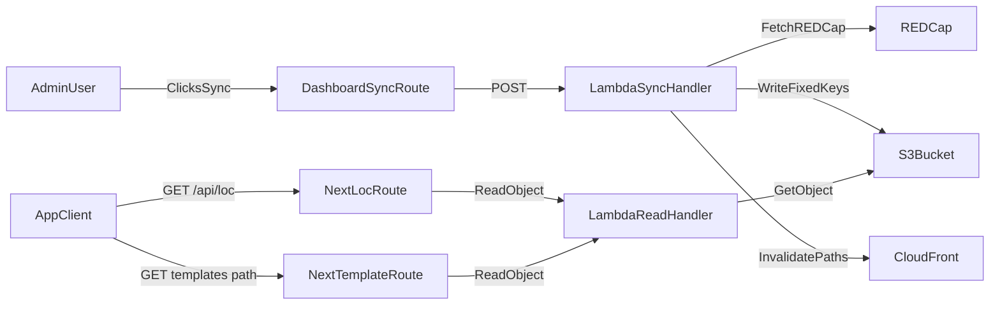

# S3-Backed LOC + CTCAE Sync Plan

## Goals
- Keep existing frontend call paths unchanged (`/api/loc`, `/api/admin/symptoms/sync`, and current template fetch path).
- Move hot-read data source from direct REDCap fetches to S3 snapshot objects.
- Use fixed object keys in one bucket (`us-east-2`).
- Trigger cache invalidation from admin sync so updates propagate within minutes.
- Preserve existing API response body shapes for migration safety.

## Architecture (Target)

## AWS Setup You Need To Complete
- Create/confirm one S3 bucket in `us-east-2` for cached payloads.
- Enable bucket versioning and default SSE-S3 encryption.
- Define fixed keys (recommended with env prefix):
  - `prod/loc.json`
  - `prod/ctcae/templates-en.json`
  - `prod/ctcae/templates-es.json`
- Add bucket policy/CORS for CloudFront/public-read delivery of snapshot objects (only needed if objects are served publicly via CDN).
- Create or reuse CloudFront distribution with S3 origin.
- Configure cache behaviors for the fixed keys and ensure invalidation permissions are available.
- Add IAM permissions to Lambda execution role:
  - `s3:GetObject` for read paths.
  - `s3:PutObject` for sync path.
  - `s3:ListBucket` (optional for diagnostics/health checks).
  - `cloudfront:CreateInvalidation` on the target distribution.
- Add env vars to Lambda/Next as needed:
  - `CACHE_S3_BUCKET`
  - `CACHE_S3_PREFIX` (e.g., `prod`)
  - `CACHE_CLOUDFRONT_DISTRIBUTION_ID`
  - optional `CACHE_INVALIDATION_PATHS` (defaults can be hardcoded).
- Add EventBridge rule for daily sync (still keep admin sync for immediate refresh).
- Add CloudWatch alarms/log filters for sync failures and invalidation failures.

## Code Plan

### 1) Backend Lambda: S3-backed read-first behavior
- Update Lambda path handlers in [`/Users/lukey/Sites/UT/SPOTS/SPOTS_backend/LambdaRedcap.py`](/Users/lukey/Sites/UT/SPOTS/SPOTS_backend/LambdaRedcap.py):
  - For `/loc`, read `loc.json` from S3 and return it in the same shape currently returned by REDCap.
  - For `/CTCAE/templates`, read language-specific snapshot object and return existing payload shape (including `choice_sets` behavior if currently included).
  - Add safe fallback policy (optional but recommended): if S3 object missing, fetch from REDCap once and return error-typed response if strict mode is enabled.
- Add S3/cache utility methods in [`/Users/lukey/Sites/UT/SPOTS/SPOTS_backend/redcap_client.py`](/Users/lukey/Sites/UT/SPOTS/SPOTS_backend/redcap_client.py) or a new helper module:
  - `read_cached_loc()`
  - `read_cached_ctcae(lang)`
  - `write_cached_loc(data)`
  - `write_cached_ctcae(lang, data)`

### 2) Backend Lambda: explicit sync endpoint/action
- Add sync action in Lambda to:
  - Pull fresh `/loc` and CTCAE template data from REDCap.
  - Write fixed-key objects to S3.
  - Trigger CloudFront invalidation for relevant paths.
  - Return sync metadata (`counts`, `keys`, invalidation id, timestamps).
- Keep the response concise and non-PHI.

### 3) Next.js admin route wiring
- Update [`/Users/lukey/Sites/UT/SPOTS/spots-app/app/api/admin/symptoms/sync/route.ts`](/Users/lukey/Sites/UT/SPOTS/spots-app/app/api/admin/symptoms/sync/route.ts):
  - Keep existing admin auth checks.
  - Call Lambda sync action (not only in-process cache warm).
  - Preserve current success/error contract used by dashboard button.
  - Optionally retain `warmSymptomCatalog` call as a local cache warm step after successful backend sync.

### 4) Dashboard UX copy/status
- Update [`/Users/lukey/Sites/UT/SPOTS/spots-app/app/(pages)/dashboard/page.tsx`](/Users/lukey/Sites/UT/SPOTS/spots-app/app/(pages)/dashboard/page.tsx):
  - Keep the existing button.
  - Adjust label/message to reflect “Sync REDCap to AWS cache”.
  - Surface invalidation success/failure details from route response.

### 5) Keep existing reader routes unchanged externally
- Confirm [`/Users/lukey/Sites/UT/SPOTS/spots-app/app/api/loc/route.ts`](/Users/lukey/Sites/UT/SPOTS/spots-app/app/api/loc/route.ts) still proxies exactly the same path.
- Ensure frontend localization/template consumers require no API shape changes.

### 6) Daily automation
- Add EventBridge schedule -> Lambda sync invocation.
- Ensure idempotent sync logic and clear logs for scheduled runs.

### 7) Validation and rollout
- Verify parity between pre-change and post-change payload shapes for LOC/templates.
- Test admin-triggered sync end-to-end and confirm CloudFront invalidation path propagation.
- Validate fallback/error behavior (missing object, S3 permission issue, invalidation failure).
- Roll out with feature flag or staged env prefix first, then cut prod prefix.

## Acceptance Criteria
- `/api/loc` and template route payloads remain shape-compatible with existing clients.
- Admin sync updates S3 fixed keys and triggers CloudFront invalidation in same operation.
- Newly updated REDCap values are served to clients within minutes.
- Daily EventBridge sync runs successfully and is observable via CloudWatch.
- No PHI/token leakage in logs or sync responses.