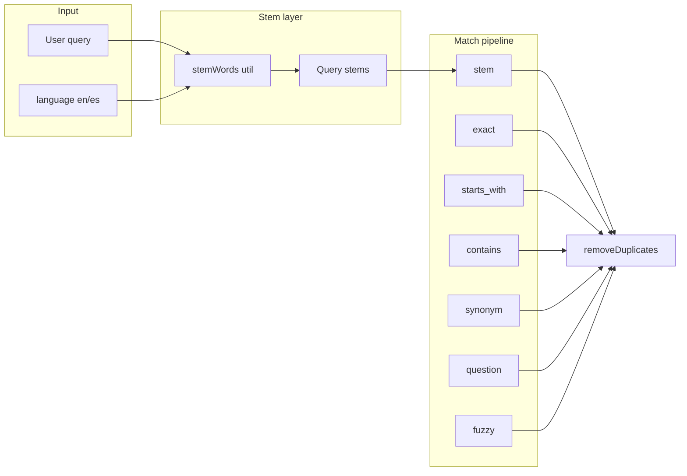

# Symptom search: stem matching (English + Spanish)

## Goal

Allow queries like "worried" or "nerviosa" to match symptoms whose table has "worry" or "nervioso" by stemming both the query and the symptom/synonym text to a common root before matching. Nurses no longer need to list every grammatical form.

## Architecture

- **Stemming**: word-level. Query and each symptom term/synonym are split into words; each word is stemmed; we match when any query stem appears in the set of stems for that symptom (term + synonyms).
- **Placement**: New step `findStemMatches` runs after synonym matching and before question matching. Existing steps unchanged. `removeDuplicates` keeps one result per symptom (highest relevance wins).

## 1. Dependency: stemmers (English + Spanish)

- **Option A (recommended)**: `stemmer` (Porter, English, ~2KB, ESM) + `natural` (use only `StemmerEs` for Spanish). `natural` is larger; tree-shake or use a subpath if the package supports it.
- **Option B**: Single package that provides both (e.g. evaluate `snowball-stemmers` or similar on npm for en+es and bundle size).

Add one or two packages to [package.json](spots-app/package.json); ensure they work in the browser (search runs client-side in the search page).

## 2. Stemmer utility module

**New file**: [app/_lib/services/search/stemmer-utils.ts](spots-app/app/_lib/services/search/stemmer-utils.ts)

- `stemWord(word: string, lang: 'en' | 'es'): string` — stem a single word; return lowercased; no-op for very short tokens (e.g. length < 2) to reduce noise.
- `stemWords(text: string, lang: 'en' | 'es'): string[]` — split `text` on non-alphabetic characters, stem each token, return unique non-empty stems.
- Use the chosen library for English (Porter) and Spanish (Snowball-style or natural’s StemmerEs). Handle empty input and non-string safely.

## 3. Search config and relevance

**File**: [app/_lib/services/search/search-service.ts](spots-app/app/_lib/services/search/search-service.ts)

- **SearchConfig**: Add `stemWeight: number` (e.g. `0.6`, between contains and synonym) and `enableStemMatching: boolean` (default `true`). Add to `DEFAULT_SEARCH_CONFIG`.
- **RelevanceScorer.getBaseScore**: Add case `'stem'` returning `this.config.stemWeight`.

## 4. New match step: findStemMatches

**File**: [app/_lib/services/search/search-service.ts](spots-app/app/_lib/services/search/search-service.ts)

- Add private method `findStemMatches(searchTerm: string, synonymMapping: Record<string, string[]>, language: 'en' | 'es', categories?: string[]): SymptomSearchResultBusiness[]`.
  - Compute `queryStems = new Set(stemWords(searchTerm, language))`. Skip if empty (e.g. query is only numbers/symbols).
  - For each symptom (respecting `categories`), get synonyms `synonymMapping[symptom.symptomId]` (or `[]`). Build set `symptomStems`: stem each word of `symptom.symptomTerm` and each synonym string with `stemWords(..., language)`, add all to set.
  - If `queryStems` and `symptomStems` have any overlap, push a result with `matchType: 'stem'`, `matchedTerms` e.g. the original search term (or the matching stem(s) for debugging).
- In `searchSymptoms`, after `findSynonymMatches` and before `findQuestionMatches`, if `config.enableStemMatching`, call `findStemMatches` and push to `results`.

## 5. Types: add "stem" match type

- [app/_lib/types/business/symptoms.ts](spots-app/app/_lib/types/business/symptoms.ts): In `SymptomSearchResultBusiness`, extend `matchType` union with `"stem"`.
- [app/_lib/types/index.ts](spots-app/app/_lib/types/index.ts): If `matchType` is repeated there for search, add `"stem"`.
- [app/_lib/types/redcap/redcap-business.ts](spots-app/app/_lib/types/redcap/redcap-business.ts): Add `'stem'` to `REDCapSymptomSearchResultBusiness.matchType` if that type is used in search flows.

## 6. Tests

- **Unit (stemmer-utils)**: Test `stemWord` / `stemWords` for English (e.g. "worried" → same stem as "worry"; "nerves" vs "nervous") and Spanish (e.g. "nerviosa" / "nervioso" → same stem). Edge cases: empty string, single character, numbers, mixed language (caller passes lang so no need to detect).
- **Search integration**: In [test-runner.ts](spots-app/test-runner.ts) or a Jest test, call `getSearchBusinessService().searchSymptoms({ query: 'worried', language: 'en', ... })` with a catalog that includes a symptom whose synonym list has "worry"; assert that symptom appears in results (e.g. with matchType `stem` or synonym). Optional: similar test for Spanish "nerviosa" → symptom with "nervioso".

## 7. Documentation

- [docs/pages/search/search-lookup-table-guidance.md](spots-app/docs/pages/search/search-lookup-table-guidance.md): Add a short section stating that the app now uses stemming for English and Spanish, so many word forms (tenses, plurals, gender variants) will match without listing each form. Nurses can still add important variations for critical terms. Optionally note that the technical detail is in the search service and stemmer-utils.

## 8. Optional tuning (before or after first release)

- Minimum word length for stemming (e.g. ignore tokens of length 1) to avoid false overlap.
- Adjust `stemWeight` so stem matches rank above or below fuzzy as desired.
- If needed later: pre-compute stemmed sets per symptom/synonym when catalog and synonyms load, and only stem the query at search time (reduces repeated work for large catalogs).

## Files to touch (summary)

| File                                              | Change                                                                                                              |
| ------------------------------------------------- | ------------------------------------------------------------------------------------------------------------------- |
| package.json                                      | Add stemmer dependency/ies                                                                                          |
| app/_lib/services/search/stemmer-utils.ts         | New: stemWord, stemWords (en/es)                                                                                    |
| app/_lib/services/search/search-service.ts        | Config stemWeight/enableStemMatching; getBaseScore('stem'); findStemMatches; call findStemMatches in searchSymptoms |
| app/_lib/types/business/symptoms.ts               | Add "stem" to matchType                                                                                             |
| app/_lib/types/index.ts                           | Add "stem" if matchType listed                                                                                      |
| app/_lib/types/redcap/redcap-business.ts          | Add 'stem' if used in search                                                                                        |
| test-runner.ts or Jest                            | Tests for stemmer-utils + one search test (worried → anxiety)                                                       |
| docs/pages/search/search-lookup-table-guidance.md | Note that stemming is in place                                                                                      |

## Out of scope (for later)

- Lemmatization (dictionary base forms); stemming is sufficient for the nurse ask.
- Pre-stemming the catalog at load time (optimization if profiling shows need).
- Stemming inside suggestion autocomplete (getSearchSuggestions); can be added later if desired.

