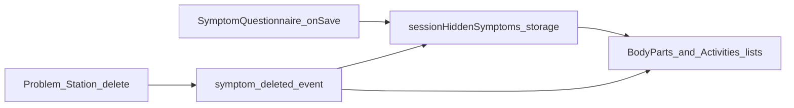

# Session-scoped hide for body parts and activities

## Goal

During a browser session:

- **Body parts:** After a successful report for symptom S on body part B, hide S in B’s list only (same template id can still appear for other parts).
- **Activities:** After a successful report for S under activity A, hide S in A’s modal only.
- **Problem Station delete:** Same mental model as [feelings/page.tsx](app/(pages)/feelings/page.tsx)—deleting a report should allow that slot to show again in the correct surface.
- **HIPAA:** New session keys must be cleared with other ePHI on logout ([storage-cleanup.ts](app/_lib/utils/storage-cleanup.ts)).

## Key design choices

**Stable composite keys** (normalize with `trim` + lowercasing on slug/subcategory and symptom id):

- Body parts: use the **REDCap subcategory** string (not the UI body-part id), because it matches [SymptomQuestionnaire](app/_components/symptoms/SymptomQuestionnaire.tsx) / REDCap (`bodyPartSymptomService.getSubcategoryForBodyPart(bodyPartId)` on submit; `symptom_subcategory` on the record on delete).
- Activities: use the **activity subcategory** already passed as `subcategory` into `SymptomQuestionnaire` from [ActivityModal](app/_components/activities/ActivityModal.tsx) (`category="activities"`, `subcategory={activity.slug || ...}`), aligned with `symptom_subcategory` on the saved record.

Storage shape (simple, one place):

- Prefer **one sessionStorage JSON blob**, e.g. `spots-session-hidden-symptoms`, versioned `{ v: 1, bodyParts: string[], activities: string[] }` where each entry is a composite like `` `${scopeKey}\t${symptomId}` `` or a delimiter you document—avoid ambiguous parsing.

**Feelings:** Keep existing [`feelings-submitted`](app/(pages)/feelings/page.tsx) for now to limit scope; no migration required in the first PR. The important fix is **delete routing** (below).

## 1. Session helper module

Add something like [app/_lib/session/session-hidden-symptoms.ts](app/_lib/session/session-hidden-symptoms.ts) (path negotiable) with:

- `readBodyPartsHidden(): Set<string>` / `readActivitiesHidden(): Set<string>` (or one snapshot type).
- `addBodyPartHidden(subcategory: string, symptomId: string)` and `addActivityHidden(activitySubcategory: string, symptomId: string)` (idempotent).
- `removeBodyPartHidden` / `removeActivityHidden` for delete handling.
- Pure helpers `makeBodyPartsKey(subcategory, symptomId)` and `makeActivityKey(activitySubcategory, symptomId)`—**concise JSDoc** on each public symbol.

Optional **hook** [app/_lib/hooks/symptoms/useSessionHiddenSymptoms.ts](app/_lib/hooks/symptoms/useSessionHiddenSymptoms.ts):

- Returns latest sets + `refreshFromStorage` after add/remove.
- Subscribes to `symptom-deleted` and calls removal using extended detail (step 2).

Components can also call the pure module directly if the hook is overkill for `ActivityModal`.

## 2. Extend `symptom-deleted` event (critical for scoped “show again”)

Today [SymptomsSummary](app/_components/symptoms/SymptomsSummary.tsx) only passes `symptomId`:

```502:508:app/_components/symptoms/SymptomsSummary.tsx
            new CustomEvent('symptom-deleted', {
              detail: { symptomId: symptom.record.symptom_id?.trim() || symptom.symptomId },
            })
```

Extend `detail` with optional **`symptomCategory`** and **`symptomSubcategory`** from `symptom.record` (already on [RedcapSymptomRecord](app/_lib/types/redcap/redcap-symptom-record.ts)).

Export a small **TypeScript type** for the payload (e.g. `SymptomDeletedEventDetail`) from a types or the same module so listeners stay typed.

**Feelings page fix:** Only call `removeSubmittedFeelingId` when the deleted row is a feelings report, e.g. `symptom_category === 'feelings'` (normalize case). This avoids a latent bug: deleting “pain” from Problem Station for **body parts** currently removes “pain” from `feelings-submitted` and can wrongly reshow a feelings card.

**New listeners** in `InteractiveBody` and activities flow:

- On `symptom-deleted`, if `symptom_category === 'body_parts'` (normalized), remove the composite key for `symptom_subcategory` + `symptomId`; update UI state.
- If `symptom_category === 'activities'`, remove activity composite; refresh activities modal list state.

Document the contract in [delete-symptom.md](docs/features/problem-station/delete-symptom.md) in one short bullet (optional but helpful).

## 3. Wire UI surfaces

**InteractiveBody** ([InteractiveBody.tsx](app/_components/body-parts/InteractiveBody.tsx))

- Where symptoms are rendered (the `uniqueSymptoms.map` block ~956–991), **filter out** entries whose composite key is in the body-parts hidden set (compute subcategory via `bodyPartSymptomService.getSubcategoryForBodyPart(displayedBodyPart.id)`).
- In the questionnaire `onSave` success path (existing callback ~1060–1071), call `addBodyPartHidden(subcategory, selectedSymptom.id)` and bump local state so the row disappears without reload.
- Decide whether to **drop or keep** `symptomResponses` indicators for hidden rows (filtering makes indicators irrelevant for hidden items).

**Activities**

- Either in [ActivityModal.tsx](app/_components/activities/ActivityModal.tsx) or [activities/page.tsx](app/(pages)/activities/page.tsx): filter `activitySymptoms` (or the list passed into the modal) using `addActivityHidden` on successful `handleQuestionnaireSave`, keyed by `activity.slug` (or the same subcategory string used in `SymptomQuestionnaire`).
- Listen for `symptom-deleted` with `symptom_category === 'activities'` and matching subcategory to restore the row.

## 4. Logout cleanup

Add `spots-session-hidden-symptoms` to `STORAGE_KEYS_TO_CLEAR` in [storage-cleanup.ts](app/_lib/utils/storage-cleanup.ts) (and comment parity with feelings key).

## 5. Verification

- Manual: report pain on leg → pain hidden for that part only; still visible on another part; delete leg report in Problem Station → pain returns for leg.
- Manual: report pain in Bathing → hidden in that activity modal only; another activity still lists pain; delete restores for Bathing.
- Manual: delete a body-parts symptom does **not** change feelings grid unless the deleted record is feelings category.
- Grep for `symptom-deleted` listeners and update typings if any assume the old detail shape only.


