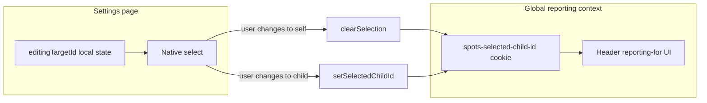

# Settings parent avatar target dropdown

## Goal

Replace the read-only “Editing settings for: …” banner in [`app/_components/user/UserSettings.tsx`](app/_components/user/UserSettings.tsx) with a labeled, keyboard- and screen-reader-friendly `<select>` for **parent and admin accounts with `family_id`**. Child users see no change.

## Behavior (confirmed)

| Rule | Implementation |
|------|----------------|
| Global sync on change | `clearSelection()` for self; `setSelectedChildId(id)` for a child |
| Default on Settings visit | **Local** state starts at parent self; **do not** call `clearSelection()` on mount (header/cookie unchanged until user acts) |
| Parent self label | `getLoggedInFirstName(userBusiness)` from [`app/_components/layout/header/header-utils.ts`](app/_components/layout/header/header-utils.ts) |
| Child labels | `getChildDisplayName(child)` (full name, consistent with current banner) |
| ADMIN | Same as parent (`PARENT` \|\| `ADMIN` + `family_id`) |
| Children loading | Hide the blue bar entirely while `useChildren().loading` is true |
| After load | Show select even if `children.length === 0` (self-only option) |

### Important side effect (intentional)

On first load, the Settings preview may show the **parent’s** avatar while the header may still show a previously selected “reporting for” child. That mismatch resolves when the parent changes the dropdown (which syncs global state).



## Architecture

### 1. New component: `SettingsAvatarTargetSelect`

Create [`app/_components/user/SettingsAvatarTargetSelect.tsx`](app/_components/user/SettingsAvatarTargetSelect.tsx).

- Renders the existing blue bar container (`bg-blue-50 … px-6 py-3`).
- Uses **native** `<label htmlFor>` + `<select>` (matches [`app/_components/reports/ReportFilter.tsx`](app/_components/reports/ReportFilter.tsx) pattern — best built-in a11y).
- Props:
  - `value`: `'self' | string` (child `individual_id`)
  - `onChange(targetId: 'self' | string)`
  - `parentFirstName`, `children`, `getLocSetting`, `disabled?`
- Select styling: full-width, min touch height (`min-h-12`), `focus-visible:ring-2`, dark-mode classes aligned with settings card.
- **Accessible name:** visible `<label>` tied via `htmlFor` / `id` (no duplicate `aria-label` on the select).
- **Live announcement:** sibling `role="status" aria-live="polite" className="sr-only"` updates when selection changes (e.g. “Now editing settings for {name}”) using localized template key.

Sentinel constant: `SETTINGS_AVATAR_TARGET_SELF = 'self'`.

### 2. Update `UserSettings.tsx`

[`app/_components/user/UserSettings.tsx`](app/_components/user/UserSettings.tsx)

**State & branching**

```typescript
const [editingTargetId, setEditingTargetId] = useState(SETTINGS_AVATAR_TARGET_SELF);

const showAvatarTargetSelect =
  isParent && hasFamilyId && !childrenLoading;

const isEditingChild =
  showAvatarTargetSelect && editingTargetId !== SETTINGS_AVATAR_TARGET_SELF;
```

- Keep calling both `useUserSettings()` and `useChildCustomizationSettings()` (existing pattern); pick hook outputs based on `isEditingChild`.
- **Do not** derive editing mode from `selectedChildId` alone anymore.

**Change handler**

```typescript
const handleAvatarTargetChange = (targetId: string) => {
  setEditingTargetId(targetId);
  if (targetId === SETTINGS_AVATAR_TARGET_SELF) {
    clearSelection();
  } else {
    setSelectedChildId(targetId);
  }
};
```

**Select value:** always `editingTargetId` (local), not `selectedChildId`.

**Display name helper** for live region: self → parent first name; child → `getChildDisplayName`.

**Remove** the old read-only `{isEditingChild && (…)}` banner block; render `<SettingsAvatarTargetSelect />` when `showAvatarTargetSelect`.

**Loading UX:** while `childrenLoading`, parent still sees avatar editors (using parent settings via local `self` default). Only the blue selector bar is hidden.

### 3. Hook compatibility (no hook API changes required)

[`useChildCustomizationSettings`](app/_lib/hooks/family/useChildCustomizationSettings.ts) continues to read `selectedChildId` from context. Because `setSelectedChildId` is called in the same handler as `setEditingTargetId`, context and local state stay aligned whenever child mode is active.

No changes needed to [`ChildSelectionContext`](app/_lib/contexts/ChildSelectionContext.tsx).

### 4. REDCap localization keys (draft EN/ES fallbacks)

Add `getLocSetting` calls with these fallbacks (for you to add to REDCap):

| Key | EN fallback | ES fallback |
|-----|-------------|-------------|
| `SettingsSelectAvatarFor` | Choose who to customize | Elija a quién personalizar |
| `SettingsEditingForChild` | *(reuse existing key)* Editing settings for | *(reuse)* Editando configuración para |
| `SettingsAvatarTargetChanged` | Now editing settings for {name} | Ahora editando configuración para {name} |

- Visible label: `SettingsSelectAvatarFor`
- Optional prefix inside live region: reuse `SettingsEditingForChild` or compose with `SettingsAvatarTargetChanged` (replace `{name}` at runtime).

No separate `SettingsAvatarForSelf` key — self option uses parent first name directly.

### 5. Tests

Add [`app/_components/user/__tests__/SettingsAvatarTargetSelect.a11y.test.tsx`](app/_components/user/__tests__/SettingsAvatarTargetSelect.a11y.test.tsx):

- Renders labeled `combobox`/`listbox` (native select) with accessible name.
- Self option shows parent first name; child options present.
- `onChange` fires with correct id.
- Live region receives updated text on change.

Add [`app/_components/user/__tests__/UserSettings.parent-target.test.tsx`](app/_components/user/__tests__/UserSettings.parent-target.test.tsx) (or extend if preferred):

- Parent + loaded children: select visible; defaults to self; uses parent customization hook path.
- Changing to child calls `setSelectedChildId`; changing to self calls `clearSelection`.
- Mount does **not** call `clearSelection` when cookie has a child (mock context).
- Bar hidden while `children.loading === true`.

Mock: `useUser`, `useChildSelection`, `useChildren`, `useUserSettings`, `useChildCustomizationSettings`, `useLocalization`.

### 6. Manual QA

From [`docs/accessibility/manual-qa-checklist.md`](docs/accessibility/manual-qa-checklist.md) patterns:

- Tab to select, arrow keys change option, Enter/Space confirms (native behavior).
- VoiceOver/NVDA: label announced; option list readable; live region announces target change.
- Parent with child pre-selected in header: open Settings → parent avatar shown, header unchanged → pick child → header updates → pick self → header clears child.

## Files to touch

| File | Change |
|------|--------|
| [`app/_components/user/SettingsAvatarTargetSelect.tsx`](app/_components/user/SettingsAvatarTargetSelect.tsx) | **New** — accessible select UI |
| [`app/_components/user/UserSettings.tsx`](app/_components/user/UserSettings.tsx) | Local target state, handler, integrate select |
| [`app/_components/user/__tests__/SettingsAvatarTargetSelect.a11y.test.tsx`](app/_components/user/__tests__/SettingsAvatarTargetSelect.a11y.test.tsx) | **New** |
| [`app/_components/user/__tests__/UserSettings.parent-target.test.tsx`](app/_components/user/__tests__/UserSettings.parent-target.test.tsx) | **New** |

## Out of scope

- Custom combobox / Headless UI (native select is sufficient and more accessible).
- Changing header child picker UI.
- REDCap JSON edits in SpotSymptoms (reference-only); fallbacks live in code until keys are added.
