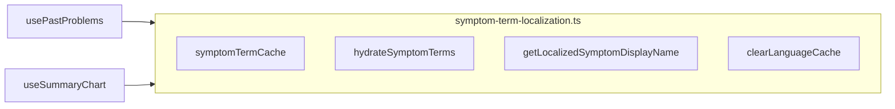

# Shared symptom catalog hydration and display names

## Problem

- [`usePastProblems.ts`](spots-app/app/_lib/hooks/reports/usePastProblems.ts) already implements the correct pattern: per-language cache keys (`${symptomId}-${language}`), `symptomService.getAllSymptoms(language)`, `search_unmatched` handling, and `clearLanguageCache` when the UI language changes.
- [`useSummaryChart.ts`](spots-app/app/_lib/hooks/reports/useSummaryChart.ts) duplicates a **separate** module-level `Map` keyed only by `symptom_id` and always calls `getAllSymptoms('en')`, so summary chart labels stay English and caches can diverge.
- [`useDataLoader`](spots-app/app/_lib/utils/hooks/useDataLoader.ts) only triggers the **first** load on mount (empty `useEffect` deps). [`usePastProblems`](spots-app/app/_lib/hooks/reports/usePastProblems.ts) compensates with an explicit `useEffect` that calls `refresh()` when `language` (or `individualId`) changes. **`useSummaryChart` has no equivalent today**, so even after sharing hydration, you must add a language-change `refresh()` (and optionally the same for `individualId` for parity with the home page’s past-problems block).

## Architecture (after refactor)

## Implementation steps

### 1. Add a shared module

Create something like [`app/_lib/services/symptoms/symptom-term-localization.ts`](spots-app/app/_lib/services/symptoms/symptom-term-localization.ts) (or `app/_lib/hooks/reports/symptom-term-localization.ts` if you prefer colocation with hooks—either works; **services/** matches “catalog + symptom-service integration”).

**Move (copy verbatim behavior) from `usePastProblems.ts`:**

- `getCacheKey(symptomId, language)`
- Module-level `symptomTermCache`, `hydrationPromises`
- `clearLanguageCache(language)`
- `hydrateSymptomTerms(symptomIds, language)` — keep the same fetch via dynamic `import('@/app/_lib/services/symptoms/symptom-service')` and `getAllSymptoms(language)`
- `getLocalizedSymptomTerm` → export as **`getLocalizedSymptomDisplayName`** (or keep the old name) with the same logic: `search_unmatched` + custom input, cache lookup, REDCap fallback, finally snake_case → Title Case

**Exports:** the hydrate function, display-name resolver, `clearLanguageCache`, and a small exported type e.g. `SymptomCatalogLanguage = 'en' | 'es'` for consumers.

### 2. Refactor `usePastProblems.ts`

- Delete the in-file duplicate implementations of the items above.
- Import from the new module inside `processPastProblems` / `mapToPastProblems` as needed (or keep `mapToPastProblems` calling the shared `getLocalizedSymptomDisplayName`).
- Keep `usePastProblems`’s existing `useEffect` that calls `clearLanguageCache(language)` and `refresh()` on language change—only change the import source for `clearLanguageCache`.

### 3. Refactor `useSummaryChart.ts`

- Extend [`UseSummaryChartOptions`](spots-app/app/_lib/hooks/reports/useSummaryChart.ts): `language?: 'en' | 'es'` (default `'en'` for backward compatibility).
- Remove local `symptomTermCache`, `templateFetchPromise`, and `hydrateSymptomTerms`.
- In `loadSummaryData`, after `aggregateSymptomHistory`, call shared `hydrateSymptomTerms` with **unique `symptom_id`s from `counts`** and **`language`** from options (same pattern as `processPastProblems`: collect IDs, await hydrate, then either mutate `symptom_term` from cache or use `getLocalizedSymptomDisplayName` per row—whichever matches current mutation style).

### 4. Reload on language change (required)

- Add a `useEffect` in `useSummaryChart` mirroring [`usePastProblems`](spots-app/app/_lib/hooks/reports/usePastProblems.ts) (lines ~645–682): when `language` changes and `autoLoad` is true, call shared `clearLanguageCache(language)` and `refresh()`. Use `useRef` for previous language to skip the first mount, same as past problems.
- **Optional parity:** also refresh when `individualId` changes, since `loadSummaryData` already passes `x-individual-id` and `usePastProblems` refreshes on that today.

### 5. Wire callers

- [`app/(pages)/home/page.tsx`](spots-app/app/(pages)/home/page.tsx): pass `language: validatedLanguage` into `useSummaryChart({ ... })` (you already compute `validatedLanguage` for `usePastProblems`).

### 6. Verification

- Spanish home: summary chart Y-axis, legend, and tooltip symptom names should match catalog Spanish (same as past problems for the same IDs).
- Toggle EN/ES: both hooks should refetch/rehydrate without stale labels.
- Quick grep: ensure no remaining `getAllSymptoms('en')` inside `useSummaryChart.ts` for hydration.

## Out of scope (optional follow-ups)

- [`app/(pages)/report/page.tsx`](spots-app/app/(pages)/report/page.tsx) still uses `getAllSymptoms('en')` for dropdown/summary hydration (~line 189); not required for this plan but the same shared module can replace it later.
- [`SymptomsSummary.tsx`](spots-app/app/_components/symptoms/SymptomsSummary.tsx) has a third isolated `symptomTermCache`; consolidating would further reduce drift but increases scope and QA surface.
