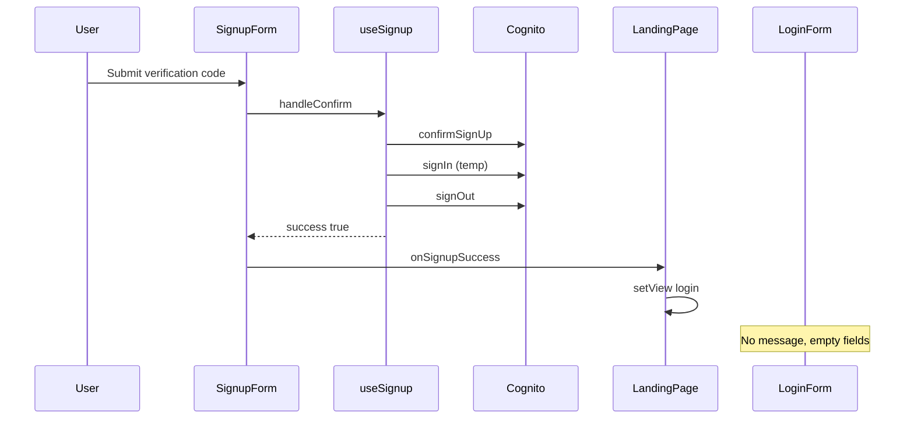

# Post-signup verification success feedback

## Problem

After `confirmSignUp` succeeds, [`useSignup.handleConfirm`](spots-app/app/_lib/hooks/auth/useSignup.ts) intentionally runs a temporary `signIn` → `updateUserAttribute` → `signOut`, then [`SignupForm`](spots-app/app/_components/auth/SignupForm.tsx) calls `onSignupSuccess()` which only does `setView('login')` in [`app/(landing)/page.tsx`](spots-app/app/(landing)/page.tsx). [`LoginForm`](spots-app/app/_components/auth/LoginForm.tsx) has no success channel—users see a blank sign-in form.



## Approach (recommended)

**Inline success box** above the login form (not a fixed top banner):

- Matches the signup step’s info styling ([`SignUp_Instructions`](spots-app/app/_components/auth/SignupForm.tsx) blue box) but **success** semantics (green border/background).
- Keeps “sign in below” visually tied to the form; avoids stacking with [`SessionLogoutBanner`](spots-app/app/_components/auth/SessionLogoutBanner.tsx) (yellow, fixed top, warning).

**SessionStorage flag** (same lifecycle pattern as idle timeout—see [`docs/components/idle-session-logout-banner.md`](spots-app/docs/components/idle-session-logout-banner.md)):

- New keys in [`app/_lib/constants/spots-logout.ts`](spots-app/app/_lib/constants/spots-logout.ts) (or a small sibling `spots-signup-notice.ts` if you prefer separation):
  - `SPOTS_SIGNUP_VERIFIED_NOTICE_KEY` — show success UI once
  - `SPOTS_SIGNUP_VERIFIED_USERNAME_KEY` — optional value for pre-fill
- Helpers: `setSignupVerifiedNotice(username)`, `clearSignupVerifiedNotice()`, `getSignupVerifiedUsername()`
- **Not** cleared by `clearSpotsLogoutGateFlags()` (same reason as `SPOTS_SESSION_TIMEOUT_NOTICE_KEY`).

## User-selected scope

| Item | In scope |
|------|----------|
| Inline success message + “sign in with same credentials” | Yes |
| REDCap/admin approval note in message | Yes (user selected) |
| Pre-fill username on login | Yes (user selected) |
| Verify-email-from-login path (`VerifyEmailForm`) | Yes (parity; ~2 call sites, same flag) |

## Implementation steps

### 1. Storage helpers

Add to [`spots-logout.ts`](spots-app/app/_lib/constants/spots-logout.ts):

```ts
export const SPOTS_SIGNUP_VERIFIED_NOTICE_KEY = 'spots_signup_verified_notice';
export const SPOTS_SIGNUP_VERIFIED_USERNAME_KEY = 'spots_signup_verified_username';

export function setSignupVerifiedNotice(username: string): void { ... }
export function clearSignupVerifiedNotice(): void { ... }
export function getSignupVerifiedUsername(): string | null { ... }
```

Normalize username with existing [`normalizeIdentifierInput`](spots-app/app/_lib/services/auth/identifier-normalization.ts) when storing (email vs `u_*`).

### 2. Set notice on verification success

**Signup path** — extend callback signature:

- [`SignupForm`](spots-app/app/_components/auth/SignupForm.tsx): `onSignupSuccess: (username: string) => void`; on confirm success call `onSignupSuccess(username)` (the form username they registered with).
- [`page.tsx`](spots-app/app/(landing)/page.tsx):
  ```ts
  onSignupSuccess={(username) => {
    setSignupVerifiedNotice(username);
    setView('login');
  }}
  ```

**Verify-email path** (login with unverified account):

- [`VerifyEmailForm`](spots-app/app/_components/auth/VerifyEmailForm.tsx) `onSuccess` — parent sets notice using `displayAccountLabel` / first email-like candidate from `usernameCandidates` before `setView('login')`.

### 3. LoginForm UI + pre-fill

In [`LoginForm.tsx`](spots-app/app/_components/auth/LoginForm.tsx):

- On mount (`useEffect`), if `SPOTS_SIGNUP_VERIFIED_NOTICE_KEY` is set:
  - `setShowVerifiedNotice(true)`
  - If `getSignupVerifiedUsername()` is non-empty, `setUsername(...)` (do not clear on generic `displayError` effect unless login fails—only clear prefill when appropriate).
- Render dismissible or static info block above the header/errors (green styling, `role="status"` `aria-live="polite"`).
- Two localization keys (or one key + one secondary—your call in REDCap):
  - `SignUp_ConfirmSuccess_Message` — e.g. “Your email is verified. Sign in with the username and password you just created.”
  - `SignUp_ConfirmSuccess_AdminNote` — e.g. “Your care team must add you in SPOTS before you can use the app. Contact them if sign-in does not work.”
- Use `getLocSetting(key, fallback)` for both (English fallbacks in code until REDCap is updated; document keys in [`docs/development/invalid-localization-keys.md`](spots-app/docs/development/invalid-localization-keys.md) or a short new doc under `docs/components/`).

Optional dismiss button using existing `Close` loc key (parity with timeout banner); clearing notice on dismiss is fine.

### 4. Clear notice on login attempt

In [`page.tsx`](spots-app/app/(landing)/page.tsx) `onLoginAttempt` (already calls `clearSessionTimeoutNotice()`):

```ts
clearSignupVerifiedNotice();
```

Also clear when user switches away from login to signup (`onSignUp`) so stale state does not return.

### 5. Tests

- **Unit**: LoginForm (or extracted `SignupVerifiedNotice`) — mock `sessionStorage`, assert success region renders and username input is pre-filled; assert cleared when simulating login attempt callback.
- **Update** [`SignupForm.a11y.test.tsx`](spots-app/app/_components/auth/__tests__/SignupForm.a11y.test.tsx) if `onSignupSuccess` signature changes (pass noop with string arg).

### 6. Documentation and REDCap follow-up

- Add [`docs/components/signup-verified-login-notice.md`](spots-app/docs/components/signup-verified-login-notice.md) mirroring idle banner doc (keys, set/clear sites, a11y).
- **REDCap task (manual, outside repo):** add `SignUp_ConfirmSuccess_Message` and `SignUp_ConfirmSuccess_AdminNote` to General EN/ES in REDCap (SpotSymptoms JSON is reference-only per project rules).
- Mark TODO item done in [`docs/todo/TODO.md`](spots-app/docs/todo/TODO.md) when shipped.

## Files to touch

| File | Change |
|------|--------|
| [`app/_lib/constants/spots-logout.ts`](spots-app/app/_lib/constants/spots-logout.ts) | Notice + username sessionStorage API |
| [`app/_components/auth/SignupForm.tsx`](spots-app/app/_components/auth/SignupForm.tsx) | Pass username to `onSignupSuccess` |
| [`app/_components/auth/LoginForm.tsx`](spots-app/app/_components/auth/LoginForm.tsx) | Success notice UI + pre-fill |
| [`app/(landing)/page.tsx`](spots-app/app/(landing)/page.tsx) | Set/clear notice; wire VerifyEmailForm success |
| [`app/_components/auth/VerifyEmailForm.tsx`](spots-app/app/_components/auth/VerifyEmailForm.tsx) | No change if parent handles `onSuccess` |
| Tests + docs | As above |

## Out of scope

- Auto-login after confirm (would conflict with `preferred_username` post-confirm flow in `useSignup`).
- Changing `handleConfirm` sign-out behavior.
- Symptom submit confetti modal (separate TODO line in `TODO.md`).

## Manual QA checklist

1. Sign up → enter code → lands on login with green message + admin note; username field pre-filled.
2. Sign in successfully → notice does not reappear on next visit to `/`.
3. Dismiss / start login → notice cleared.
4. Login with unverified account → complete `VerifyEmailForm` → same notice + prefill.
5. Spanish locale (once REDCap keys exist): both strings localized.
