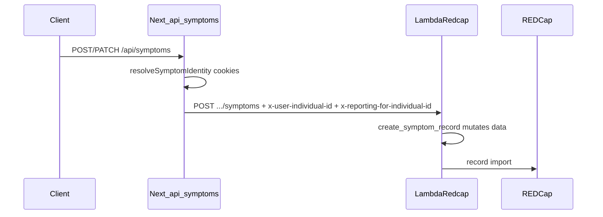

# Plan: `submitted_by_individual_id` and `submitted_id_role` on symptom writes

## Current state

- **`submitted_by_individual_id`** is already written in [`SPOTS_backend/redcap_client.py`](SPOTS_backend/redcap_client.py) inside `create_symptom_record`: `data["submitted_by_individual_id"] = user_individual_id`, where `user_individual_id` comes from the **`x-user-individual-id`** header. The Next.js BFF sets that header from cookies in [`spots-app/app/api/symptoms/route.ts`](spots-app/app/api/symptoms/route.ts) (POST ~lines 370–378; PATCH uses the same pattern later in the file). The client does **not** need to send this field in the JSON body for the normal app path.
- **`submitted_id_role`** is not set anywhere in backend or BFF today. REDCap will stay blank until we add it.

## Design choices

1. **Trust boundary**: Do **not** accept `submitted_id_role` from the browser request body as the only source. Populate it on the **server** in [`spots-app/app/api/symptoms/route.ts`](spots-app/app/api/symptoms/route.ts) when building the `data` object (same place as `symptom_login_id`, `symptom_id`, etc.), using [`serverUserCookies.getUserServer()`](spots-app/app/_lib/utils/cookie-utils-server.ts) and the existing [`User.role`](spots-app/app/_lib/types/redcap/redcap-api.ts) string (`"P"`, `"C"`, `"A"`).
2. **Lambda validation (recommended)**: In `create_symptom_record`, **enforce** a simple invariant so direct API callers cannot contradict family logic: if `user_individual_id != reporting_for_individual_id`, set `submitted_id_role` to **`parent`** (caregiver reporting for another individual). If they are equal, use the role from `request_data` only if it is one of the allowed REDCap values (e.g. `parent` / `child`); otherwise normalize from a small helper or omit. This keeps one source of truth for the cross-individual case without an extra REDCap read.
3. **REDCap alignment**: Confirm the instrument variable name is exactly `submitted_id_role` and that stored values match what you write (plain text `parent` / `child` vs coded values). Match whatever the instrument expects.

## Implementation steps

### 1) Next.js BFF — set `submitted_id_role` on writes

- Add a small helper (e.g. next to identity resolution or in a tiny `app/_lib/server/submitter-role.ts`) that maps `User.role` → REDCap string: `P` → `parent`, `C` → `child`, and decide **`A` (admin)** (e.g. map to `parent` or omit field if REDCap has no admin option — product call).
- In [`spots-app/app/api/symptoms/route.ts`](spots-app/app/api/symptoms/route.ts):
  - **POST**: After `resolveSymptomIdentity`, load user via `serverUserCookies.getUserServer()`, compute role string, set `data.submitted_id_role` on the object sent inside `lambdaRequestBody.data`.
  - **PATCH**: Same — include `submitted_id_role` on the update payload so repeat overwrites keep the field consistent (optional but avoids stale role if someone changes reporting context mid-session; still subject to Lambda override below).

### 2) Lambda / REDCap client — validate and set `submitted_id_role`

- In [`SPOTS_backend/redcap_client.py`](SPOTS_backend/redcap_client.py) `create_symptom_record`, after setting `submitted_by_individual_id`:
  - If `str(user_individual_id).strip() != str(reporting_for_individual_id).strip()`: set `data["submitted_id_role"] = "parent"` (or your agreed literal).
  - Else: read candidate from `data.get("submitted_id_role")`, validate against allowlist; if invalid/missing, default e.g. from mapping `P`/`C` is not available on Lambda without an extra field — simplest is **require BFF to always send** self-report role and Lambda only validates allowlist + cross-individual override.
- No change required to [`LambdaRedcap.py`](SPOTS_backend/LambdaRedcap.py) `/symptoms` case beyond what `create_symptom_record` already receives (`request_data` is the mutable dict).

### 3) Types and tests (light)

- Optionally extend the symptom payload / business types under `app/_lib/types` if you want TypeScript to document `submitted_id_role` on internal shapes (not required for REDCap import).
- Update or add a unit test for the POST handler or symptom route that asserts `lambdaRequestBody.data` includes `submitted_id_role` when a mocked user cookie has `role: 'P' | 'C'` (see existing patterns in [`spots-app/app/_lib/services/symptoms/__tests__/symptom-service-submit.test.ts`](spots-app/app/_lib/services/symptoms/__tests__/symptom-service-submit.test.ts) and route tests if present).
- Python: if you have tests around `create_symptom_record`, add cases for user≠reporting (forces parent) and user==reporting (passes through allowed value).

### 4) Edge / dev routes

- [`spots-app/app/api/test/symptoms/route.ts`](spots-app/app/api/test/symptoms/route.ts) forwards to Lambda directly; either add the same role field there for parity or document that dev bypasses do not populate role.

### 5) Verification

- Submit one symptom as **parent for self**, **parent for child** (reporting header differs), and **child for self**; confirm REDCap shows `submitted_by_individual_id` and `submitted_id_role` as expected.
- If `submitted_by_individual_id` is still empty on real rows, verify deployed Lambda includes the current `redcap_client.py` and REDCap variable name matches `submitted_by_individual_id` (no code change needed if already correct).

## Out of scope (unless you want it)

- Changing how `submitted_by_individual_id` is sourced (already header-driven; no client body field required).
- [`SPOTS_backend/lambda_auth.py`](SPOTS_backend/lambda_auth.py) `RedCapClient.create_symptom_record` — different legacy shape; only relevant if something still calls it for production symptom writes.
