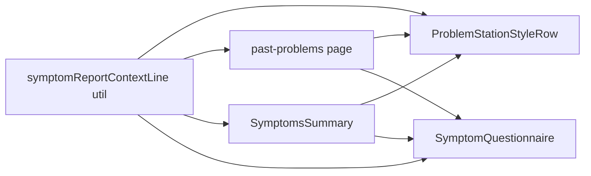

# Unified symptom source context (cards + questionnaire)

## Goals

- One string format everywhere: **display category** / **display subcategory** (e.g. `Body Parts / Abdomen`, `Past Problems / Skin`), using REDCap’s `symptom_category` + `symptom_subcategory` where available.
- **Past Problems** list: **title → context line → date** (per your DevTools mock), not only the date in the muted slot.
- **Problem Station** ([`ProblemStationStyleRow`](spots-app/app/_components/common/ProblemStationStyleRow.tsx)): same stacked layout; optional third line = formatted **report date** when [`SymptomItem.when`](spots-app/app/_components/symptoms/SymptomsSummary.tsx) exists (MM/DD/YYYY to match [`formatDate`](spots-app/app/(pages)/past-problems/page.tsx)).
- **[`SymptomQuestionnaire`](spots-app/app/_components/symptoms/SymptomQuestionnaire.tsx)**: show the same context **above the main title** on every flow; **omit the `
`** when the line is empty to remove the dead space from your SS.

## 1. Shared utility

Add something like [`app/_lib/utils/symptom-report-context-line.ts`](spots-app/app/_lib/utils/symptom-report-context-line.ts) (name flexible) that:

- Accepts a minimal shape: `{ symptom_category?: string | null; symptom_subcategory?: string | null }` (works for `RedcapSymptomRecord`, `PastProblem`, API rows).
- Normalizes **category keys** (e.g. `body`, `body_parts` → **Body Parts**; `feelings`, `feeling` → **Feelings**; `activities`, `activity`, `thinking` → **Activities**; `search` → **Search**; `prior_problems` → **Past Problems**; sensible fallback: replace `_` with spaces and title-case if unknown).
- Formats **subcategory** for display: trim, replace `_` with spaces (avoid double “feelings” noise where REDCap stores generic subcategory—see below).
- Returns **`Category / Subcategory`** with spaces around `/` to match your mock (replaces the old ` · ` style in [`getProblemStationContextSubtext`](spots-app/app/_components/symptoms/SymptomsSummary.tsx)).
- **Dedup rule**: if normalized category and subcategory strings are the same (case-insensitive), return a **single** segment (e.g. `Feelings` or `Search`) so flows that pass `subcategory="feelings"` for all feelings do not show `Feelings / feelings`.

Move logic out of [`SymptomsSummary.tsx`](spots-app/app/_components/symptoms/SymptomsSummary.tsx) (lines 97–120) and call the util instead so Problem Station and Past Problems cannot drift.

## 2. `ProblemStationStyleRow` API and layout

Extend props (keep backward compatibility where easy):

- **`contextSubtext`** = first muted line: **source context** from the new util (category / subcategory).
- **`dateSubtext`** (optional) = second muted line: **report date** (same `text-xs text-gray-500 dark:text-gray-400 truncate` as today).

Implementation: under `primaryLabel`, render a `flex flex-col` wrapper for zero, one, or two muted lines (matches your nested structure in the SS).

Update call sites:

- [`past-problems/page.tsx`](spots-app/app/(pages)/past-problems/page.tsx): `contextSubtext={symptomReportContextLineFromProblem(problem)}`, `dateSubtext={formatDate(problem.date)}` (stop using date-only as the only subtext).
- [`SymptomsSummary.tsx`](spots-app/app/_components/symptoms/SymptomsSummary.tsx): keep building context via the shared util from `symptom.record`; add `dateSubtext` when `symptom.when` parses (same MM/DD/YYYY pattern as Past Problems for consistency—extract tiny formatter to util if needed to avoid duplicating locale logic).

## 3. `SymptomQuestionnaire` header

Today [`displayBodyPartName`](spots-app/app/_components/symptoms/SymptomQuestionnaire.tsx) only reflects `bodyPartName` (filled mainly from [`InteractiveBody.tsx`](spots-app/app/_components/body-parts/InteractiveBody.tsx)); other flows leave the `
` empty.

**Resolve the displayed header line** in this order:

1. **`contextHeaderLine` (new optional prop)** – explicit override (required for **Past Problems**: submit uses `category="prior_problems"` but the line must reflect **historical** `questionnaireProblem.symptomCategory` / `symptomSubcategory`).
2. Else **`bodyPartName`** when `bodyPartId` is set – treat as **Body Parts / {name}** via the same util (so Interactive Body matches the slash format without each caller hand-building strings).
3. Else **util(symptom_category, symptom_subcategory)** from props `category` / `subcategory` (covers **edit-in-place** in Symptoms Summary, **feelings**, **search**, **ActivityModal** once dedupe handles generic subs).

Conditionally render the top `
` only when the resolved string is non-empty.

## 4. Call-site wiring

| Location | Change |
|----------|--------|
| [past-problems/page.tsx](spots-app/app/(pages)/past-problems/page.tsx) | Row: context + `dateSubtext`. Modal: `contextHeaderLine={util(problem)}` from selected `PastProblem`. |
| [SymptomsSummary.tsx](spots-app/app/_components/symptoms/SymptomsSummary.tsx) | Replace local helper with util; row + optional date; edit `SymptomQuestionnaire` needs no extra prop **if** category/sub on the record already reflect the source (verify `existingRecord` / spread props—today lines 698–703 supply record values). |
| [InteractiveBody.tsx](spots-app/app/_components/body-parts/InteractiveBody.tsx) | Rely on questionnaire fallback **Body Parts / part name** (stop depending on raw `bodyPartName` alone as the only format), or pass explicit `contextHeaderLine`—either is fine if behavior matches. |
| [feelings/page.tsx](spots-app/app/(pages)/feelings/page.tsx), [search/page.tsx](spots-app/app/(pages)/search/page.tsx), [ActivityModal.tsx](spots-app/app/_components/activities/ActivityModal.tsx) | No change **unless** props don’t yield a good subcategory; ActivityModal already passes activity slug—good. Feelings/search may resolve to a single-line “Feelings” / “Search” until product passes a more specific subcategory. |

## 5. QA / edge cases

- Rows with **missing** category/subcategory: show **date only** on Past Problems (second line), no bogus middle line.
- **`search_unmatched`**: subcategory may be weak; util should still not throw; empty → no header line if nothing to show.
- Spot-check **dark mode** on questionnaire card: your mock used `text-gray-500`; current classes include `dark:text-white` on that `
`—confirm with design (optional tweak in the same PR).

## Dependency diagram

