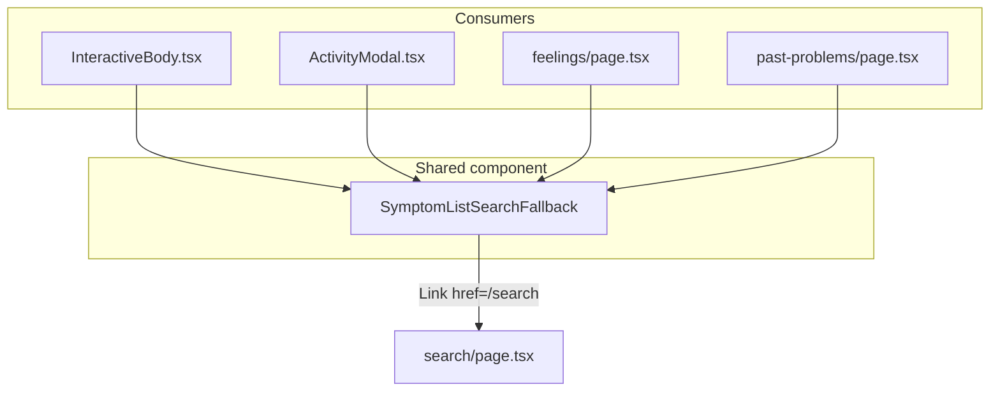

# Unable to find → Search (category lists)

## Goal

When a user cannot find their symptom in a category list, they should always see an option at the **bottom** of that list that takes them to the existing Search screen (`/search`).

**In scope (per tester feedback):**
- Body parts **symptom list** (when a body part is selected)
- Activities **symptom list** (inside activity modal)
- Feelings screen
- Past problems screen

**Out of scope:** Body-part picker (before a part is selected), Problem Station sidebar, Home preview, Search page itself.

## Architecture

## 1. New shared component

Create [`app/_components/common/SymptomListSearchFallback.tsx`](app/_components/common/SymptomListSearchFallback.tsx):

- Client component using `next/link` → `/search` (matches Header nav pattern; no new `router.push` usage)
- Label from new REDCap key **`SymptomListUnableToFind`** with code fallback until REDCap is updated
- Export constants for key + fallback (same pattern as `SIGNIN_RESET_SESSION_LABEL_KEY` in [`useResetSignIn.ts`](app/_lib/hooks/auth/useResetSignIn.ts))
- Single visual treatment across screens: full-width, low-emphasis action **below** symptom items (link or tertiary-style row — not competing with selectable symptom buttons)
- `aria-label` should include Search context for screen readers (e.g. localized label + `SearchTitle`)

**Suggested copy (for REDCap + fallbacks):**

| Lang | Value |
|------|--------|
| EN | `Unable to find your problem? Search for it` |
| ES | `¿No encuentras tu problema? Búscalo` |

Document the new key in [`docs/development/invalid-localization-keys.md`](docs/development/invalid-localization-keys.md) until it exists in REDCap `spots_settings`.

## 2. Wire into each screen

### Body parts — [`InteractiveBody.tsx`](app/_components/body-parts/InteractiveBody.tsx)

- **Where:** Inside the `displayedBodyPart ? (...)` branch, after the `visibleSymptoms.map(...)` block (~line 1011)
- **When:** Always when a body part is selected — including when `visibleSymptoms.length === 0` (all submitted/hidden)
- **Not** on the body-part picker list (`allBodyParts.map`)

### Activities — [`ActivityModal.tsx`](app/_components/activities/ActivityModal.tsx)

- **Where:** Inside the scrollable symptoms area, after the symptom `Button` list (~line 250)
- **When:** Always — replace/supplement the current empty-only `NoSymptoms` / `NoSymptomsHelp` block so the search fallback still appears when the list is empty
- Modal navigation to `/search` naturally closes the modal (full route change)

### Feelings — [`feelings/page.tsx`](app/(pages)/feelings/page.tsx)

- **Where:** Immediately after the feelings `grid` (~line 388), before error/modal blocks
- **When:** Always — even when all feeling cards are filtered out / grid is empty

### Past problems — [`past-problems/page.tsx`](app/(pages)/past-problems/page.tsx)

- **Where:** After the `problems.map(...)` / empty-state block inside `.problem-list` (~line 318)
- **When:** Always — below rows when problems exist, below `PastProblem_None` when empty

## 3. REDCap localization

- Add **`SymptomListUnableToFind`** to REDCap `spots_settings` (EN + ES) — you indicated you can provide/update copy
- Until REDCap is live, component fallbacks ensure the UI works in dev/staging (consistent with project “no silent mock data” rule for symptoms; this is UI copy only)

## 4. Testing

**Manual QA checklist:**
- Body part selected → scroll to bottom → tap link → lands on `/search`
- Activity modal with symptoms / empty symptoms → link visible at bottom → `/search`
- Feelings (full grid / all submitted) → link below grid → `/search`
- Past problems (with rows / empty) → link at bottom → `/search`
- Spanish locale shows ES string

**Optional automated:** Extend [`e2e/symptom-flow.spec.ts`](e2e/symptom-flow.spec.ts) with one assertion that the fallback link is present on one screen (e.g. past problems) and navigates to `/search`.

## 5. Files to touch

| File | Change |
|------|--------|
| `app/_components/common/SymptomListSearchFallback.tsx` | **New** shared link component |
| `app/_components/body-parts/InteractiveBody.tsx` | Append fallback after symptom list |
| `app/_components/activities/ActivityModal.tsx` | Append fallback; keep empty-state message if desired |
| `app/(pages)/feelings/page.tsx` | Append fallback below grid |
| `app/(pages)/past-problems/page.tsx` | Append fallback below list/empty state |
| `docs/development/invalid-localization-keys.md` | Document new key |

## Notes / constraints

- Legacy C# app does **not** have this on category screens — this is a **new** UX improvement, not a parity gap
- Do **not** modify SpotSymptoms reference JSON (workspace rule); REDCap update is separate
- Reuse `Link` navigation only — Search is already in Header at `/search`
- No backend/Lambda changes required
