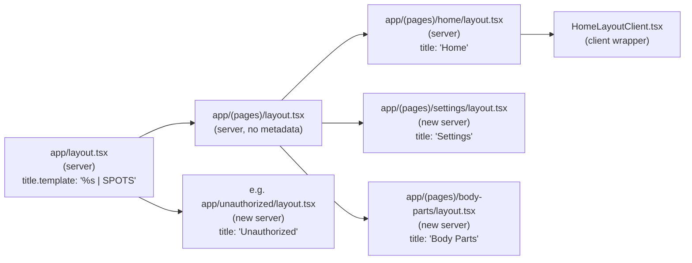

# Unique `<title>` per page (UTHealth requirement #5)

## Goal

Make every route emit a unique `<title>` in the initial HTML response. Browsers, screen readers, SEO crawlers, and UWS reviewers should all see e.g. `Body Parts | SPOTS` for `/body-parts` and `Settings | SPOTS` for `/settings`.

## Approach

Use Next.js's metadata API end-to-end. Pages stay `'use client'`; titles come from server-component `layout.tsx` files at each segment.

- Root `title.template` adds the `" | SPOTS"` suffix once.
- Routes without a layout get a tiny new server `layout.tsx` that exports `metadata` and renders `{children}`.
- The 4 existing client layouts are split into a server `layout.tsx` (exports `metadata`) + a `*LayoutClient.tsx` (keeps the current client behavior). Mechanical refactor, no behavior change.



## Title map

| Route | Title segment | Action |
|---|---|---|
| `/` | — (root default) | Update root metadata only |
| `/unauthorized` | `Unauthorized` | New server layout |
| `/auth/callback` | `Signing In` | New server layout |
| `/auth/error` | `Authentication Error` | New server layout |
| `/auth/reporting-as` | `Choose Profile` | New server layout |
| `/home` | `Home` | Split existing client layout |
| `/dashboard` | `Dashboard` | Split existing client layout |
| `/report` | `Report` | Split existing client layout |
| `/settings` | `Settings` | New server layout |
| `/body-parts` | `Body Parts` | New server layout |
| `/privacy` | `Privacy` | New server layout |
| `/past-problems` | `Past Problems` | New server layout |
| `/search` | `Search` | New server layout |
| `/activities` | `Activities` | New server layout |
| `/feelings` | `Feelings` | New server layout |
| `/help` | `Help` | New server layout |
| `/test` | `Test` | New server layout (dev only) |
| `/test/backend-integration` | `Backend Integration Test` | New server layout (dev only) |

Plus: split `app/(pages)/layout.tsx` (no metadata, just architectural cleanup so `metadata` can flow through child segments without being intercepted).

## File-level changes

### Root: update title template

`[app/layout.tsx](app/layout.tsx)` — replace the current `title` with a template + default:

```ts
export const metadata: Metadata = {
  title: {
    default: 'SPOTS - Supporting Pediatric Oncology Treatment Success',
    template: '%s | SPOTS',
  },
  description: '...', // unchanged
  icons: { /* unchanged */ },
};
```

### Pattern A: brand-new server-component layout (12 files)

For each route in the table marked "New server layout", add one file. Example for `/body-parts`:

```tsx
// app/(pages)/body-parts/layout.tsx
import type { Metadata } from 'next';

/**
 * Page title for the Body Parts route.
 *
 * Layman: this is the text that appears in the browser tab and is read out
 * by screen readers when the page opens. Each route needs its own so users
 * know where they are. Required by UTHealth UWS Technical Requirements #5.
 */
export const metadata: Metadata = {
  title: 'Body Parts',
};

export default function BodyPartsLayout({ children }: { children: React.ReactNode }) {
  return <>{children}</>;
}
```

Identical shape for all 12 (settings, privacy, past-problems, search, activities, feelings, help, body-parts, test, test/backend-integration, unauthorized, auth/callback, auth/error, auth/reporting-as).

### Pattern B: split existing client layout into server + client (4 files)

For `[app/(pages)/home/layout.tsx](app/(pages)/home/layout.tsx)`, `[app/(pages)/dashboard/layout.tsx](app/(pages)/dashboard/layout.tsx)`, `[app/(pages)/report/layout.tsx](app/(pages)/report/layout.tsx)`, and `[app/(pages)/layout.tsx](app/(pages)/layout.tsx)`:

1. Rename current file body into a new sibling `<Name>LayoutClient.tsx` (still `'use client'`).
2. Replace `layout.tsx` with a server component:

```tsx
// app/(pages)/home/layout.tsx
import type { Metadata } from 'next';
import { HomeLayoutClient } from './HomeLayoutClient';

export const metadata: Metadata = { title: 'Home' };

export default function HomeLayout({ children }: { children: React.ReactNode }) {
  return <HomeLayoutClient>{children}</HomeLayoutClient>;
}
```

`(pages)/layout.tsx` gets the same split, **but exports no `metadata`** (its children own the titles).

### Validation

After the edits, run in parallel:

- `npm run lint` — should remain green.
- `npm run build` — confirms Next.js accepts the layout shapes (it will error if a `'use client'` file exports `metadata`).
- `npm run test:a11y:public` — should stay green; the `/auth/error`, `/privacy`, `/unauthorized` reports under `e2e/.a11y-reports/` will now include the page-specific title in `pageTitle`.
- Manual: `curl -s http://localhost:3000/body-parts | rg '<title>'` confirms the SSR-rendered title.

## Out of scope (deferred)

- **Localized titles** (Spanish via REDCap). Metadata exports are static; supporting locale would need `generateMetadata` + request-time locale detection. UWS reviewers read the English copy; this can be a follow-up.
- **Per-page meta descriptions**. Row 6 in the audit. Same mechanism, separate change.
- **Viewport export** (row 7). Same mechanism, can piggy-back on root layout in a follow-up.

## Risk

Low. The page bodies don't change. The only behavior-touching edit is wrapping each existing client layout in a thin server shell — same component tree, same rendering, just one extra hop. Pre-build catches the most likely failure mode (a stray `'use client'` directive in a file that exports `metadata`).