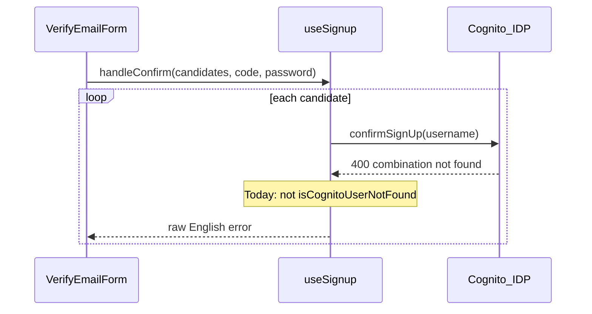
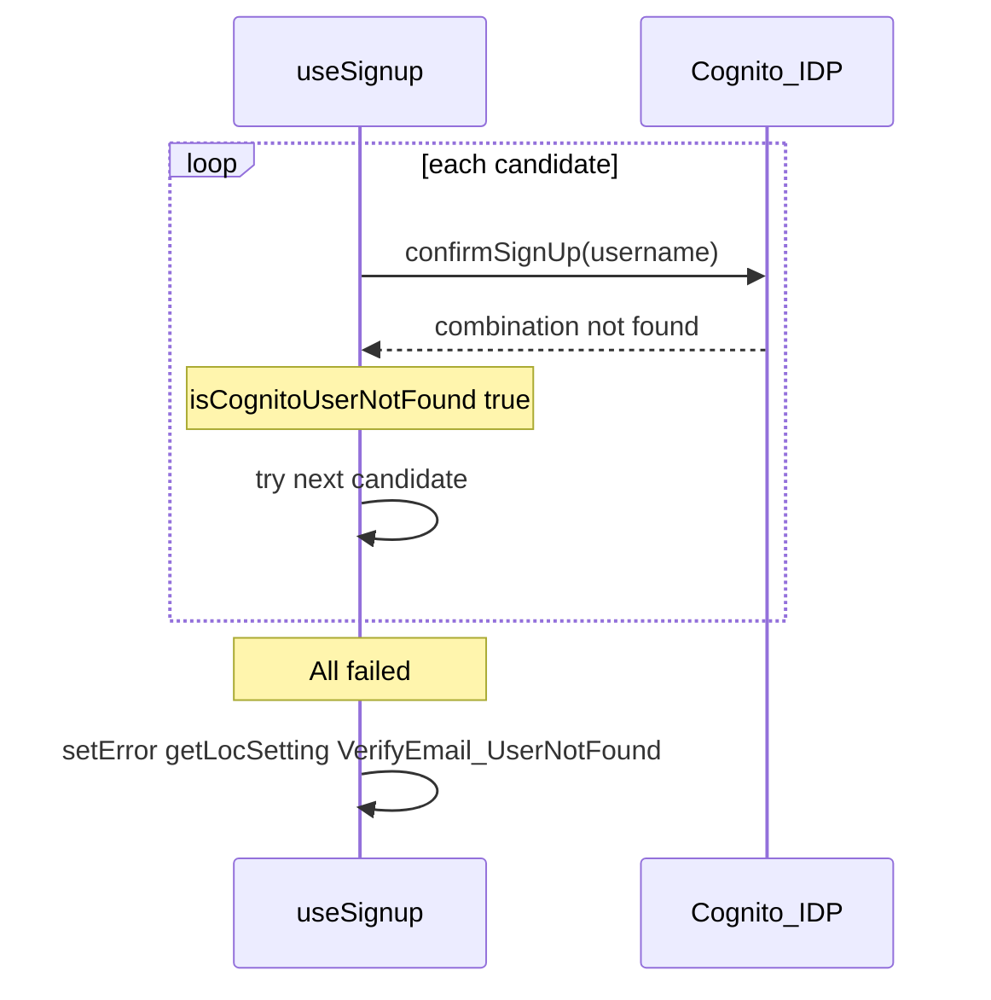

# Verify-email Cognito error translation and retry fix

## Problem

On the verify-email flow ([`VerifyEmailForm.tsx`](spots-app/app/_components/auth/VerifyEmailForm.tsx) → [`useSignup.ts`](spots-app/app/_lib/hooks/auth/useSignup.ts)), Cognito returns the raw English message **"Username/client id combination not found."** when `confirmSignUp` / `resendSignUpCode` fails. The UI renders `{error}` unchanged.

Two gaps in [`useSignup.ts`](spots-app/app/_lib/hooks/auth/useSignup.ts):

1. **No localization mapping** — `applyConfirmError` only maps `CodeMismatchException`, `ExpiredCodeException`, and `AliasExistsException`; all other errors use `err.message` (lines 197–215).
2. **Retry stops too early** — `isCognitoUserNotFound` (lines 44–53) does not match Cognito’s “combination not found” wording, so the candidate loop does not `continue` to the next identifier and may surface a misleading error on the first wrong username.



After fix:



## Recommended approach

**Single new loc key** (verify-specific, not `SignIn_Error`): `VerifyEmail_UserNotFound_ErrorMessage` — clearer on the verify screen than the generic login error used in [`useLogin.ts`](spots-app/app/_lib/hooks/auth/useLogin.ts) line 274.

**Code-only changes** in spots-app (no SpotSymptoms edits per project rules). REDCap remains source of truth per [`docs/uthealth/redcap-page-title-keys.md`](spots-app/docs/uthealth/redcap-page-title-keys.md).

---

## 1. Broaden `isCognitoUserNotFound`

In [`useSignup.ts`](spots-app/app/_lib/hooks/auth/useSignup.ts), extend the helper to return true when:

- `name === 'UserNotFoundException'` (unchanged)
- Message (lowercased) includes: `user not found`, `user does not exist`, **`combination not found`**

Used by:

- `handleConfirm` retry loop (line 256)
- `handleResendCode` retry loop (line 289)

This aligns confirm/resend with login’s multi-candidate strategy from [`buildVerificationUsernameCandidates`](spots-app/app/_lib/services/auth/identifier-normalization.ts) (email vs `u_*` vs normalized input).

---

## 2. Centralize “not found” → localized message

Add a small helper in the same file (keeps scope minimal):

```ts
function getVerifyEmailUserNotFoundMessage(getLocSetting: ...) {
  return getLocSetting(
    'VerifyEmail_UserNotFound_ErrorMessage',
    'We could not find an account to verify. Check your email or sign up again.',
  );
}
```

Use it in:

**`applyConfirmError`** — after existing branches, before the final `setError(errorMessage)`:

- If `isCognitoUserNotFound(err)` → `setError(getVerifyEmailUserNotFoundMessage(...))`
- Optionally also match message substring in `applyConfirmError` if Amplify sometimes omits `UserNotFoundException` name but keeps the message (belt-and-suspenders with the helper)

**`handleResendCode`** — in the catch after retries exhausted:

- Same mapping instead of raw `errorMessage` (lines 292–294)

Do **not** change [`VerifyEmailForm.tsx`](spots-app/app/_components/auth/VerifyEmailForm.tsx) or [`SignupForm.tsx`](spots-app/app/_components/auth/SignupForm.tsx); they already display `error` from the hook.

---

## 3. REDCap localization (required for Spanish in prod)

Add to REDCap General strings (EN + ES), mirroring existing verify keys (`VerifyEmail_InvalidCode`, etc.):

| Key | Purpose |
|-----|---------|
| `VerifyEmail_UserNotFound_ErrorMessage` | Shown when all username candidates fail confirm/resend |

**Copy guidelines** (no “client id”; layman-friendly):

- **EN (suggested):** “We couldn’t find an account to verify with that information. Check your email or complete sign-up again.”
- **ES (suggested):** “No encontramos una cuenta para verificar con esa información. Revise su correo o regístrese de nuevo.”

Until REDCap has the key, the `getLocSetting` fallback keeps English readable (not Cognito’s technical string).

**Docs (optional but consistent with project):** Add the key to [`docs/development/invalid-localization-keys.md`](spots-app/docs/development/invalid-localization-keys.md) if it is not yet in the `GeneralEng.json` reference export.

---

## 4. Testing

**Manual (primary)** — use dev accounts from [`LOCAL/tests/Login-Dev-Test-Accounts.md`](spots-app/LOCAL/tests/Login-Dev-Test-Accounts.md):

| Scenario | Language | Expected |
|----------|----------|----------|
| Login → unverified user → verify with **wrong code** | ES | Existing `VerifyEmail_InvalidCode` (unchanged) |
| Login → unverified user → verify with valid code | EN/ES | Success (retry may fix wrong first candidate) |
| Verify/resend when account truly missing | ES | Spanish `VerifyEmail_UserNotFound_ErrorMessage`, not Cognito English |
| Signup confirm step (SignupForm) | ES | Same error mapping via shared `useSignup` |

**Automated (optional, small):** Extract `isCognitoUserNotFound` (and optionally message mapping) to a pure function under `app/_lib/services/auth/` or `app/_lib/utils/` and add a Jest test with fixture errors:

- `{ name: 'UserNotFoundException', message: '...' }`
- `{ message: 'Username/client id combination not found.' }`
- `{ name: 'CodeMismatchException', message: '...' }` → false

No E2E required unless you already have auth E2E coverage.

---

## 5. Out of scope

- Changing Cognito/Amplify pool config (only investigate if **all** users hit this on first candidate with correct codes).
- Editing SpotSymptoms `GeneralEng.json` / `GeneralEsp.json` (reference-only).
- Translating every possible Cognito error string globally.

---

## Files to touch

| File | Change |
|------|--------|
| [`app/_lib/hooks/auth/useSignup.ts`](spots-app/app/_lib/hooks/auth/useSignup.ts) | Extend `isCognitoUserNotFound`; map not-found in `applyConfirmError` + `handleResendCode` |
| REDCap General (EN/ES) | New key `VerifyEmail_UserNotFound_ErrorMessage` |
| [`docs/development/invalid-localization-keys.md`](spots-app/docs/development/invalid-localization-keys.md) | Document new key (optional) |
| New unit test file (optional) | Fixtures for `isCognitoUserNotFound` |
